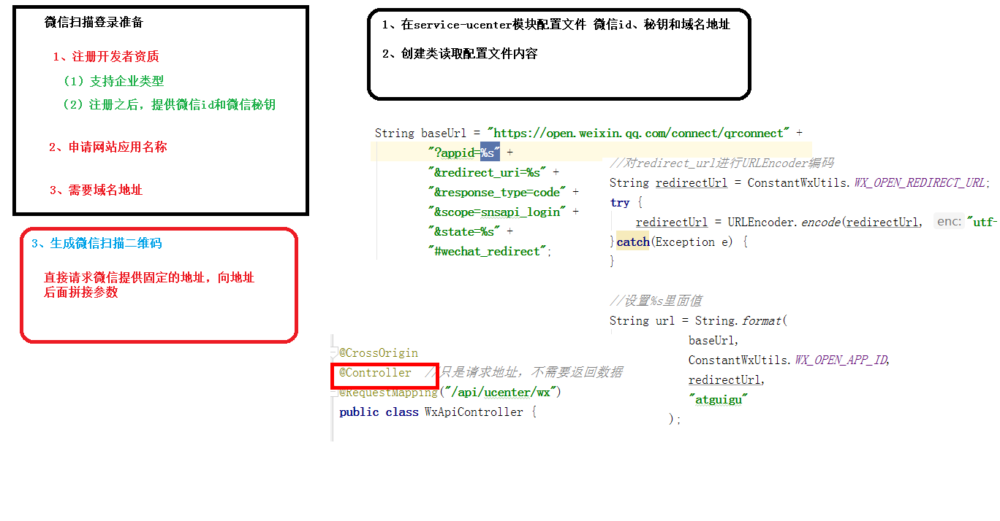

---


# **一、准备工作**

https://open.weixin.qq.com

## 1、注册 

## 2、邮箱激活

## 3、完善开发者资料

## 4、开发者资质认证

准备营业执照，1-2个工作日审批、300元

## 5、创建网站应用

提交审核，7个工作日审批

## 6、熟悉微信登录流程

参考文档：https://open.weixin.qq.com/cgi-bin/showdocument?action=dir_list&t=resource/res_list&verify=1&id=open1419316505&token=e547653f995d8f402704d5cb2945177dc8aa4e7e&lang=zh_CN

**获取access_token时序图**


# 二、生成授权URL

## 1、添加配置

application.properties添加相关配置信息

 

```properties
# 微信开放平台 appid
wx.open.app_id=你的appid
# 微信开放平台 appsecret
wx.open.app_secret=你的appsecret
# 微信开放平台 重定向url
wx.open.redirect_url=http://你的服务器名称/api/ucenter/wx/callback

# 尚硅谷提供的信息，20-7-29还可用
wx:
  open:
    # 微信开放平台 appid

    appid: wxed9954c01bb89b47

    # 微信开放平台 appsecret
    appsecret: a7482517235173ddb4083788de60b90e

    # 微信开放平台 重定向url（guli.shop需要在微信开放平台配置）
    redirecturl: http://guli.shop/api/ucenter/wx/callback

```

## **2、创建常量类**

创建util包，创建ConstantPropertiesUtil.java常量类

 

```java
package com.guli.ucenter.util;
@Component
//@PropertySource("classpath:application.properties")
public class ConstantPropertiesUtil implements InitializingBean {
    @Value("${wx.open.app_id}")
    private String appId;
    @Value("${wx.open.app_secret}")
    private String appSecret;
    @Value("${wx.open.redirect_url}")
    private String redirectUrl;
    public static String WX_OPEN_APP_ID;
    public static String WX_OPEN_APP_SECRET;
    public static String WX_OPEN_REDIRECT_URL;
    @Override
    public void afterPropertiesSet() throws Exception {
        WX_OPEN_APP_ID = appId;
        WX_OPEN_APP_SECRET = appSecret;
        WX_OPEN_REDIRECT_URL = redirectUrl;
    }
}
```

## 3、创建controller

guli-microservice-ucenter微服务中创建api包

api包中创建WxApiController

 

```java
package com.guli.ucenter.controller.api;
@CrossOrigin
@Controller//注意这里没有配置 @RestController
@RequestMapping("/api/ucenter/wx")
public class WxApiController {
    @GetMapping("login")
    public String genQrConnect(HttpSession session) {
        // 微信开放平台授权baseUrl
        String baseUrl = "https://open.weixin.qq.com/connect/qrconnect" +
                "?appid=%s" +
                "&redirect_uri=%s" +
                "&response_type=code" +
                "&scope=snsapi_login" +
                "&state=%s" +
                "#wechat_redirect";
        // 回调地址
        String redirectUrl = ConstantPropertiesUtil.WX_OPEN_REDIRECT_URL; //获取业务服务器重定向地址
        try {
            redirectUrl = URLEncoder.encode(redirectUrl, "UTF-8"); //url编码
        } catch (UnsupportedEncodingException e) {
            throw new GuliException(20001, e.getMessage());
        }
        // 防止csrf攻击（跨站请求伪造攻击）
        //String state = UUID.randomUUID().toString().replaceAll("-", "");//一般情况下会使用一个随机数
        String state = "imhelen";//为了让大家能够使用我搭建的外网的微信回调跳转服务器，这里填写你在ngrok的前置域名
        System.out.println("state = " + state);
        // 采用redis等进行缓存state 使用sessionId为key 30分钟后过期，可配置
        //键："wechar-open-state-" + httpServletRequest.getSession().getId()
        //值：satte
        //过期时间：30分钟
        
        //生成qrcodeUrl
        String qrcodeUrl = String.format(
                baseUrl,
                ConstantPropertiesUtil.WX_OPEN_APP_ID,
                redirectUrl,
                state);
        return "redirect:" + qrcodeUrl;
    }
}
```

授权url参数说明

| 参数          | 是否必须 | 说明                                                         |
| ------------- | -------- | ------------------------------------------------------------ |
| appid         | 是       | 应用唯一标识                                                 |
| redirect_uri  | 是       | 请使用urlEncode对链接进行处理                                |
| response_type | 是       | 填code                                                       |
| scope         | 是       | 应用授权作用域，拥有多个作用域用逗号（,）分隔，网页应用目前仅填写snsapi_login即 |
| state         | 否       | 用于保持请求和回调的状态，授权请求后原样带回给第三方。该参数可用于防止csrf攻击（跨站请求伪造攻击），建议第三方带上该参数，可设置为简单的随机数加session进行校验 |

## 4、测试 

访问：[http://localhost:8201/api/ucenter/wx/login](http://localhost:8104/api/ucenter/wx/login) 

访问授权url后会得到一个微信登录二维码


用户扫描二维码会看到确认登录的页面


用户点击“确认登录”后，微信服务器会向谷粒学院的业务服务器发起回调，因此接下来我们需要开发回调controller

**注意：**如果没有正确的配置业务服务器的回调url，则会看到以下错误提示


---


# 三、准备工作

## 1、全局配置的跳转路径

 

```
# 微信开放平台 重定向url
wx.open.redirect_url=http://回调地址/api/ucenter/wx/callback
```

## 2、修改当前项目启动端口号为8150 

## 3、测试回调是否可用

在WxApiController中添加方法

 

```java
@GetMapping("callback")
public String callback(String code, String state, HttpSession session) {
    //得到授权临时票据code
    System.out.println("code = " + code);
    System.out.println("state = " + state);
}
```

# 四、开发回调URL

# 1、添加依赖

 

```
 <!--httpclient-->
<dependency>
    <groupId>org.apache.httpcomponents</groupId>
    <artifactId>httpclient</artifactId>
</dependency>
<!--commons-io-->
<dependency>
    <groupId>commons-io</groupId>
    <artifactId>commons-io</artifactId>
</dependency>
<!--gson-->
<dependency>
    <groupId>com.google.code.gson</groupId>
    <artifactId>gson</artifactId>
</dependency>
```

## 2、创建httpclient工具类

放入util包

 

```
HttpClientUtils.java
```

## 3、创建回调controller方法

在WxApiController.java中添加如下方法

 

```java
/**
* @param code
* @param state
* @return
*/
@GetMapping("callback")
public String callback(String code, String state){
    //得到授权临时票据code
    System.out.println(code);
    System.out.println(state);
    //从redis中将state获取出来，和当前传入的state作比较
    //如果一致则放行，如果不一致则抛出异常：非法访问
    //向认证服务器发送请求换取access_token
    String baseAccessTokenUrl = "https://api.weixin.qq.com/sns/oauth2/access_token" +
        "?appid=%s" +
        "&secret=%s" +
        "&code=%s" +
        "&grant_type=authorization_code";
    String accessTokenUrl = String.format(baseAccessTokenUrl,
                                          ConstantPropertiesUtil.WX_OPEN_APP_ID,
                                          ConstantPropertiesUtil.WX_OPEN_APP_SECRET,
                                          code);
    String result = null;
    try {
        result = HttpClientUtils.get(accessTokenUrl);
        System.out.println("accessToken=============" + result);
    } catch (Exception e) {
        throw new GuliException(20001, "获取access_token失败");
    }
    //解析json字符串
    Gson gson = new Gson();
    HashMap map = gson.fromJson(result, HashMap.class);
    String accessToken = (String)map.get("access_token");
    String openid = (String)map.get("openid");
    //查询数据库当前用用户是否曾经使用过微信登录
    Member member = memberService.getByOpenid(openid);
    if(member == null){
        System.out.println("新用户注册");
         
        String userInfoUrl = String.format(baseUserInfoUrl, accessToken, openid);
        String resultUserInfo = null;
        try {
            resultUserInfo = HttpClientUtils.get(userInfoUrl);
            System.out.println("resultUserInfo==========" + resultUserInfo);
        } catch (Exception e) {
            throw new GuliException(20001, "获取用户信息失败");
        }
        //解析json
        HashMap<String, Object> mapUserInfo = gson.fromJson(resultUserInfo, HashMap.class);
        String nickname = (String)mapUserInfo.get("nickname");
        String headimgurl = (String)mapUserInfo.get("headimgurl");
        //向数据库中插入一条记录
        member = new Member();
        member.setNickname(nickname);
        member.setOpenid(openid);
        member.setAvatar(headimgurl);
        memberService.save(member);
    }
    //TODO 登录
    return "redirect:http://localhost:3000";
}
```

## 4、业务层

业务接口：MemberService.java

 

```
Member getByOpenid(String openid);
```

业务实现：MemberServiceImpl.java

 

```java
@Override
public Member getByOpenid(String openid) {
    QueryWrapper<Member> queryWrapper = new QueryWrapper<>();
    queryWrapper.eq("openid", openid);
    Member member = baseMapper.selectOne(queryWrapper);
    return member;
}
```

