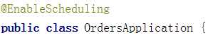

# 一、添加定时任务

## 1、创建定时任务类，使用cron表达式 

**复制日期工具类**

 

```java
@Component
public class ScheduledTask {
    @Autowired
    private StatisticsDailyService dailyService;
    /**
     * 测试
     * 每天七点到二十三点每五秒执行一次
     */
    @Scheduled(cron = "0/5 * * * * ?")
    public void task1() {
        System.out.println("*********++++++++++++*****执行了");
    }
    /**
     * 每天凌晨1点执行定时
     */
    @Scheduled(cron = "0 0 1 * * ?")
    public void task2() {
        //获取上一天的日期
        String day = DateUtil.formatDate(DateUtil.addDays(new Date(), -1));
        dailyService.createStatisticsByDay(day);
    }
}
```

## 2、在启动类上添加注解



## **3、在线生成cron表达式**

http://cron.qqe2.com/

