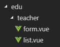

# 一、后台系统路由实现分析

## 1、入口文件中调用路由

src/main.js

 

```
......
import router from './router' //引入路由模块
......
new Vue({
  el: '#app',
  router, //挂载路由
  store,
  render: h => h(App)
})
```

## 2、路由模块中定义路由

src/router/index.js

 

```
......
export const constantRouterMap = [
  ......
]
export default new Router({
  ......
  routes: constantRouterMap
})    
```

# 二、谷粒学院路由定义

## 1、复制icon图标

将vue-element-admin/src/icons/svg 中的图标复制到 guli-admin项目中

## 2、修改路由

修改 src/router/index.js 文件，重新定义constantRouterMap

**注意：**每个路由的name不能相同

 

```js
 export const constantRouterMap = [
  { path: '/login', component: () => import('@/views/login/index'), hidden: true },
  { path: '/404', component: () => import('@/views/404'), hidden: true },
  // 首页
  {
    path: '/',
    component: Layout,
    redirect: '/dashboard',
    name: 'Dashboard',
    children: [{
      path: 'dashboard',
      component: () => import('@/views/dashboard/index'),
      meta: { title: '谷粒学院后台首页', icon: 'dashboard' }
    }]
  },
  // 讲师管理
  {
    path: '/edu/teacher',
    component: Layout,
    redirect: '/edu/teacher/list',
    name: 'Teacher',
    meta: { title: '讲师管理', icon: 'peoples' },
    children: [
      {
        path: 'list',
        name: 'EduTeacherList',
        component: () => import('@/views/edu/teacher/list'),
        meta: { title: '讲师列表' }
      },
      {
        path: 'create',
        name: 'EduTeacherCreate',
        component: () => import('@/views/edu/teacher/form'),
        meta: { title: '添加讲师' }
      },
      {
        path: 'edit/:id',
        name: 'EduTeacherEdit',
        component: () => import('@/views/edu/teacher/form'),
        meta: { title: '编辑讲师', noCache: true },
        hidden: true
      }
    ]
  },
  { path: '*', redirect: '/404', hidden: true }
]
```

## 3、创建vue组件

在src/views文件夹下创建以下文件夹和文件



## 4、form.vue

 

```
<template>
  <div class="app-container">
    讲师表单
  </div>
</template>
```

## 5、list.vue

 

```
<template>
  <div class="app-container">
    讲师列表
  </div>
</template>
```

# 一、分页列表

## 1、定义api 

创建文件 src/api/edu/teacher.js

 

```
import request from '@/utils/request'
const api_name = '/admin/edu/teacher'
export default {
  getPageList(page, limit, searchObj) {
    return request({
      url: `${api_name}/${page}/${limit}`,
      method: 'get',
      data: searchObj
    })
  }
}
```

## 2、初始化vue组件

src/views/edu/teacher/list.vue

 

```
<template>
  <div class="app-container">
    讲师列表
  </div>
</template>
<script>
import teacher from '@/api/edu/teacher'
export default {
  data() {// 定义数据
      return {}
  },
    
  created() { // 当页面加载时获取数据
    this.fetchData()
  },
    
  methods: {
    fetchData() { // 调用api层获取数据库中的数据
      console.log('加载列表')
    }
  }
}
</script>
```

# 

**3、定义data**

 

```
  data() {
    return {
      listLoading: true, // 是否显示loading信息
      list: null, // 数据列表
      total: 0, // 总记录数
      page: 1, // 页码
      limit: 10, // 每页记录数
      searchObj: {}// 查询条件
    }
  },
```

## 4、定义methods

 

```
  methods: {
    fetchData(page = 1) { // 调用api层获取数据库中的数据
      console.log('加载列表')
      this.page = page
      this.listLoading = true
      teacher.getPageList(this.page, this.limit, this.searchObj).then(response => {
        // debugger 设置断点调试
        if (response.success === true) {
          this.list = response.data.rows
          this.total = response.data.total
        }
        this.listLoading = false
      })
    }
  }
```

## 5、表格渲染

 

```
    <!-- 表格 -->
    <el-table
      v-loading="listLoading"
      :data="list"
      element-loading-text="数据加载中"
      border
      fit
      highlight-current-row>
      <el-table-column
        label="序号"
        width="70"
        align="center">
        <template slot-scope="scope">
          {{ (page - 1) * limit + scope.$index + 1 }}
        </template>
      </el-table-column>
      <el-table-column prop="name" label="名称" width="80" />
      <el-table-column label="头衔" width="80">
        <template slot-scope="scope">
          {{ scope.row.level===1?'高级讲师':'首席讲师' }}
        </template>
      </el-table-column>
      <el-table-column prop="intro" label="资历" />
      <el-table-column prop="gmtCreate" label="添加时间" width="160"/>
      <el-table-column prop="sort" label="排序" width="60" />
      <el-table-column label="操作" width="200" align="center">
        <template slot-scope="scope">
          <router-link :to="'/edu/teacher/edit/'+scope.row.id">
            <el-button type="primary" size="mini" icon="el-icon-edit">修改</el-button>
          </router-link>
          <el-button type="danger" size="mini" icon="el-icon-delete" @click="removeDataById(scope.row.id)">删除</el-button>
        </template>
      </el-table-column>
    </el-table>
```

## 6、分页组件

 

```
   <!-- 分页 -->
    <el-pagination
      :current-page="page"
      :page-size="limit"
      :total="total"
      style="padding: 30px 0; text-align: center;"
      layout="total, prev, pager, next, jumper"
      @current-change="fetchData"
    />
```

## 7、顶部查询表单

**注意：**

element-ui的 date-picker组件默认绑定的时间值是默认世界标准时间，和中国时间差8小时

设置 value-format="yyyy-MM-dd HH:mm:ss" 改变绑定的值

 

```
    <!--查询表单-->
    <el-form :inline="true" class="demo-form-inline">
      <el-form-item>
        <el-input v-model="searchObj.name" placeholder="讲师名"/>
      </el-form-item>
      <el-form-item>
        <el-select v-model="searchObj.level" clearable placeholder="讲师头衔">
          <el-option :value="1" label="高级讲师"/>
          <el-option :value="2" label="首席讲师"/>
        </el-select>
      </el-form-item>
      <el-form-item label="添加时间">
        <el-date-picker
          v-model="searchObj.begin"
          type="datetime"
          placeholder="选择开始时间"
          value-format="yyyy-MM-dd HH:mm:ss"
          default-time="00:00:00"
        />
      </el-form-item>
      <el-form-item>
        <el-date-picker
          v-model="searchObj.end"
          type="datetime"
          placeholder="选择截止时间"
          value-format="yyyy-MM-dd HH:mm:ss"
          default-time="00:00:00"
        />
      </el-form-item>
      <el-button type="primary" icon="el-icon-search" @click="fetchData()">查询</el-button>
      <el-button type="default" @click="resetData()">清空</el-button>
    </el-form>
```

清空方法

 

```
resetData() {
    this.searchObj = {}
    this.fetchData()
}
```

## 8、测试

# 二、删除

## 1、定义api

src/api/edu/teacher.js

 

```
removeById(teacherId) {
    return request({
        url: `${api_name}/${teacherId}`,
        method: 'delete'
    })
}
```

## 2、定义methods

src/views/edu/teacher/list.vue

使用MessageBox 弹框组件

 

```
removeDataById(id) {
    // debugger
    // console.log(memberId)
    this.$confirm('此操作将永久删除该记录, 是否继续?', '提示', {
        confirmButtonText: '确定',
        cancelButtonText: '取消',
        type: 'warning'
    }).then(() => {
        return teacher.removeById(id)
    }).then(() => {
        this.fetchData()
        this.$message({
            type: 'success',
            message: '删除成功!'
        })
    }).catch((response) => { // 失败
        if (response === 'cancel') {
            this.$message({
                type: 'info',
                message: '已取消删除'
            })
        } else {
            this.$message({
                type: 'error',
                message: '删除失败'
            })
        }
    })
}
```

# 一、新增 

## 1、定义api

 src/api/edu/teacher.js

 

```
save(teacher) {
    return request({
        url: api_name,
        method: 'post',
        data: teacher
    })
}
```

## 2、初始化组件

src/views/edu/teacher/form.vue

html

 

```
<template>
  <div class="app-container">
    <el-form label-width="120px">
      <el-form-item label="讲师名称">
        <el-input v-model="teacher.name"/>
      </el-form-item>
      <el-form-item label="讲师排序">
        <el-input-number v-model="teacher.sort" controls-position="right" min="0"/>
      </el-form-item>
      <el-form-item label="讲师头衔">
        <el-select v-model="teacher.level" clearable placeholder="请选择">
          <!--
            数据类型一定要和取出的json中的一致，否则没法回填
            因此，这里value使用动态绑定的值，保证其数据类型是number
          -->
          <el-option :value="1" label="高级讲师"/>
          <el-option :value="2" label="首席讲师"/>
        </el-select>
      </el-form-item>
      <el-form-item label="讲师资历">
        <el-input v-model="teacher.career"/>
      </el-form-item>
      <el-form-item label="讲师简介">
        <el-input v-model="teacher.intro" :rows="10" type="textarea"/>
      </el-form-item>
      <!-- 讲师头像：TODO -->
      <el-form-item>
        <el-button :disabled="saveBtnDisabled" type="primary" @click="saveOrUpdate">保存</el-button>
      </el-form-item>
    </el-form>
  </div>
</template>
```

js

 

```
<script>
export default {
  data() {
    return {
      teacher: {
        name: '',
        sort: 0,
        level: 1,
        career: '',
        intro: '',
        avatar: ''
      },
      saveBtnDisabled: false // 保存按钮是否禁用,
    }
  },
  methods: {
    saveOrUpdate() {
      this.saveBtnDisabled = true
      this.saveData()
    },
    // 保存
    saveData() {
    }
  }
}
</script>
```

## 3、实现新增功能

引入teacher api模块

 

```
import teacher from '@/api/edu/teacher'
```

完善save方法

 

```js
    // 保存
    saveData() {
      teacher.save(this.teacher).then(response => {
        return this.$message({
          type: 'success',
          message: '保存成功!'
        })
      }).then(resposne => {
          // 路由跳转，重中之重
        this.$router.push({ path: '/edu/teacher' })
      }).catch((response) => {
        // console.log(response)
        this.$message({
          type: 'error',
          message: '保存失败'
        })
      })
    }
```

# 二、回显

## 1、定义api

 src/api/edu/teacher.js

 

```
getById(id) {
    return request({
        url: `${api_name}/${id}`,
        method: 'get'
    })
}
```

## 2、组件中调用api

methods中定义fetchDataById

 

```
// 根据id查询记录
fetchDataById(id) {
    teacher.getById(id).then(response => {
        this.teacher = response.data.item
    }).catch((response) => {
        this.$message({
            type: 'error',
            message: '获取数据失败'
        })
    })
}
```

## 3、页面渲染前调用fetchDataById

 

```
  created() {
    console.log('created')
    if (this.$route.params && this.$route.params.id) {
      const id = this.$route.params.id
      this.fetchDataById(id)
    }
  }
```

# 三、更新

## 1、定义api

 

```
updateById(teacher) {
    return request({
        url: `${api_name}/${teacher.id}`,
        method: 'put',
        data: teacher
    })
}
```

## 2、组件中调用api

methods中定义updateData

 

```
// 根据id更新记录
updateData() {
    this.saveBtnDisabled = true
    teacher.updateById(this.teacher).then(response => {
        return this.$message({
            type: 'success',
            message: '修改成功!'
        })
    }).then(resposne => {
        this.$router.push({ path: '/edu/teacher' })
    }).catch((response) => {
        // console.log(response)
        this.$message({
            type: 'error',
            message: '保存失败'
        })
    })
}
```

## 3、完善saveOrUpdate方法

 

```
saveOrUpdate() {
    this.saveBtnDisabled = true
    if (!this.teacher.id) {
        this.saveData()
    } else {
        this.updateData()
    }
}
```

## 四、存在问题

vue-router导航切换 时，如果两个路由都渲染同个组件，组件会重（chong）用,

组件的生命周期钩子（created）不会再被调用, 使得组件的一些数据无法根据 path的改变得到更新

因此：

1、我们可以在watch中监听路由的变化，当路由变化时，重新调用created中的内容

2、在init方法中我们判断路由的变化，如果是修改路由，则从api获取表单数据，

   如果是新增路由，则重新初始化表单数据

 

```
<script>
import teacher from '@/api/edu/teacher'
const defaultForm = {
  name: '',
  sort: 0,
  level: '',
  career: '',
  intro: '',
  avatar: ''
}
export default {
  data() {
    return {
      teacher: defaultForm,
      saveBtnDisabled: false // 保存按钮是否禁用,
    }
  },
  // vue的监听器
  watch: {
  //监听路由切换
    $route(to, from) {
      console.log('watch $route')
      this.init()
    }
  },
  created() {
    console.log('created')
    this.init()
  },
  methods: {
    init() {
      if (this.$route.params && this.$route.params.id) {
        const id = this.$route.params.id
        this.fetchDataById(id)
      } else {
        // 使用对象拓展运算符，拷贝对象，而不是引用，
        // 否则新增一条记录后，defaultForm就变成了之前新增的teacher的值
        this.teacher = { ...defaultForm }
      }
    },
    ......
  }
}
</script>
```

# 四、总结

## 1、通过url判断是添加还是保存功能

路由表

```js
{
    // 这个path是关键，对应下面的 id
        path: 'edit/:id',
        name: '修改讲师',
        component: () => import('@/views/edu/teacher/save'),
        meta: {title: '修改讲师', icon: 'form'},
        hidden: true
}
```

API

```js
// 根据ID查询讲师
    getTeacherInfo(id) {
        return request({
            url: '/eduservice/teacher/getTeacher/' + id,
            method: 'get',
        })
    },
```

页面

```js
// 获取路由中 的属性，中的ID，判断是否存在
if (this.$route.params && this.$route.params.id) {
      const id = this.$route.params.id;
      this.getInfo(id);
    }
```

## 2、路由转发，从一个菜单跳转到另一个菜单

路由表

```js
{
    path: '/edu/teacher',
    component: Layout,
    redirect: '/edu/teacher/list',
    name: 'Teacher',
    meta: { title: '讲师管理', icon: 'peoples' },
    children: [
      {
        path: 'list',
        name: '讲师列表',
        component: () => import('@/views/edu/teacher/list'),
        meta: { title: '讲师列表', icon: 'table' }
      },
      {
        path: 'create',
        name: '添加讲师',
        component: () => import('@/views/edu/teacher/save'),
        meta: { title: '添加讲师', icon: 'form' }
      },
      {
        path: 'edit/:id',
        name: '修改讲师',
        component: () => import('@/views/edu/teacher/save'),
        meta: {title: '修改讲师', icon: 'form'},
        hidden: true
      }
    ]
  },
```

在需要跳转到功能上加入这一句

```js
这个路径对应上面的path 和 子菜单的path
this.$router.push({path: '/edu/teacher/list'})
```


## 3、删除提示框

```js
removeDataById(id) {
      this.$confirm("此操作将永久删除讲师记录，是否继续？", "提示", {
        confirmButtonText: "确定",
        cancelButtonText: "取消",
        type: "warning"
      }).then(() => {
        teacher.delTeacherById(id).then(res => {
          this.$message({
            type: "success",
            message: "删除成功！"
          });
          this.getList();
        });
      });
    }
```

4、获取 `dev.env.js` 中 `BASE_API` 地址的值

```js
url: process.env.BASE_API
```

