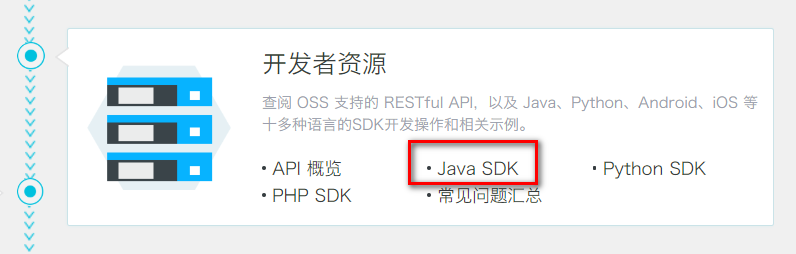

# ** **

# **一、****对象存储OSS**

为了解决海量数据存储与弹性扩容，项目中我们采用云存储的解决方案- 阿里云OSS。 

## 1、开通“对象存储OSS”服务

（1）申请阿里云账号

（2）实名认证

（3）开通“对象存储OSS”服务

（4）进入管理控制台

## 2、创建Bucket

选择：标准存储、公共读、不开通


## 3、上传默认头像

创建文件夹avatar，上传默认的用户头像


## 4、创建RAM子用户


# **二、使用SDK**



## **1、创建Mavaen项目**

com.atguigu

aliyun-oss

## 2、pom

 

```
<dependencies>
    <!--aliyunOSS-->
    <dependency>
        <groupId>com.aliyun.oss</groupId>
        <artifactId>aliyun-sdk-oss</artifactId>
        <version>2.8.3</version>
    </dependency>
    <dependency>
        <groupId>junit</groupId>
        <artifactId>junit</artifactId>
        <version>4.12</version>
    </dependency>
</dependencies>
```

## 3、找到编码时需要用到的常量值

（1）endpoint

（2）bucketName

（3）accessKeyId

（4）accessKeySecret

## 4、测试创建Bucket的连接


 

```
package com.atguigu.oss;
public class OSSTest {
    // Endpoint以杭州为例，其它Region请按实际情况填写。
    String endpoint = "your endpoint";
    // 阿里云主账号AccessKey拥有所有API的访问权限，风险很高。强烈建议您创建并使用RAM账号进行API访问或日常运维，请登录 https://ram.console.aliyun.com 创建RAM账号。
    String accessKeyId = "your accessKeyId";
    String accessKeySecret = "your accessKeySecret";
    String bucketName = "guli-file";
    @Test
    public void testCreateBucket() {
        // 创建OSSClient实例。
        OSSClient ossClient = new OSSClient(endpoint, accessKeyId, accessKeySecret);
        // 创建存储空间。
        ossClient.createBucket(bucketName);
        // 关闭OSSClient。
        ossClient.shutdown();
    }
}
```

## 5、判断存储空间是否存在


 

```
@Test
public void testExist() {
    // 创建OSSClient实例。
    OSSClient ossClient = new OSSClient(endpoint, accessKeyId, accessKeySecret);
    boolean exists = ossClient.doesBucketExist(bucketName);
    System.out.println(exists);
    // 关闭OSSClient。
    ossClient.shutdown();
}
```

## 6、设置存储空间的访问权限

 

```
@Test
public void testAccessControl() {
    // 创建OSSClient实例。
    OSSClient ossClient = new OSSClient(endpoint, accessKeyId, accessKeySecret);
    // 设置存储空间的访问权限为：公共读。
    ossClient.setBucketAcl(bucketName, CannedAccessControlList.PublicRead);
    // 关闭OSSClient。
    ossClient.shutdown();
}
```


## 7、阿里云开发准备


# 一、新建云存储微服务

## 1、在service模块下创建子模块service-oss


## 2、配置pom.xml

service-oss上级模块service已经引入service的公共依赖，所以service-oss模块只需引入阿里云oss相关依赖即可，

service父模块已经引入了service-base模块，所以Swagger相关默认已经引入

 

```
<dependencies>
    <!-- 阿里云oss依赖 -->
    <dependency>
        <groupId>com.aliyun.oss</groupId>
        <artifactId>aliyun-sdk-oss</artifactId>
    </dependency>
    <!-- 日期工具栏依赖 -->
    <dependency>
        <groupId>joda-time</groupId>
        <artifactId>joda-time</artifactId>
    </dependency>
</dependencies>
```

## 3、配置application.properties

 

```
#服务端口
server.port=8002
#服务名
spring.application.name=service-oss
#环境设置：dev、test、prod
spring.profiles.active=dev
        
#阿里云 OSS
#不同的服务器，地址不同
aliyun.oss.file.endpoint=your endpoint
aliyun.oss.file.keyid=your accessKeyId
aliyun.oss.file.keysecret=your accessKeySecret
#bucket可以在控制台创建，也可以使用java代码创建
aliyun.oss.file.bucketname=guli-file
```

## 4、logback-spring.xml

## 5、创建启动类

创建OssApplication.java

 

```
package com.guli.oss;
@SpringBootApplication
@ComponentScan({"com.atguigu"})
public class OssApplication {
    public static void main(String[] args) {
        SpringApplication.run(OssApplication.class, args);
    }
}
```

## 6、启动项目

**报错**


spring boot 会默认加载org.springframework.boot.autoconfigure.jdbc.DataSourceAutoConfiguration这个类，

而DataSourceAutoConfiguration类使用了@Configuration注解向spring注入了dataSource bean，又因为项目（oss模块）中并没有关于dataSource相关的配置信息，所以当spring创建dataSource bean时因缺少相关的信息就会报错。

**解决办法：**

方法1、在@SpringBootApplication注解上加上exclude，解除自动加载DataSourceAutoConfiguration

 

```
@SpringBootApplication(exclude = DataSourceAutoConfiguration.class)
```

# 二、实现文件上传

## 1、从配置文件读取常量

创建常量读取工具类：ConstantPropertiesUtil.java

使用@Value读取application.properties里的配置内容

用spring的 InitializingBean 的 afterPropertiesSet 来初始化配置信息，这个方法将在所有的属性被初始化后调用。

 

```
/**
 * 常量类，读取配置文件application.properties中的配置
 */
@Component
//@PropertySource("classpath:application.properties")
public class ConstantPropertiesUtil implements InitializingBean {
    @Value("${aliyun.oss.file.endpoint}")
    private String endpoint;
    @Value("${aliyun.oss.file.keyid}")
    private String keyId;
    @Value("${aliyun.oss.file.keysecret}")
    private String keySecret;
    @Value("${aliyun.oss.file.filehost}")
    private String fileHost;
    @Value("${aliyun.oss.file.bucketname}")
    private String bucketName;
    public static String END_POINT;
    public static String ACCESS_KEY_ID;
    public static String ACCESS_KEY_SECRET;
    public static String BUCKET_NAME;
    public static String FILE_HOST ;
    @Override
    public void afterPropertiesSet() throws Exception {
        END_POINT = endpoint;
        ACCESS_KEY_ID = keyId;
        ACCESS_KEY_SECRET = keySecret;
        BUCKET_NAME = bucketName;
        FILE_HOST = fileHost;
    }
}
```

## 2、文件上传

创建Service接口：FileService.java

 

```
public interface FileService {
    /**
     * 文件上传至阿里云
     * @param file
     * @return
     */
    String upload(MultipartFile file);
}
```

实现：FileServiceImpl.java

参考SDK中的：Java->上传文件->简单上传->流式上传->上传文件流


```
public class FileServiceImpl implements FileService {
    @Override
    public String upload(MultipartFile file) {
        //获取阿里云存储相关常量
        String endPoint = ConstantPropertiesUtil.END_POINT;
        String accessKeyId = ConstantPropertiesUtil.ACCESS_KEY_ID;
        String accessKeySecret = ConstantPropertiesUtil.ACCESS_KEY_SECRET;
        String bucketName = ConstantPropertiesUtil.BUCKET_NAME;
        String fileHost = ConstantPropertiesUtil.FILE_HOST;
        String uploadUrl = null;
        try {
            //判断oss实例是否存在：如果不存在则创建，如果存在则获取
            OSSClient ossClient = new OSSClient(endPoint, accessKeyId, accessKeySecret);
            if (!ossClient.doesBucketExist(bucketName)) {
                //创建bucket
                ossClient.createBucket(bucketName);
                //设置oss实例的访问权限：公共读
                ossClient.setBucketAcl(bucketName, CannedAccessControlList.PublicRead);
            }
            //获取上传文件流
            InputStream inputStream = file.getInputStream();
            //构建日期路径：avatar/2019/02/26/文件名
            String filePath = new DateTime().toString("yyyy/MM/dd");
            //文件名：uuid.扩展名
            String original = file.getOriginalFilename();
            String fileName = UUID.randomUUID().toString();
            String fileType = original.substring(original.lastIndexOf("."));
            String newName = fileName + fileType;
            String fileUrl = fileHost + "/" + filePath + "/" + newName;
            //文件上传至阿里云
            ossClient.putObject(bucketName, fileUrl, inputStream);
            // 关闭OSSClient。
            ossClient.shutdown();
            //获取url地址
            uploadUrl = "http://" + bucketName + "." + endPoint + "/" + fileUrl;
        } catch (IOException e) {
            throw new GuliException(ResultCodeEnum.FILE_UPLOAD_ERROR);
        }
        return uploadUrl;
    }
}
```

**3、控制层**

创建controller：FileUploadController.java

 

```
package com.guli.oss.controller;
@Api(description="阿里云文件管理")
@CrossOrigin //跨域
@RestController
@RequestMapping("/admin/oss/file")
public class FileController {
    @Autowired
    private FileService fileService;
    /**
     * 文件上传
     *
     * @param file
     */
    @ApiOperation(value = "文件上传")
    @PostMapping("upload")
    public R upload(
            @ApiParam(name = "file", value = "文件", required = true)
            @RequestParam("file") MultipartFile file) {
        String uploadUrl = fileService.upload(file);
        //返回r对象
        return R.ok().message("文件上传成功").data("url", uploadUrl);
    }
}
```

## **4、重启oss服务**

## 5、Swagger中测试文件上传 

## 6、配置nginx反向代理

将接口地址加入nginx配置

 

```
location ~ /eduoss/ {           
    proxy_pass http://localhost:8001;
}
```