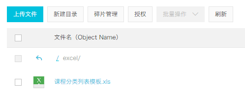
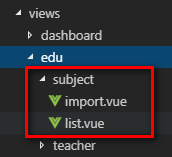

# 1、后端

## 一、添加依赖

### **1、service-edu模块****配置依赖**

 

```
<dependencies>
    <!-- https://mvnrepository.com/artifact/com.alibaba/easyexcel -->
    <dependency>
        <groupId>com.alibaba</groupId>
        <artifactId>easyexcel</artifactId>
        <version>2.1.1</version>
    </dependency>
</dependencies>
```

## 二、业务处理

### 1、SubjectAdminController

 

```
package com.guli.edu.controller.admin;
@Api(description="课程分类管理")
@CrossOrigin //跨域
@RestController
@RequestMapping("/eduservice/subject")
public class SubjectAdminController {
    @Autowired
    private SubjectService subjectService;
    //添加课程分类
    @ApiOperation(value = "Excel批量导入")
    @PostMapping("addSubject")
    public R addSubject(MultipartFile file) {
        //1 获取上传的excel文件 MultipartFile
        //返回错误提示信息
        subjectService.importSubjectData(file,subjectService);
        //判断返回集合是否为空
        return R.ok();
    }
}
```

### 2、创建和Excel对应的实体类

 

```
import com.alibaba.excel.annotation.ExcelProperty;
import lombok.Data;
@Data
public class ExcelSubjectData {
    @ExcelProperty(index = 0)
    private int oneSubjectName;
    @ExcelProperty(index = 1)
    private String twoSubjectName;
}
```

3、SubjectService

#### **（1）接口**

 

```
void batchImport(MultipartFile file);
```

#### **（2）实现类**

 

```
//添加课程分类
//poi读取excel内容
@Override
public void importSubjectData(MultipartFile file,EduSubjectService subjectService) {
    try {
        //1 获取文件输入流
        InputStream inputStream = file.getInputStream();
        // 这里 需要指定读用哪个class去读，然后读取第一个sheet 文件流会自动关闭
        EasyExcel.read(inputStream, ExcelSubjectData.class, new SubjectExcelListener(subjectService)).sheet().doRead();
    }catch(Exception e) {
        e.printStackTrace();
        throw new GuliException(20002,"添加课程分类失败");
    }
}
```

### **4、创建读取Excel监听器**

 

```
import com.alibaba.excel.context.AnalysisContext;
import com.alibaba.excel.event.AnalysisEventListener;
import com.atguigu.eduservice.entity.EduSubject;
import com.atguigu.eduservice.entity.vo.ExcelSubjectData;
import com.atguigu.eduservice.service.EduSubjectService;
import com.atguigu.servicebase.handler.GuliException;
import com.baomidou.mybatisplus.core.conditions.query.QueryWrapper;
import java.util.ArrayList;
import java.util.List;
import java.util.Map;
public class SubjectExcelListener extends AnalysisEventListener<ExcelSubjectData> {
    public EduSubjectService subjectService;
    
    public SubjectExcelListener() {}
    //创建有参数构造，传递subjectService用于操作数据库
    public SubjectExcelListener(EduSubjectService subjectService) {
        this.subjectService = subjectService;
    }
    //一行一行去读取excle内容
    @Override
    public void invoke(ExcelSubjectData user, AnalysisContext analysisContext) {
        if(user == null) {
            throw new GuliException(20001,"添加失败");
        }
        //添加一级分类
        EduSubject existOneSubject = this.existOneSubject(subjectService,user.getOneSubjectName());
        if(existOneSubject == null) {//没有相同的
            existOneSubject = new EduSubject();
            existOneSubject.setTitle(user.getOneSubjectName());
            existOneSubject.setParentId("0");
            subjectService.save(existOneSubject);
        }
        //获取一级分类id值
        String pid = existOneSubject.getId();
        
        //添加二级分类
        EduSubject existTwoSubject = this.existTwoSubject(subjectService,user.getTwoSubjectName(), pid);
        if(existTwoSubject == null) {
            existTwoSubject = new EduSubject();
            existTwoSubject.setTitle(user.getTwoSubjectName());
            existTwoSubject.setParentId(pid);
            subjectService.save(existTwoSubject);
        }
    }
    //读取excel表头信息
    @Override
    public void invokeHeadMap(Map<Integer, String> headMap, AnalysisContext context) {
        System.out.println("表头信息："+headMap);
    }
    //读取完成后执行
    @Override
    public void doAfterAllAnalysed(AnalysisContext analysisContext) {}
    //判断一级分类是否重复
    private EduSubject existTwoSubject(EduSubjectService subjectService,String name,String pid) {
        QueryWrapper<EduSubject> wrapper = new QueryWrapper<>();
        wrapper.eq("title",name);
        wrapper.eq("parent_id",pid);
        EduSubject eduSubject = subjectService.getOne(wrapper);
        return eduSubject;
    }
    //判断一级分类是否重复
    private EduSubject existOneSubject(EduSubjectService subjectService,String name) {
        QueryWrapper<EduSubject> wrapper = new QueryWrapper<>();
        wrapper.eq("title",name);
        wrapper.eq("parent_id","0");
        EduSubject eduSubject = subjectService.getOne(wrapper);
        return eduSubject;
    }
}
```

# 2、前端

## 一、前端实现

### 1、参考 views/tree/index.vue

### 2、创建api

api/edu/subject.js

 

```
import request from '@/utils/request'
const api_name = '/admin/edu/subject'
export default {
  getNestedTreeList() {
    return request({
      url: `${api_name}`,
      method: 'get'
    })
  }
}
```

### 3、list.vue

 

```
<template>
  <div class="app-container">
    <el-input v-model="filterText" placeholder="Filter keyword" style="margin-bottom:30px;" />
    <el-tree
      ref="subjectTree"
      :data="subjectList"
      :props="defaultProps"
      :filter-node-method="filterNode"
      class="filter-tree"
      default-expand-all
    />
  </div>
</template>
<script>
import subject from '@/api/edu/subject'
export default {
  data() {
    return {
      filterText: '',
      subjectList: [],
      defaultProps: {
        children: 'children',
        label: 'title'
      }
    }
  },
  watch: {
    filterText(val) {
      this.$refs.subjectTree.filter(val)
    }
  },
  created() {
    this.fetchNodeList()
  },
  methods: {
    fetchNodeList() {
      subject.getNestedTreeList().then(response => {
        if (response.success === true) {
          this.subjectList = response.data.items
        }
      })
    },
    filterNode(value, data) {
      if (!value) return true
      return data.title.indexOf(value) !== -1
    }
  }
}
</script>
```

## 二、上传文件组件

### 一、Excel模板

#### 1、编辑Excel模板

#### 2、将文件上传至阿里云OSS



### 二、配置路由

#### 1、添加路由

 

```
// 课程分类管理
{
  path: '/edu/subject',
  component: Layout,
  redirect: '/edu/subject/list',
  name: 'Subject',
  meta: { title: '课程分类管理', icon: 'nested' },
  children: [
    {
      path: 'list',
      name: 'EduSubjectList',
      component: () => import('@/views/edu/subject/list'),
      meta: { title: '课程分类列表' }
    },
    {
      path: 'import',
      name: 'EduSubjectImport',
      component: () => import('@/views/edu/subject/import'),
      meta: { title: '导入课程分类' }
    }
  ]
},
```

#### 2、添加vue组件



三、表单组件import.vue1、js定义数据

 

```
<script>
export default {
  data() {
    return {
      BASE_API: process.env.BASE_API, // 接口API地址
      OSS_PATH: process.env.OSS_PATH, // 阿里云OSS地址
      fileUploadBtnText: '上传到服务器', // 按钮文字
      importBtnDisabled: false, // 按钮是否禁用,
      loading: false
    }
  }
}
</script>
```

#### 2、template

 

```
<template>
  <div class="app-container">
    <el-form label-width="120px">
      <el-form-item label="信息描述">
        <el-tag type="info">excel模版说明</el-tag>
        <el-tag>
          <i class="el-icon-download"/>
          <a :href="OSS_PATH + '/excel/%E8%AF%BE%E7%A8%8B%E5%88%86%E7%B1%BB%E5%88%97%E8%A1%A8%E6%A8%A1%E6%9D%BF.xls'">点击下载模版</a>
        </el-tag>
      </el-form-item>
      <el-form-item label="选择Excel">
        <el-upload
          ref="upload"
          :auto-upload="false"
          :on-success="fileUploadSuccess"
          :on-error="fileUploadError"
          :disabled="importBtnDisabled"
          :limit="1"
          :action="BASE_API+'/admin/edu/subject/import'"
          name="file"
          accept="application/vnd.ms-excel">
          <el-button slot="trigger" size="small" type="primary">选取文件</el-button>
          <el-button
            :loading="loading"
            style="margin-left: 10px;"
            size="small"
            type="success"
            @click="submitUpload">{{ fileUploadBtnText }}</el-button>
        </el-upload>
      </el-form-item>
    </el-form>
  </div>
</template>
```

#### 3、js上传方法

 

```
methods: {
    submitUpload() {
      this.fileUploadBtnText = '正在上传'
      this.importBtnDisabled = true
      this.loading = true
      this.$refs.upload.submit()
    },
    fileUploadSuccess(response) {
      
    },
    fileUploadError(response) {
      
    }
}
```

#### 4、回调函数

 

```
fileUploadSuccess(response) {
    if (response.success === true) {
    this.fileUploadBtnText = '导入成功'
    this.loading = false
    this.$message({
        type: 'success',
        message: response.message
    })
    } 
},
fileUploadError(response) {
    this.fileUploadBtnText = '导入失败'
    this.loading = false
    this.$message({
    type: 'error',
    message: '导入失败'
    })
}
```

### 三、课程发布表单

#### 一、需求


#### 二、配置路由

##### 1、添加路由

 

```
// 课程管理
{
  path: '/edu/course',
  component: Layout,
  redirect: '/edu/course/list',
  name: 'Course',
  meta: { title: '课程管理', icon: 'form' },
  children: [
    {
      path: 'list',
      name: 'EduCourseList',
      component: () => import('@/views/edu/course/list'),
      meta: { title: '课程列表' }
    },
    {
      path: 'info',
      name: 'EduCourseInfo',
      component: () => import('@/views/edu/course/info'),
      meta: { title: '发布课程' }
    },
    {
      path: 'info/:id',
      name: 'EduCourseInfoEdit',
      component: () => import('@/views/edu/course/info'),
      meta: { title: '编辑课程基本信息', noCache: true },
      hidden: true
    },
    {
      path: 'chapter/:id',
      name: 'EduCourseChapterEdit',
      component: () => import('@/views/edu/course/chapter'),
      meta: { title: '编辑课程大纲', noCache: true },
      hidden: true
    },
    {
      path: 'publish/:id',
      name: 'EduCoursePublishEdit',
      component: () => import('@/views/edu/course/publish'),
      meta: { title: '发布课程', noCache: true },
      hidden: true
    }
  ]
},
```

##### 2、添加vue组件


#### 三、整合步骤条组件

参考 http://element-cn.eleme.io/#/zh-CN/component/steps

##### 1、课程信息页面

info.vue

 

```
<template>
  <div class="app-container">
    <h2 style="text-align: center;">发布新课程</h2>
    <el-steps :active="1" process-status="wait" align-center style="margin-bottom: 40px;">
      <el-step title="填写课程基本信息"/>
      <el-step title="创建课程大纲"/>
      <el-step title="提交审核"/>
    </el-steps>
    <el-form label-width="120px">
      <el-form-item>
        <el-button :disabled="saveBtnDisabled" type="primary" @click="next">保存并下一步</el-button>
      </el-form-item>
    </el-form>
  </div>
</template>
<script>
export default {
  data() {
    return {
      saveBtnDisabled: false // 保存按钮是否禁用
    }
  },
  created() {
    console.log('info created')
  },
  methods: {
    next() {
      console.log('next')
      this.$router.push({ path: '/edu/course/chapter/1' })
    }
  }
}
</script>
```

##### 2、课程大纲页面

chapter.vue

 

```
<template>
  <div class="app-container">
    <h2 style="text-align: center;">发布新课程</h2>
    <el-steps :active="2" process-status="wait" align-center style="margin-bottom: 40px;">
      <el-step title="填写课程基本信息"/>
      <el-step title="创建课程大纲"/>
      <el-step title="提交审核"/>
    </el-steps>
    <el-form label-width="120px">
      <el-form-item>
        <el-button @click="previous">上一步</el-button>
        <el-button :disabled="saveBtnDisabled" type="primary" @click="next">下一步</el-button>
      </el-form-item>
    </el-form>
  </div>
</template>
<script>
export default {
  data() {
    return {
      saveBtnDisabled: false // 保存按钮是否禁用
    }
  },
  created() {
    console.log('chapter created')
  },
  methods: {
    previous() {
      console.log('previous')
      this.$router.push({ path: '/edu/course/info/1' })
    },
    next() {
      console.log('next')
      this.$router.push({ path: '/edu/course/publish/1' })
    }
  }
}
</script>
```

##### 3、课程发布页面

publish.vue

 

```
<template>
  <div class="app-container">
    <h2 style="text-align: center;">发布新课程</h2>
    <el-steps :active="3" process-status="wait" align-center style="margin-bottom: 40px;">
      <el-step title="填写课程基本信息"/>
      <el-step title="创建课程大纲"/>
      <el-step title="提交审核"/>
    </el-steps>
    <el-form label-width="120px">
      <el-form-item>
        <el-button @click="previous">返回修改</el-button>
        <el-button :disabled="saveBtnDisabled" type="primary" @click="publish">发布课程</el-button>
      </el-form-item>
    </el-form>
  </div>
</template>
<script>
export default {
  data() {
    return {
      saveBtnDisabled: false // 保存按钮是否禁用
    }
  },
  created() {
    console.log('publish created')
  },
  methods: {
    previous() {
      console.log('previous')
      this.$router.push({ path: '/edu/course/chapter/1' })
    },
    publish() {
      console.log('publish')
      this.$router.push({ path: '/edu/course/list' })
    }
  }
}
</script>
```

# 二、后端实现

### 1、创建vo

 

```
package com.guli.edu.vo;
@Data
public class SubjectVo {
    private String id;
    private String title;
}
```

 

```
package com.guli.edu.vo;
@Data
public class SubjectNestedVo {
    private String id;
    private String title;
    private List<SubjectVo> children = new ArrayList<>();
}
```

### 2、创建controller

 

```
@ApiOperation(value = "嵌套数据列表")
@GetMapping("")
public R nestedList(){
    List<SubjectNestedVo> subjectNestedVoList = subjectService.nestedList();
    return R.ok().data("items", subjectNestedVoList);
}
```

### 3、创建service

接口

 

```
List<SubjectNestedVo> nestedList();
```

实现Final

 

```
@Override
public List<SubjectNestedVo> nestedList() {
    //最终要的到的数据列表
    ArrayList<SubjectNestedVo> subjectNestedVoArrayList = new ArrayList<>();
    //获取一级分类数据记录
    QueryWrapper<Subject> queryWrapper = new QueryWrapper<>();
    queryWrapper.eq("parent_id", 0);
    queryWrapper.orderByAsc("sort", "id");
    List<Subject> subjects = baseMapper.selectList(queryWrapper);
    //获取二级分类数据记录
    QueryWrapper<Subject> queryWrapper2 = new QueryWrapper<>();
    queryWrapper2.ne("parent_id", 0);
    queryWrapper2.orderByAsc("sort", "id");
    List<Subject> subSubjects = baseMapper.selectList(queryWrapper2);
    //填充一级分类vo数据
    int count = subjects.size();
    for (int i = 0; i < count; i++) {
        Subject subject = subjects.get(i);
        //创建一级类别vo对象
        SubjectNestedVo subjectNestedVo = new SubjectNestedVo();
        BeanUtils.copyProperties(subject, subjectNestedVo);
        subjectNestedVoArrayList.add(subjectNestedVo);
        //填充二级分类vo数据
        ArrayList<SubjectVo> subjectVoArrayList = new ArrayList<>();
        int count2 = subSubjects.size();
        for (int j = 0; j < count2; j++) {
            Subject subSubject = subSubjects.get(j);
            if(subject.getId().equals(subSubject.getParentId())){
                //创建二级类别vo对象
                SubjectVo subjectVo = new SubjectVo();
                BeanUtils.copyProperties(subSubject, subjectVo);
                subjectVoArrayList.add(subjectVo);
            }
        }
        subjectNestedVo.setChildren(subjectVoArrayList);
    }
    return subjectNestedVoArrayList;
}
```

## 三、优化前端过滤功能

 

```
filterNode(value, data) {
    if (!value) return true
    return data.title.toLowerCase().indexOf(value.toLowerCase()) !== -1
}
```

