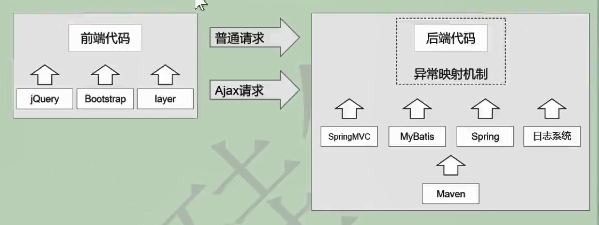
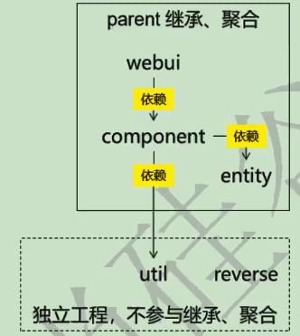

# 1、环境搭建

## 1）总体目标



## 2）项目架构图



## 3）项目构建

```xml
创建一个空项目(com.z.crowd)--》创建第一个父模块(crowdfunding01-admin-parent)--打包方式：pom
-->创建子模块admin的子模块(crowdfunding02-admin-webui)：war
-->创建模块2(crowdfunding03-admin-component)：jar
-->模块3(corwdfunding04-admin-entity)：jar
-->创建与父模块同级模块(crowdfunding05-common-util)：jar
-->同上(crowdfunding06-common-reverse)：jar
```

细节：注意目录结构，一定是要

```shell
com.z.crowd
--|parent
   --|webui
   --|component
   --|entity
--|util
--|reverse
```

==所以创建空项目下一级的子模块的时候一定要看清楚路径== 

## 4）数据库


## 5）父工程依赖

```xml
<?xml version="1.0" encoding="UTF-8"?>
<project xmlns="http://maven.apache.org/POM/4.0.0"
         xmlns:xsi="http://www.w3.org/2001/XMLSchema-instance"
         xsi:schemaLocation="http://maven.apache.org/POM/4.0.0 http://maven.apache.org/xsd/maven-4.0.0.xsd">
    <modelVersion>4.0.0</modelVersion>

    <groupId>com.z.crowd</groupId>
    <artifactId>crowdfunding01-admin-parent</artifactId>
    <version>1.0-SNAPSHOT</version>
    <modules>
        <module>crowdfunding02-admin-webui</module>
        <module>crowdfunding03-admin-component</module>
        <module>corwdfunding04-admin-entity</module>
    </modules>
    <packaging>pom</packaging>

    <properties>
        <spring.version>4.3.20.RELEASE</spring.version>
        <spring.security.version>4.2.10.RELEASE</spring.security.version>
    </properties>
    <dependencyManagement>

        <dependencies>
            <dependency>
                <groupId>org.springframework</groupId>
                <artifactId>spring-orm</artifactId>
                <version>${spring.version}</version>
            </dependency>
            <dependency>
                <groupId>org.springframework</groupId>
                <artifactId>spring-webmvc</artifactId>
                <version>${spring.version}</version>
            </dependency>
            <dependency>
                <groupId>org.springframework</groupId>
                <artifactId>spring-test</artifactId>
                <version>${spring.version}</version>
            </dependency>
            <dependency>
                <groupId>org.aspectj</groupId>
                <artifactId>aspectjweaver</artifactId>
                <version>1.9.2</version>
            </dependency>
            <dependency>
                <groupId>cglib</groupId>
                <artifactId>cglib</artifactId>
                <version>2.2</version>
            </dependency>


            <dependency>
                <groupId>mysql</groupId>
                <artifactId>mysql-connector-java</artifactId>
                <version>8.0.19</version>
            </dependency>
            <dependency>
                <groupId>com.alibaba</groupId>
                <artifactId>druid</artifactId>
                <version>1.0.31</version>
            </dependency>
            <dependency>
                <groupId>org.mybatis</groupId>
                <artifactId>mybatis</artifactId>
                <version>3.2.8</version>
            </dependency>
            <dependency>
                <groupId>org.mybatis</groupId>
                <artifactId>mybatis-spring</artifactId>
                <version>1.2.2</version>
            </dependency>
            <dependency>
                <groupId>com.github.pagehelper</groupId>
                <artifactId>pagehelper</artifactId>
                <version>4.0.0</version>
            </dependency>


            <dependency>
                <groupId>org.slf4j</groupId>
                <artifactId>slf4j-api</artifactId>
                <version>1.7.7</version>
            </dependency>
            <dependency>
                <groupId>ch.qos.logback</groupId>
                <artifactId>logback-classic</artifactId>
                <version>1.2.3</version>
            </dependency>
            <dependency>
                <groupId>org.slf4j</groupId>
                <artifactId>jcl-over-slf4j</artifactId>
                <version>1.7.25</version>
            </dependency>
            <dependency>
                <groupId>org.slf4j</groupId>
                <artifactId>jul-to-slf4j</artifactId>
                <version>1.7.25</version>
            </dependency>


            <dependency>
                <groupId>com.fasterxml.jackson.core</groupId>
                <artifactId>jackson-core</artifactId>
                <version>2.9.8</version>
            </dependency>
            <dependency>
                <groupId>com.fasterxml.jackson.core</groupId>
                <artifactId>jackson-databind</artifactId>
                <version>2.9.8</version>
            </dependency>
            <dependency>
                <groupId>jstl</groupId>
                <artifactId>jstl</artifactId>
                <version>1.2</version>
            </dependency>

            <dependency>
                <groupId>junit</groupId>
                <artifactId>junit</artifactId>
                <version>4.12</version>
                <scope>test</scope>
            </dependency>
            <dependency>
                <groupId>javax.servlet</groupId>
                <artifactId>javax.servlet-api</artifactId>
                <version>3.1.0</version>
                <scope>provided</scope>
            </dependency>
            <dependency>
                <groupId>javax.servlet.jsp</groupId>
                <artifactId>jsp-api</artifactId>
                <version>2.1.3-b06</version>
                <scope>provided</scope>
            </dependency>
            <dependency>
                <groupId>com.google.code.gson</groupId>
                <artifactId>gson</artifactId>
                <version>2.8.5</version>
            </dependency>

            <dependency>
                <groupId>org.springframework.security</groupId>
                <artifactId>spring-security-web</artifactId>
                <version>4.2.10.RELEASE</version>
            </dependency>

        </dependencies>
    </dependencyManagement>
</project>
```

## 6）Component的pom

```xml
 <dependency>
                <groupId>org.springframework</groupId>
                <artifactId>spring-orm</artifactId>
                <version>${spring.version}</version>
            </dependency>
            <dependency>
                <groupId>org.springframework</groupId>
                <artifactId>spring-webmvc</artifactId>
                <version>${spring.version}</version>
            </dependency>
<dependency>
                <groupId>org.aspectj</groupId>
                <artifactId>aspectjweaver</artifactId>
                <version>1.9.2</version>
            </dependency>
            <dependency>
                <groupId>cglib</groupId>
                <artifactId>cglib</artifactId>
                <version>2.2</version>
            </dependency>
<dependency>
                <groupId>mysql</groupId>
                <artifactId>mysql-connector-java</artifactId>
                <version>8.0.19</version>
            </dependency>
            <dependency>
                <groupId>com.alibaba</groupId>
                <artifactId>druid</artifactId>
                <version>1.0.31</version>
            </dependency>
            <dependency>
                <groupId>org.mybatis</groupId>
                <artifactId>mybatis</artifactId>
                <version>3.2.8</version>
            </dependency>
            <dependency>
                <groupId>org.mybatis</groupId>
                <artifactId>mybatis-spring</artifactId>
                <version>1.2.2</version>
            </dependency>
            <dependency>
                <groupId>com.github.pagehelper</groupId>
                <artifactId>pagehelper</artifactId>
                <version>4.0.0</version>
            </dependency>
<dependency>
                <groupId>com.fasterxml.jackson.core</groupId>
                <artifactId>jackson-core</artifactId>
                <version>2.9.8</version>
            </dependency>
            <dependency>
                <groupId>com.fasterxml.jackson.core</groupId>
                <artifactId>jackson-databind</artifactId>
                <version>2.9.8</version>
            </dependency>
            <dependency>
                <groupId>jstl</groupId>
                <artifactId>jstl</artifactId>
                <version>1.2</version>
            </dependency>
 <dependency>
                <groupId>com.google.code.gson</groupId>
                <artifactId>gson</artifactId>
                <version>2.8.5</version>
            </dependency>

```

## 7）写配置

`db.properties` `spring-persist-mybatis.xml` 

## 8）测试

在 webui 模块，记得导包

```java
@ContextConfiguration(locations = {"classpath:spring-persist-mybatis.xml"})
@RunWith(value = SpringJUnit4ClassRunner.class)
public class MyTest {

    @Autowired
    private DataSource dataSource;

    @Test
    public void testConnection() throws SQLException {
        Connection connection = dataSource.getConnection();
        System.out.println(connection);
    }
}
```

## 9）日志环境搭建

更换日志系统

在pom排除默认日志依赖，加上 `jcl-over-slf4j` 

```xml
<?xml version="1.0" encoding="UTF-8"?>
<configuration>

    <!-- magenta:洋红 -->
    <!-- boldMagenta:粗红-->
    <!-- cyan:青色 -->
    <!-- white:白色 -->
    <!-- magenta:洋红 -->

    <property name="CONSOLE_LOG_PATTERN"
              value="%yellow(%date{yyyy-MM-dd HH:mm:ss}) |%highlight(%-5level) |%blue(%thread) |%blue(%file:%line) |%green(%logger) |%cyan(%msg%n)"/>

    <property name="FILE_PATH"
              value="/root/sys/logs/member"/>

    <!--==================写入文件==================-->

    <appender name="logfile" class="ch.qos.logback.core.rolling.RollingFileAppender">
        <File>${FILE_PATH}/log/aurora-member.log</File>
        <encoder>
            <!--   <pattern>%date %level [%thread] %logger{10} [%file:%line] %msg%n</pattern> -->
            <pattern>${CONSOLE_LOG_PATTERN}</pattern>

        </encoder>
        <rollingPolicy class="ch.qos.logback.core.rolling.TimeBasedRollingPolicy">
            <fileNamePattern>${FILE_PATH}/log/aurora-member-%d{yyyy-MM-dd}.%i.log</fileNamePattern>
            <maxHistory>30</maxHistory>
            <TimeBasedFileNamingAndTriggeringPolicy class="ch.qos.logback.core.rolling.SizeAndTimeBasedFNATP">
                <maxFileSize>512MB</maxFileSize>
            </TimeBasedFileNamingAndTriggeringPolicy>
        </rollingPolicy>
    </appender>
    <!--==================写入文件==================-->


    <!--==================异常日志==================-->
    <appender name="error_file" class="ch.qos.logback.core.rolling.RollingFileAppender">
        <file>${FILE_PATH}/member-error/member-error.log</file>
        <!-- 只打印错误日志 -->
        <filter class="ch.qos.logback.classic.filter.LevelFilter">
            <level>ERROR</level>
            <onMatch>ACCEPT</onMatch>
            <onMismatch>DENY</onMismatch>
        </filter>
        <rollingPolicy class="ch.qos.logback.core.rolling.TimeBasedRollingPolicy">
            <fileNamePattern>
                ${FILE_PATH}/member-error/member-error-%d{yyyy-MM-dd}.%i.log
            </fileNamePattern>
            <maxHistory>30</maxHistory>
            <TimeBasedFileNamingAndTriggeringPolicy
                    class="ch.qos.logback.core.rolling.SizeAndTimeBasedFNATP">
                <maxFileSize>512MB</maxFileSize>
            </TimeBasedFileNamingAndTriggeringPolicy>
        </rollingPolicy>
        <encoder>
            <pattern>${CONSOLE_LOG_PATTERN}</pattern>
        </encoder>
    </appender>
    <!--==================异常日志==================-->


    <!--==================控制台==================-->

    <appender name="stdout" class="ch.qos.logback.core.ConsoleAppender">
        <encoder>
            <pattern>${CONSOLE_LOG_PATTERN}</pattern>
        </encoder>
    </appender>
    <!--==================控制台==================-->

    <logger name="com.ibatis" level="INFO"/>
    <logger name="org.springframework" level="INFO"/>
    <logger name="java.sql.PreparedStatement" level="INFO"/>
    <logger name="org.springframework.web.servlet.DispatcherServlet" level="INFO"/>
    <logger name="com.ibatis.sqlmap.engine.impl.SqlMapClientDelegate" level="INFO"/>
    <logger name="java.sql" level="INFO"/>
    <logger name="org.apache.commons" level="INFO"/>
    <logger name="java.sql.Statement" level="INFO"/>
    <logger name="org.springframework.web.context.support.XmlWebApplicationContext" level="INFO"/>
    <logger name="com.ibatis.common.jdbc.SimpleDataSource" level="INFO"/>
    <logger name="org.springframework.web.servlet.handler.SimpleUrlHandlerMapping" level="INFO"/>
    <logger name="java.sql.ResultSet" level="INFO"/>
    <logger name="java.sql.Connection" level="INFO"/>
    <logger name="com.ibatis.common.jdbc.ScriptRunner" level="INFO"/>
    <logger name="com.z.crowd.mapper" level="INFO"/>
    <root level="DEBUG">
        <appender-ref ref="logfile"/>
        <appender-ref ref="stdout"/>
        <appender-ref ref="error_file" />
    </root>
</configuration>
```

## 10）声明式事务


```xml
<?xml version="1.0" encoding="UTF-8"?>
<beans xmlns="http://www.springframework.org/schema/beans"
       xmlns:xsi="http://www.w3.org/2001/XMLSchema-instance"
       xmlns:context="http://www.springframework.org/schema/context"
       xmlns:aop="http://www.springframework.org/schema/aop" xmlns:tx="http://www.springframework.org/schema/tx"
       xsi:schemaLocation="http://www.springframework.org/schema/beans http://www.springframework.org/schema/beans/spring-beans.xsd http://www.springframework.org/schema/context http://www.springframework.org/schema/context/spring-context.xsd http://www.springframework.org/schema/aop http://www.springframework.org/schema/aop/spring-aop.xsd http://www.springframework.org/schema/tx http://www.springframework.org/schema/cache/spring-tx.xsd">

    <context:component-scan base-package="com.z.crowd.service"/>

    <bean id="txManager" class="org.springframework.jdbc.datasource.DataSourceTransactionManager">
        <property name="dataSource" ref="dataSource"/>
    </bean>

    <tx:advice transaction-manager="txManager" id="txAdvice">
        <tx:attributes>
            <tx:method name="get*" read-only="true"/>
            <tx:method name="query*" read-only="true"/>
            <tx:method name="find*" read-only="true"/>
            <tx:method name="count*" read-only="true"/>
            <!--propagation属性：
                    REQUIRED:默认值，表示当前方法必须工作在事务中，如果当前线程上没有已经开启的事务，则自己开新的事务
                        如果已经有了，就使用已有的事务。
                        但是使用已有的事务，意味着会被其他事务影响。
                    REQUIRED_NEW：建议使用的值，不管当前线程上有没有事务，都开启新的事务。
            -->
            <!--
                rollback-for：配置事务方法遇到什么异常才回滚
                    默认：运行时异常回滚
                    建议：编译时异常和运行时异常都回滚
            -->
            <tx:method name="save*" propagation="REQUIRES_NEW" rollback-for="java.lang.Exception"/>
            <tx:method name="update*" propagation="REQUIRES_NEW" rollback-for="java.lang.Exception"/>
            <tx:method name="remove*" propagation="REQUIRES_NEW" rollback-for="java.lang.Exception"/>
            <tx:method name="batch*" propagation="REQUIRES_NEW" rollback-for="java.lang.Exception"/>

        </tx:attributes>
    </tx:advice>

    <aop:config>
        <aop:pointcut id="txPointcut" expression="execution(* *..*ServiceImpl.*(..))"/>
        <aop:advisor advice-ref="txAdvice" pointcut-ref="txPointcut"/>
    </aop:config>

</beans>
```

注意

基于 xml 的声明式事务中，事务的属性 `tx:method` 是必须配置的，如果某个方法没有配置对应的 `tx:method` ，那么事务对这个方法就不生效了

顺序 ：

`DataSourceTransactionManager` --》`tx:advice` --》`tx:method` --》`aop:config` 

## 11）前端

配置一个公共路径

```java
<base href="http://${pageContext.request.serverName}:${pageContext.request.serverPort}${pageContext.request.contextPath}/">

```

ajax

```html
 var array = [2,6,23];
            var str = JSON.stringify(array);
            $("#btn2").click(function(){
                $.ajax({
                    "url": "send/array/two.html",
                    "contentType": "application/json;charset=UTF-8",
                    "type": "post",
                    "data": {"array": str},
                    "dataType": "text",
                    "success": function(result) {
                        alert(result);
                    },
                    "error": function(result) {
                        alert(result);
                    }
                });
            });
```

ajax请求返回数据的规范

```java
public class ResultEntity<T>{

    public static final String SUCCESS = "SUCCESS";
    public static final String FAILED = "FAILED";

    private String result;
    private String message;
    private T data;

    public static <E> ResultEntity<E> successWithoutData() {
        return new ResultEntity<E>(SUCCESS, null, null);
    }

    public static <E> ResultEntity<E> successWithData(E data) {
        return new ResultEntity<E>(SUCCESS, null, data);
    }

    public static <E> ResultEntity<E> failed(String message) {
        return new ResultEntity<E>(null, message, null);
    }

    public ResultEntity() {
    }

    public ResultEntity(String result, String message, T data) {
        this.result = result;
        this.message = message;
        this.data = data;
    }

    @Override
    public String toString() {
        return "ResultEntity{" +
                "result='" + result + '\'' +
                ", message='" + message + '\'' +
                ", data=" + data +
                '}';
    }

    public String getResult() {
        return result;
    }

    public void setResult(String result) {
        this.result = result;
    }

    public String getMessage() {
        return message;
    }

    public void setMessage(String message) {
        this.message = message;
    }

    public T getData() {
        return data;
    }

    public void setData(T data) {
        this.data = data;
    }
}
```


## 12）异常解析器

```java
@ControllerAdvice
public class CrowdExceptionResolver {


    @ExceptionHandler(value = NullPointerException.class)
    public ModelAndView resolveNullPointException(
        NullPointerException e,
        HttpServletRequest request,
        HttpServletResponse response) throws IOException
    {
        return commonResolve("system-error", e, request, response);
    }


    private ModelAndView commonResolve(
        String viewName,
        Exception e,
        HttpServletRequest request,
        HttpServletResponse response
    ) throws IOException
    {
        String message = e.getMessage();
        boolean judgeResult = CrowdUtil.judgeRequestType(request);
        if (judgeResult) {
            ResultEntity<Object> result = ResultEntity.failed(message);
            Gson gson = new Gson();
            String json = gson.toJson(result);
            response.getWriter().write(json);
            return null;
        } else {
            ModelAndView mav = new ModelAndView();
            mav.addObject("exception", e);
            mav.setViewName(viewName);
            return mav;
        }
    }
}

```


## 13）自定义异常

```java
package com.z.crowd.exception;

/**
 * @Author : zfl
 * @Create 2020/6/23 13:26
 * 登录失败后抛出的异常
 */

public class LoginFailedException extends RuntimeException {

    private static final long serialVersionUID = 1;

    public LoginFailedException() {
    }

    public LoginFailedException(String message) {
        super(message);
    }

    public LoginFailedException(String message, Throwable cause) {
        super(message, cause);
    }

    public LoginFailedException(Throwable cause) {
        super(cause);
    }

    public LoginFailedException(String message, Throwable cause, boolean enableSuppression, boolean writableStackTrace) {
        super(message, cause, enableSuppression, writableStackTrace);
    }
}

```

要加个异常解析器，然后页面接受异常信息并处理，就可以了


## 14）MD5加密工具

```java
/**
     * @Author: zfl
     * @Date: 2020/6/23 13:22
     * @param 传入的字符串
     * @return 加密结果
     */
public static String md5(String source) {
    if (StringUtils.isEmpty(source)) {
        throw new RuntimeException(CrowdConstant.MESSAGE_STRING_INVALID);
    }
    String algorithm = "md5";
    // 获取messageDigest对象
    try {
        MessageDigest messageDigest = MessageDigest.getInstance(algorithm);
        byte[] in = source.getBytes();

        byte[] output = messageDigest.digest(in);

        // 创建BigInteger对象
        int signum = 1;
        BigInteger bigInteger = new BigInteger(signum, output);

        // 按照16进制将bigInteger的值转换为字符串
        String encoded = bigInteger.toString().toUpperCase();
        return encoded;
    } catch (NoSuchAlgorithmException e) {
        e.printStackTrace();
    }
    return null;
}
```


## 15）表单幂等性

防止二次提交：--》重定向

配置视图控制器

```xml
<mvc:view-controller path="/amdin/to/main/page.xml" viewName="admin-main"></mvc:view-controller>
```

Handler

```java
return "redirect:/admin/to/main/page.xml";
```

## 16）拦截器配置

```xml
<mvc:interceptors>
    <mvc:interceptor>
        <!--/*代表一层路径，/**对应多层路径-->
        <mvc:mapping path="/**"/>
        <mvc:exclude-mapping path="*.js"/>
        <mvc:exclude-mapping path="*.css"/>
        <mvc:exclude-mapping path="/admin/to/login/page.html"/>
        <bean class="com.z.crowd.mvc.interceptor.LoginInterceptor"/>
    </mvc:interceptor>
</mvc:interceptors>
```


## 18）PageHelper

在 mybatis-config 中配置插件

```xml
<plugins>
    <plugin interceptor="com.github.pagehelper.PageHelper">
        <property name="dialect" value="mysql"/>
        <property name="reasonable" value="true"/>
    </plugin>
</plugins>
```

## 19）模糊查询

```xml
<select id="selectAdminByKeyword" resultMap="BaseResultMap">
        select
        <include refid="Base_Column_List"/>
        from
        t_admin
        where login_acct like concat("%", #{keyword}, "%")
                or
              user_name like concat("%", #{keyword}, "%")
                or
              email like concat("%", #{keyword}, "%")
</select>
```


## 20）Layer

### 1）删除确认

layer.confirm();

```html
<button th:attr="del_uri=@{/admin/remove/} + ${admin.id}" type="button" class=" delBtn btn btn-danger btn-xs"><i
                                                                                                                 class=" glyphicon glyphicon-remove"></i></button>
<form id="delForm" method="post">

</form>

<script type="application/javascript">
    $(".delBtn").click(function() {
        // 获取标签中的自定义属性
        var del_uri = $(this).attr("del_uri");
        // 使用layer的确认框
        layer.confirm(
            //确定框内内容
            '确认删除用户吗？',{
			//定义按钮内容
            bth:['确定','取消'],
            //定义确认框的标题
            title: '删除用户',
            //第一个按钮的事件
            btn1:function(index) {
                $("#delForm").attr("action", del_uri).submit();
            },
             //第二个
            btn2:function(){
            }
    })

    });
</script>
```


## 21）权限管理

自己写一个sql语句，在RoleMapper.xml 里面

```xml
<select id="selectRoleByKeyword">
    select
    <include refid="Base_Column_List"/>
    from
    t_role
    where
    name like concat("%",#{keyword},"%")
</select>
```


```xml

```


