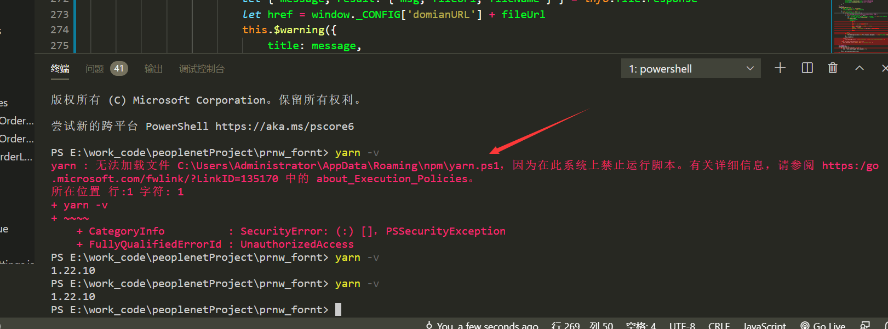

### Win找不到Hosts

如果Window找不到hosts文件，那么如果有`Imhosts.sam`文件的话，就复制一份并且改名为hosts就好了。

如果连`Imhosts.sam`也没有的话，直接新建一个hosts也是可以的；


# 解决VS Code 内部终端无法执行某些命令的问题

例如 `yarn -v` 之类的会因为权限不够还是什么鬼的执行不了。

百度了很多教程，都是说以管理员方式运行vscode，然并卵


## 报错实例：


```java
使用 yarn --version时提示 无法加载文件 C:\Users\XXX\AppData\Roaming\npm\yarn.ps1，因为在此系统上禁止运行脚本
```




## 解决方式：

管理员运行powershell

**set-ExecutionPolicy RemoteSigned** 

****

使用 `win+R` 输入 `powershell` ，这样子打开的终端是不行的，需要找到这个PowerShell，以管理员方式运行，然后在使用上面的方法