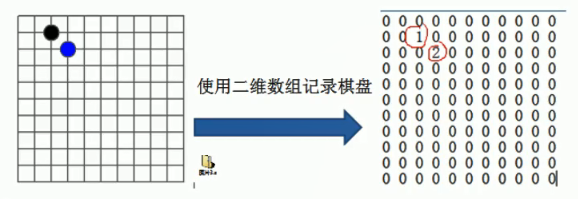

算法时间复杂度排序--》常数<对数(log2n)<幂函数(n^1)<指数(n^n)<阶数(n^!)

==常对幂指阶== 

---

# 顺序表的定义

线性表的顺序存储又称为 ==顺序表== 

# 稀疏数组

## 1.应用场景

对五子棋棋盘存档

将含有很多 **无意义数据** 的二维数组进行压缩，达到节省存储空间的目的

例如：

* 稀疏数组的第一行记录了当前二维数组的行列数以及二维数组中有效数据的个数
* 剩余行记录各个有效数据的行、列号，以及有效数据的值

|      | 行（row） | 列（col） | 值（value） |
| ---- | --------- | --------- | ----------- |
| [0]  | 11        | 11        | 2           |
| [1]  | 1         | 2         | 1           |
| [2]  | 2         | 3         | 2           |

通过稀疏数组的压缩，只用了一个3x3的数组就能将原本11x11的数组保存下来，达到了压缩空间的目的

---

