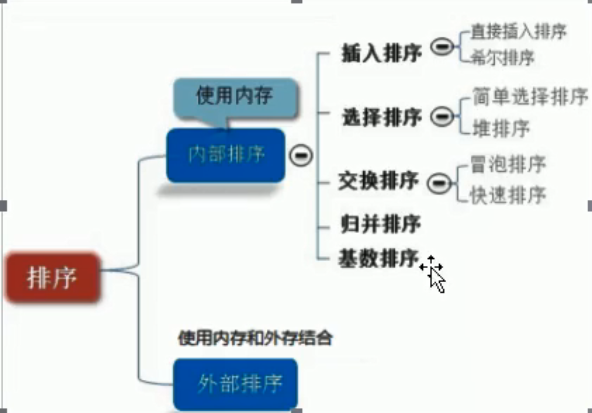
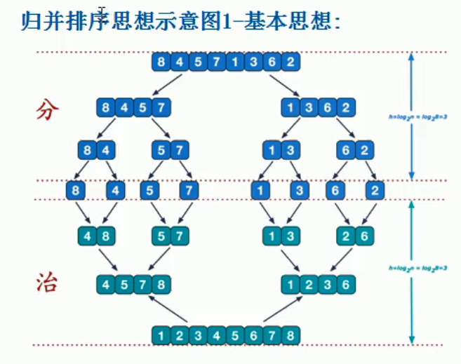
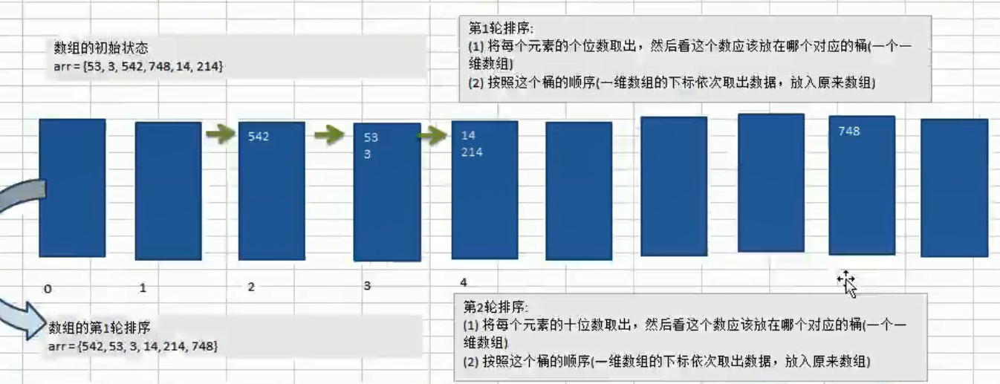
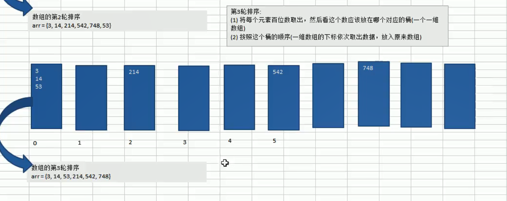

# 排序算法

将一组数据，依指定的顺序进行排列的过程。

## 排序的分类

### 1）内部排序

指，将需要处理的所有数据一次性加载到内存中进行排序。

### 2）外部排序

当数据量过大的时候，无法全部加载到内存中，需要借助外部存储进行排序。




## 排序详情

### 一、冒泡排序

#### 基本介绍

冒泡排序（Bubble Sorting）的基本思想是：

-----通过对待排序序列从前向后（从下标较小的元素开始），依次比较相邻元素的值，如果发现逆序（前面的元素比后面的元素的大——逆序）则交换，使得值较大的元素组件向后移，就像水中，大泡泡总是会比小泡泡先到达水面；

因为排序过程中，各元素不断接近自己的位置，如果一次循环下来没有进行过交换，就证明当前序列没有出现相邻逆序的情况，也就是说序列有序；因此要在排序过程中设置一个标志位（flag）判断元素是否进行过交换，从而减少不必要的比较；

#### 算法CODE


````java
public static void doitplusAddOne(int[] nums) {
    boolean flag = true;
    for (int i = 0; i < nums.length; i++) {
        int temp = 0;// 临时变量

        for (int j = 0; j < nums.length - 1 - i; j++) {
            if (nums[j] > nums[j + 1]) {
                int keep = 0;
                keep = nums[j + 1];
                nums[j + 1] = nums[j];
                nums[j] = keep;
                flag = false;
            }
        }
        System.out.println("i-->" + (i+1));
        if (flag) break;
        else flag = true;
    }
    for (int i : nums) {
        System.out.println(i);
    }
}
````


#### 总结

核心思想在于：

1.循环比较序列中相邻两个数的大小，确保他们是顺序的

2.嵌套循环：大循环表示-》比较相邻数大小的轮数；小循环表示-》指向相邻数的两个指针变量；

3.冒泡排序比较相邻数大小的次数是每轮减少的，规律是序列长度-1-轮数

4.这样的规律是因为，每一次冒泡都会使得 当前轮中最大的数排在最后，所以下一轮可以减少一次比较，因为最后一位肯定是最大的了；

通俗的说：

循环比较相邻数大小，每一轮都会确定当前轮的最大值，并且保证最大值的位置处于 **他应该在的位置** 

 

---


### 二、选择排序

#### 基本介绍：

用一个辅助变量保存当前循环次数的序列最小元素，循环结束后，将最小元素与头元素交换；

#### 算法CODE


```java
// 8w-3396
public static void doit(int[] nums) {
    int min = 0;
    int index = 0;
    for (int i = 0; i < nums.length; i++) {
        min = nums[i];
        for (int j = i + 1; j < nums.length; j++) {
            if (nums[j] < min) {
                min = nums[j];
                index = j;
            }
        }
        if (min != nums[i]) {
            min = nums[index];
            nums[index] = nums[i];
            nums[i] = min;
        }
    }
}
```

#### 总结

核心思想在于：

1.每次循环都找出当前序列中最小/最大的值，然后与当前元素交换，直到最后一次循环，得出顺序/逆序序列；

2.也有两层嵌套循环，大循环：定位当前元素，需要与后面所有元素比较一次；内循环：找出被定位元素之后的最小值（包括定位元素）

通俗的说：

每一次循环都定位一个元素，然后找到当前元素开始到序列结尾中的最小/最大值，然后元素交换；最终得到结果序列；

#### 与冒泡的比较

1.**冒泡排序** 总是将最大的元素交换到序列尾部；**选择排序** 总是将最大/最小的元素交换到队列头部。

2.**冒泡排序** 内层循环中--》 元素比较成功总是交换；**选择排序** 内层循环中 --》元素比较成功后，将元素保存；内层循环结束后才选择与序列头部元素交换；

3.**选择排序** 元素交换操作少；**冒泡排序** 元素交换操作多；交换次数少了，算法速度就上来了，所以选择排序比冒泡排序快

 

---


### 三、插入排序

#### 基本介绍：

插入式排序属于 **内部排序法** ，是对于 **预排序** 的元素以插入的方式寻找该元素的适当位置，以达到排序的目的；

#### 算法CODE：


```java
static void doitPlus(int[] nums) {

    static void doitPlus(int[] nums) {

        //        int insertVal ;// 将临时变量放在外面会不会更好？
        for (int i = 1; i < nums.length; i++) {
            int index = i;
            //            insertVal = nums[i];
            int insertVal = nums[i];// 
            for (int j = i - 1; j >= 0; j--) {
                if (nums[j] > insertVal) {
                    nums[j + 1] = nums[j];
                    index = j;
                } else {
                    break;
                }
            }
            if (index != i)// 这一句优化效果比较小
                nums[index] = insertVal;

        }

    }
    // 一开始我自己写的，8W数据 4191
    // 为什么慢？因为交换，元素多次交换会拖慢执行速度
    static int[] doit(int[] nums) {
        int[] re = new int[nums.length];
        re[0] = nums[0];
        // issue 源数组怎么讲元素插入到结果数组，数组移动这么麻烦
        int temp = 0;
        int insertIndex = 0;
        for (int i = 1; i < nums.length; i++) {
            insertIndex = i;
            for (int j = i - 1; j >= 0; j--) {
                if (re[j] > nums[i]) {
                    temp = re[j + 1];
                    re[j + 1] = re[j];
                    re[j] = temp;
                    insertIndex = j;
                }
            }
            re[insertIndex] = nums[i];
        }
        return re;
    }

}
```

#### ISSUE

```java
源数组怎么讲元素插入到结果数组，数组移动这么麻烦
```

答案是：原数组和结果数组是同一个数组，只需要将不符合条件的元素无条件向后移动一位

#### 总结：

1.从序列的第二个元素开始，**依次向前比较**，如果前一个元素比当前元素要小，那么将当前元素插入前一个元素的后面；

2.每次需要插入的元素需要用一个临时变量保存起来，所以当前一个元素比需要插入的元素大的时候，前一个元素可以无条件向后移动一位(`arr[j+1] = arr[j]`)  

#### 与冒泡比较：

冒泡要经历每一个相邻的元素比较然后交换的过程，插入排序只需要移动元素，不需要交换，所以用时比较少(我是这么认为的)

#### 与选择比较：

1.这两个算法由于都使用了 **临时变量** ，所以看起来似乎差不多；

2.**插入算法** 将当前元素存档，找到前面元素序列中的合适位置插入；**选择算法** 将当前序列最小值存档，然后与头元素交换；


---


### 四、希尔排序（Shell）

#### 基本介绍

 分为交换法，和插入法；交换法相当于加了增量的冒泡排序；插入法相当于加了增量的插入排序；


#### 算法CODE：


```java
// 8W-20  80W-247
// 增量+插入
static void move(int[] nums) {
    int length = nums.length;
    int temp = 0;
    int index = 0;
    for (int step = length / 2; step > 0; step /= 2) {
        for (int i = step; i < nums.length; i++) {
            index = i;
            temp = nums[i];
            for (int j = i - step; j >= 0; j -= step) {
                // 如果当前元素大于加上步长后的那个元素，说明交换
                if (nums[j] > temp) {
                    nums[j + step] = nums[j];
                    index = j;
                } else {
                    break;
                }
            }
            if (index != i)
                nums[index] = temp;
        }

    }
}

// 9426-8W
// 增量+冒泡
static void swap(int[] nums) {

    int length = nums.length;
    int temp = 0;
    for (int step = length / 2; step > 0; step /= 2) {
        for (int i = step; i < nums.length; i++) {
            for (int j = i - step; j >= 0; j -= step) {
                // 如果当前元素大于加上步长后的那个元素，说明交换
                if (nums[j] > nums[j + step]) {
                    temp = nums[j];
                    nums[j] = nums[j + step];
                    nums[j + step] = temp;
                }
            }
        }

    }
}
```

####  总结：

1.**希尔排序** 相当于增量模式+插入排序；

2.以序列长度每次/2为增量(相当于步长)，作为插入排序的元素位置标记，例如当前增量为：3，那么插入排序需要排序的序列为(0,3,6,9…) ；一定程度上减少了元素交换的次数，所以速度比前三个算法快；

3.暂时不是很能捋清楚思路，总体来讲就是在插入排序的基础上，加一个外层循环，控制增量/步长

4.所以 **希尔排序** 也是插入排序，只不过是升级版本

5.也称为缩小增量排序

 

---


### 五、快速排序

#### 基本介绍

快速排序是对冒泡排序的一种改进；

通过一趟排序将要排序的数据分割成独立的两部分，其中一部分所有数据都比另一部分的所有数据要小，然后再按照此方法对这两部分数据分别进行快速排序，整个排序过程可以递归进行；

有点迷  没错就是这样！


#### 算法CODE：


```java
// 800w-1499 8w-14
static void doit(int[] arr, int left, int right) {
    int temp;
    int l = left;
    int r = right;
    int mid = arr[(right + left) / 2];
    while (l < r) {
        // 能理解
        while (arr[l] < mid) l++;
        // 能理解
        while (arr[r] > mid) r--;
        // 还可以
        if (l >= r) break;
        temp = arr[l];
        arr[l] = arr[r];
        arr[r] = temp;
        // 这两句有点模糊，知道什么意思
        // 相邻元素交换处理
        // 相邻元素交换之后，左右指针需要处理一下
        if (arr[l] == mid) r -= 1;
        if (arr[r] == mid) l += 1;
    }

    if (l == r) {
        l += 1;
        r -= 1;
    }
    if (left < r) doit(arr, left, r);
    if (right > l) doit(arr, l, right);
}
```

#### 总结：

1.蒙蔽中

2.将序列以一个中间元素为基准，分为左右两部分，左边一定比中间元素大，右边同理；

3.硬记！！！！


这个图的基准元素与上面代码的不一样，但是不影响

---


### 六、归并排序

#### 基本介绍

利用贵宾的思想实现排序

采用经典的 **分治策略** ，将大问题分解成小问题求解，将各个阶段得到的答案组合在一起，得到最终答案；




#### 算法CODE：


```java
//        GetData.max = 8000000;// 800w-1274
//        GetData.max = 80000000;// 8kw-12675
static void mergeSort(int[] arr, int left, int right, int[] temp) {
    if (left < right) {
        int mid = (left + right) / 2;// 中间索引
        // 向左递归进行分解
        mergeSort(arr, left, mid, temp);
        // 向右递归分解
        mergeSort(arr, mid + 1, right, temp);

        // 到合并
        merge(arr, left, right, mid, temp);
    }
}

/**
     * @Author: zfl
     * @Date: 2020/9/4 22:20
     * @param arr 需要排序的数组
     * @param left 左边有序序列的索引
     * @param right 右边的索引
     * @param mid 中间索引
     * @param temp 中转数组
     */
static void merge(int[] arr, int left, int right, int mid, int[] temp) {
    int i = left;
    int j = mid + 1;
    int t = 0;// 中转数组的索引
    // 先把左右两边（有序）的数据，按照规则，填充到中转数组中，
    // 直到左右两边的有序序列，有一边处理完毕为止
    while (i <= mid && j <= right) {
        if (arr[i] <= arr[j]) {
            temp[t] = arr[i];
            t++;
            i++;
        }else {
            //            if (arr[j] <= arr[i]) {
            temp[t] = arr[j];
            t++;
            j++;
        }
    }
    // 2.
    // 把有剩余数据的一遍数据，依次填充到temp中
    while (i <= mid) {
        temp[t] = arr[i];
        t++;
        i++;
    }
    while (j <= right) {
        temp[t] = arr[j];
        j++;
        i++;
    }
    // 3.
    // 将Temp数组的元素copy到arr
    t = 0;
    int tempLeft = left;
    while (tempLeft <= right) {
        arr[tempLeft] = temp[t];
        t++;
        tempLeft++;
    }
}
```


#### 总结：

1.递归将序列分成不可分的一小块，然后通过一个临时的数组将不可分的序列段合并，最终会合并成一个完整的有序的序列；


---


### 七、基数排序

#### 基本介绍：

1.基数排序属于 **分配式排序** ，又称为 “**桶子法**” 

2.它是通过键值的各个位的值，将要排序的元素分配至某些桶中，达到排序的作用。

3.基数排序属于稳定性排序，基数排序法是效率高的稳定性排序法

4.基数排序是桶排序的扩展 

5.赫尔曼.何乐礼发明的。

6.实现：将整数按位数切割成不同的数字，然后每个位数分别比较。看不懂。。。。

7.将所有待比较数值统一为同样的数位长度，数位较短的数前面补0，然后从最低位开始，依次进行一次排序。这样从最低位排序一直到最高位排序完成后，数列就变成了有序序列。








#### 算法CODE：


```java
//8kw-7681 消耗差不多4G内存 800w-900
static void redix(int[] arr) {
    // 第一轮(针对元素的个位排序)
    // 定义一个二维数组，表示十个桶
    int[][] bucket = new int[10][arr.length];
    // 用来记录每个桶中是否有数据
    int[] bucketIndex = new int[10];
	
    // 这个标记为很精髓，主要就是用来判断序列中最大位数。。算了
    // 意思就是 比如说当前序列最大值最高位数是百位，所以循环3次就能排好序；
    // 那么当循环第四次的时候，所有数据的千位必定全为0，此时标志位为true;在循环中，当标志位为true时候，退出循环；
    // 排序完毕
    boolean flag = true;
    // 这个是用来选择位数的
    int mult = 1;
    while (true) {
        for (int j = 0; j < arr.length; j++) {
            // 取出每个元素的个位
            int digit = arr[j] / mult % 10;
            if (digit != 0) flag = false;
            bucket[digit][bucketIndex[digit]] = arr[j];
            bucketIndex[digit]++;
        }
        // 在将桶里的序列复制到原数组中前推出，这样就可以少复制一遍了 ，因为最后一次循环的数组复制是没意义的
        if (flag) break;
        else {
            flag = true;
            mult *= 10;
        }
        // 把桶中的数据放到原来的数组
        int index = 0;
        for (int k = 0; k < bucket.length; k++) {
            if (bucketIndex[k] != 0) {
                for (int i = 0; i < bucketIndex[k]; i++) {
                    arr[index] = bucket[k][i];
                    index++;

                }
                bucketIndex[k] = 0;
            }
        }

    }
}
```


#### 总结：

1.典型的空间换时间的算法；

2.通过辅助数组，加快排序过程；

3.每次循环都按顺序将当前的位数(个十百千万…) 放入相应的桶中(也就是一个二维数组，一维表示0-9；二维表示序列长度)；最后将桶中的数据放入原序列

4.重复上述步骤，知道最高位数遍历完


---


### 八、堆排序

#### 基本介绍：

1. 堆排序是利用堆 这种数据结构而设计的 排序算法，堆排序 是一种 **选择排序** ，他的最好最坏，平均时间复杂度均为O(nlogn)，也是不稳定的排序。

2. 堆是具有以下性质的 **完全二叉树** 。
   1. 每个节点的值都大于或等于其他 左右孩子节点的值，成为 **大顶堆**；
   2. 注意：没有要求节点的左孩子的值和右孩子的值的大小关系。
   3. 每个节点的值都小于或者等于其 左右孩子节点的值，成为 **小顶堆** 

#### 	基本思想：

1. 将待排序序列构造成一个大顶堆。

2. 此时，整个序列的最大值就是堆顶的根节点。
3. 将其与末尾元素进行交换，此时末尾就是最大值。
4. 然后将剩下的n-1个元素重新构成一个堆，这样会得到n个元素的次小值。