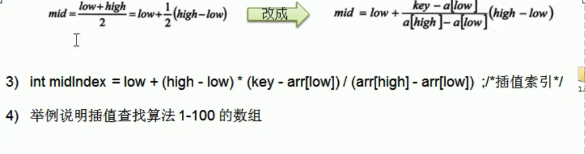
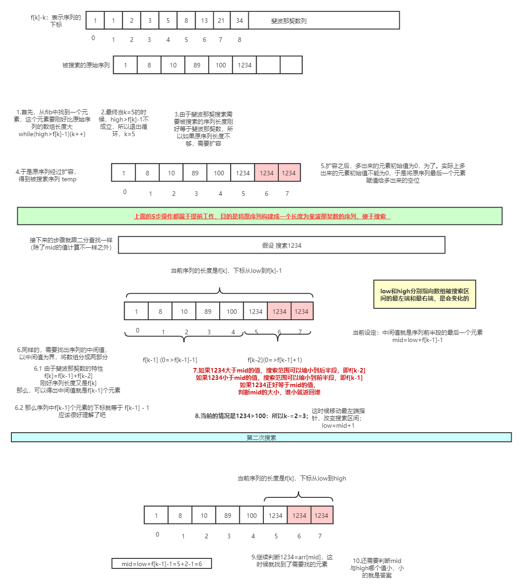
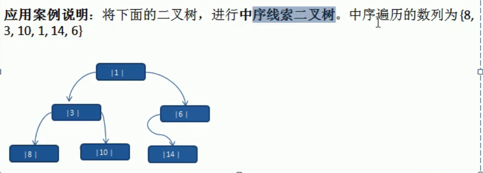

 

# 一、线性查找法

## 基本介绍：

就是for循环数组查找。。。


## 算法CODE：


```java
private static int doit(int[] data, int value) {
    for (int i = 0; i < data.length; i++) {
        if (data[i] == value) {
            return i;
        }
    }
    return -1;
}
```


## 总结：

没什么好说的  


---


# 二、二分查找

## 基本介绍

 1.被查找的序列必须是有序的

2.使用递归找到

3.如果要找的数比中间的数字小，向前查找，如果大，向后查找

4.递归


```java
public static void main(String[] args) {
    int[] data = {1234, 1, 1000, 10, 89};
    insertSort(data);
    GetData.printf(data);
    System.out.println(divide(data, 0, data.length - 1, 189));
}

static int divide(int[] arr, int left, int right, int value) {
    if (left > right) 
        return -1;
    int mid = (left + right) / 2;
    if (value > arr[mid]) {
        return divide(arr, mid + 1, right, value);
    } else if (value < arr[mid]) {
        return divide(arr, left, mid - 1, value);
    } else return mid;
}

static void insertSort(int[] arr) {
    int insertVa;
    int index;
    for (int step = arr.length / 2; step > 0; step /= 2) {

        for (int i = step; i < arr.length; i++) {
            insertVa = arr[i];
            index = i;
            for (int j = i - step; j >= 0; j -= step) {
                if (arr[j] > insertVa) {
                    arr[j + step] = arr[j];
                    index = j;
                } else break;
            }
            if (index != i) {
                arr[index] = insertVa;
            }
        }
    }
}
```


## 总结：

1.先排序，再查找


---


# 三、插值查找

## 基本介绍

1.插值查找类似二分查找，不同的是  插值查找每次从 自适应mid 处开始查找。

2.将折半查找中的mid 索引的公式，low 表示左边索引 ，high表示右边索引。




## CODE:

```java
private static int insertVSearch(int[] arr, int left, int right, int value) {
    if (left > right || value < arr[0] || value > arr[arr.length - 1]) return -1;
    int mid = left + (right - left) * (value - arr[left]) / (arr[right] - arr[left]);
    System.out.println("mid-->" + mid);
    if (value < arr[mid]) return insertVSearch(arr, left, mid - 1, value);
    else if (value > arr[mid]) return insertVSearch(arr, mid + 1, right, value);
    else return mid;
}
```


## 注意：

1.对于数据量较大，关键字分布比较均匀的查找表来说，采用插值查找速度较快。

2.关键字分布不均匀的情况下，该方法不一定比 **二分查找** 好

## 总结：

将二分查找中的中间索引的计算方法进行优化


---


# 四、斐波那契查找

黄金分割法

## 基本介绍：

1.黄金分割点是指 把一条 线段分割为两部分，使其中一部分与全长之比 等于另一部分与这部分之比。取其前三位数字的近似值是 0.618.

2.由于按此比例设计的造型十分美丽，因此称之为 黄金分割，此处已成为 **中外比** 。这是一个神奇的数字，会带来意想不到的效果

3.斐波那契数列 `{1,1,2,3,5,8,13,21,34,55}` ，发现斐波那契数列的两个相邻数的比例。无限接近于 黄金分割值 0.618 


## CODE：


```java

// 构建斐波那契数列
// 非递归
public static int[] fib() {
    int[] f = new int[maxSize];
    f[0] = 1;
    f[1] = 1;
    for (int i = 2; i < maxSize; i++) {
        f[i] = f[i - 1] + f[i - 2];
    }
    return f;
}

/**
     * @param arr arrayList
     * @param key 需要查找的关键码(值)
     *
     * @Author: zfl
     * @Date: 2020/9/17 20:05
     */
public static int doit(int[] arr, int key) {
    int low = 0;
    int high = arr.length - 1;
    int k = 0;// 表示斐波那契分割数值的下标，通俗的说，f[k] 就相当于被搜索数组的长度，所以说下面的 f[k] - 1 就相当于数组最后一个元素的下标；
    int[] f = fib();
    int mid;
    // 获取到斐波那契分割数值 的下标
    while (high > f[k] - 1) {
        k++;
    }
    // 因为f[k] 可能大于 数组的长度，因此需要使用一个Arrays类，构造一个新的数组，并且指向arr
    int[] temp = Arrays.copyOf(arr, f[k]);
    // 实际上，需要使用a[high]填充temp的空白处
    for (int i = high + 1; i < temp.length ; i++) {
        temp[i] = arr[high];
    }

    // 使用 while 循环处理，找到我们的key
    while (low <= high) {// 只要这个条件满足就可以找
        mid = low + f[k - 1] - 1;
        if (key < temp[mid]) {// 继续向数组的前面查找
            high = mid - 1;
            // 为什么是k--
            /*
                1.全部元素 = 前面元素 + 后面元素
                2. f[k] = f[k - 1] + f[k - 2]
                因为前面有f[k - 1] 个元素，所以可以继续向前拆分 f[k - 1] = f[k-2]+f[k-3]
                即在f[k-1]的前面继续查找k--
                即下次循环 mid=f[k-1-1]-1;
                 */
            k--;
        } else if (key > temp[mid]) {
            low = mid + 1;
            k -= 2;
        } else {
            // 需要确定返回的是哪个下标
            if (mid <= high) return mid;
            else return high;
        }
    }
    return -1;
}

// 为什么上面的代码f[k] 总是要 减去1，因为数组下标从0开始，如果数组下标从1开始，那么代码将会是这样
private static int doit2(int[] arr, int key) {
    int low = 1;
    int high = arr.length;
    int k = 0;
    int[] f = fib();
    
    while (high > f[k]) k++;
    
    if (high < f[k]) {
		int[] temp = Arrays.copyOf(arr, f[k]);
    	for (int i = high + 1; i <= f[k]; i++) {
            temp[i] = arr[high];
        }
    }
    
    while (low <= high) {
        int mid = low + f[k - 1];
        if (key < arr[mid]) {
            high = mid - 1;
            k--;
        } else if (key > arr[mid]) {
            low = mid + 1;
            k -= 2;
        } else {
            if (mid < high) return mid;
            else return high;
        }
    }
    return -1;
}
```


## 总结：

1.需要将被搜索的原数组的长度扩容成斐波那契数，即 `arr.length=f[k]` 

2.中间值的计算，`mid=low+f[k-1] - 1` 

3.非递归，每次循环，假设key小于中间值，那么

​	1.将high指向mid-1

​	2.否则将low指向mid+1


下面是目前的理解图，不知道日后看不看得懂，哈哈




---


# 五、哈希表

## 基本介绍：

其实是个 **数据结构** 

散列表，根据关键码值（key-value）来直接进行访问的一种 **数据结构** 。已就是说，他通过把关键码值映射到表中一个位置来访问记录，以加快查找的速度。

这个映射函数叫做散列函数。

哈希表可以用来做数据库缓存，例如redis/memcache

## 总结：

跟手撕hashmap一样，自己动手模拟一个hashtable 。OVER!


---


# 六、树的基础

## 二叉树

### 基本介绍：

输出存储方式分析：

优点：通过下标方式访问元素，速度快。对于有序数组，可以使用 **二分查找** 提高搜索速度。

缺点：如果检索具体某个值，或者插入值会整体移动，效率低

链式存储方式分析：

优点：增、删快。

缺点：改、查慢

树存储方式的分析：

能够提高数据存储、读取的效率，比如利用 **二叉排序树** ，既可以保证数据的检索速度，同时也可以保证数据的插入、删除、修改速度。


### 算法CODE：


```java
public class HeroNode {
    private HeroNode left;
    private HeroNode right;
    private int no;
    private String name;

    public boolean del(int key) {
        if (this.left != null && this.left.getNo() == key) {
            this.left = null;
            return true;
        }
        if (this.left != null) {
            boolean del = this.left.del(key);
            if (del) return true;
        }
        if (this.right != null && this.right.getNo() == key) {
            this.right = null;
            return true;
        }
        if (this.right != null) {
            boolean del = this.right.del(key);
            if (del) return true;
        }
        return false;
    }


    // 前序查找
    public HeroNode fronts(int value) {
        if (this.getNo() == value) {
            return this;
        }
        if (this.left != null) {
            return this.left.fronts(value);
        }
        if (this.right != null) {
            return this.right.fronts(value);
        }
        return null;
    }

    // 前序遍历
    public void front() {
        System.out.println(this);
        if (this.left != null) {
            this.left.front();
        }
        if (this.right != null) {
            this.right.front();
        }
    }

    // 中序查找
    public HeroNode mids(int value) {
        if (this.left != null) {
            return this.left. mids(value);
        }
        if (this.getNo() == value) {
            return this;
        }

        if (this.right != null) {
            return this.right.mids(value);
        }
        return null;
    }

    // 中序遍历
    public void mid() {
        if (this.left != null) {
            this.left. mid();
        }
        System.out.println(this);
        if (this.right != null) {
            this.right.mid();
        }
    }


    // 后序查找
    public HeroNode backs(int value) {

        if (this.left != null) {
            return this.left.backs(value);
        }
        if (this.right != null) {
            return this.right.backs(value);
        }


        if (this.getNo() == value) {
            return this;
        }
        return null;
    }


    // 后续遍历
    public void back() {
        if (this.left != null) {
            this.left.back();
        }
        if (this.right != null) {
            this.right.back();
        }
        System.out.println(this);
    }


    public HeroNode getLeft() {
        return left;
    }

    public void setLeft(HeroNode left) {
        this.left = left;
    }

    public HeroNode getRight() {
        return right;
    }

    public void setRight(HeroNode right) {
        this.right = right;
    }

    public int getNo() {
        return no;
    }

    public void setNo(int no) {
        this.no = no;
    }

    public String getName() {
        return name;
    }

    public void setName(String name) {
        this.name = name;
    }

    public HeroNode(int no, String name) {
        this.no = no;
        this.name = name;
    }

    @Override
    public String toString() {
        return "HeroNode{" +
            "no=" + no +
            ", name='" + name + '\'' +
            '}';
    }
}

```


```java
class DTree {
    private HeroNode root;

    public void setRoot(HeroNode root) {
        this.root = root;
    }


    public boolean del(int key){
        if (root == null) {
            System.out.println("当前树为空");
            return false;
        }
        if (root.getNo() == key) {
            root = null;
            return true;
        }
        boolean del = root.del(key);
        return del;
    }

    // 前序遍历
    public void front() {
        if (root != null) {
            root.front();
        } else {
            System.out.println("当前tree为空");
        }
    }

    public HeroNode frontSearch(int value) {
        if (root != null) {
            return root.fronts(value);
        }else {
            System.out.println("当前tree为空");
            return null;
        }
    }
    public HeroNode midSearch(int value) {
        if (root != null) {
            return root.mids(value);
        }else {
            System.out.println("当前tree为空");
            return null;
        }
    }

    public HeroNode backSearch(int value) {
        if (root != null) {
            return root.backs(value);
        }else {
            System.out.println("当前tree为空");
            return null;
        }
    }

    // 中序遍历
    public void mid() {
        if (root != null) {
            root.mid();
        } else {
            System.out.println("当前tree为空");
        }
    }

    // 后续遍历
    public void back() {
        if (root != null) {
            root.back();
        } else {
            System.out.println("当前tree为空");
        }
    }
}
```


## 顺序存储二叉树

xxxxxx


## 线索化二叉树

### 基本介绍：

1.n个节点的二叉链表中，含有n+1【2n-(n-1)=n+1】个空的指针域。利用二叉链表中的空指针域，存放指向该结点的 **某种遍历次序** 下的前驱和后继结点的指针。

2.这种加上了线索的二叉链表称为 **线索链表** 。响应的二叉树成为 **线索二叉树** 。根据线索性质不同，线索二叉树可以分为 **前序线索二叉树**、**中序线索二叉树** 和 **后序线索二叉树**。3种





### 算法CODE：


```java
class Node2 extends HeroNode {

    // 如果leftType==0，表示指向左子树，如果leftType==1，表示指向前驱节点
    // rightType同上，        右子树， 后继节点
    private int leftType;
    private int rightType;

    public int getLeftType() {
        return leftType;
    }

    public void setLeftType(int leftType) {
        this.leftType = leftType;
    }

    public int getRightType() {
        return rightType;
    }

    public void setRightType(int rightType) {
        this.rightType = rightType;
    }

    public Node2(int no, String name) {
        super(no, name);
    }
}
```


```java
class ThreadTree extends DTree {

    private Node2 pre = null;


    /**
     * @param node 当前需要线索化的节点
     *
     * @Author: zfl
     * @Date: 2020/9/26 21:10
     */
    // 编写对二叉树进行中序线索化的方法
    public void threadedNodes(Node2 node) {
        if (node == null) {
            return;
        }

        // 三.先线索化左子树
        threadedNodes((Node2) node.getLeft());

        // 二、线索化当前节点
        if (node.getLeft() == null) {
            // 让当前节点的左指针指向 前驱节点
            node.setLeft(pre);
            // 修改当前节点的左指针的类型
            node.setLeftType(1);
        }
        
        if (pre != null && pre.getRight() == null) {
            // 让前驱节点的右子针指向当前节点
            pre.setRight(node);
            // 修改前驱节点的右子针类型
            pre.setRightType(1);
        }
        // 后继节点的赋值不在当前节点进行，而是在下一个节点进行
        pre = node;

        // 三、线索化右子树
        threadedNodes((Node2) node.getRight());
    }
}
```


### 遍历：

```java
public void threadedList() {
    // 定义一个变量，存储当前遍历的节点，从root开始
    Node2 node = root;
    while (node != null) {
        // 循环的找到leftType==1的节点，第一个找到的应该是8
        // 后面随着遍历会变化，因为当leftType==1的时候，说明该结点是按照线索化
        // 处理后的有效节点

        while (node.getLeftType() == 0) {
            node = (Node2) node.getLeft();
        }
        // 打印当前节点
        System.out.println(node);
        // 如果当前节点的指针指向后继节点，一直输出
        while (node.getRightType() == 1) {
            // 获取到当前节点的后继节点
            node = (Node2) node.getRight();
            System.out.println(node);
        }

        // 替换这个遍历的节点
        node = (Node2) node.getRight();

    }

}
```


