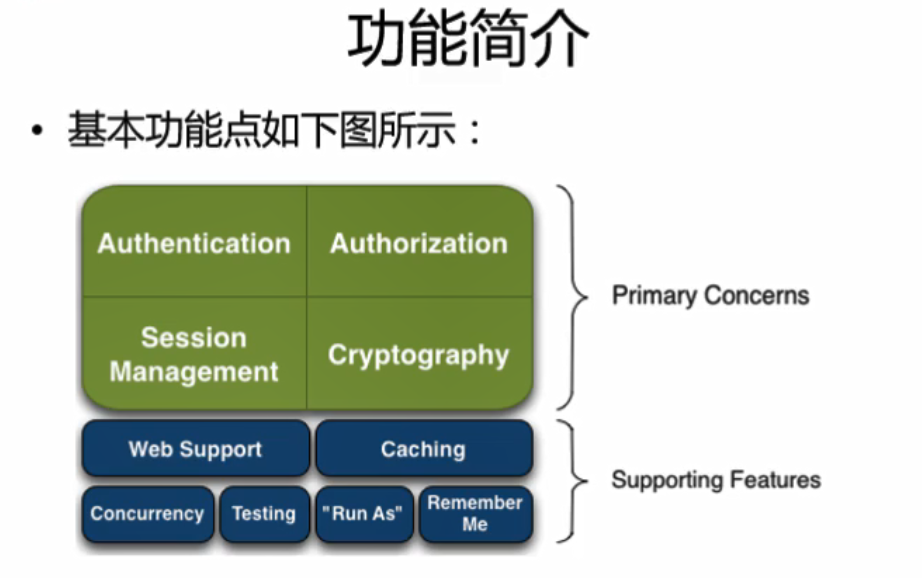

* Apache Shiro 是 Java 的一个安全（权限）框架
* Shiro可以非常容易的开发出足够好的应用

## Shiro架构

* `Subject`：任何可以与应用交互的“用户”；
* **SecurityManager**：相当于springMVC中的DispatchServlet；是SHiro的心脏；
  * 所有具体的交互都通过`SecurityManager`进行控制；
  * 它管理着所有 `Subject` 、且负责进行认证、授权、会话及缓存的管理；。
* **Autenticator**：负责 `Subject` 认真，是一个扩展点，可以自定义实现；可以使用认真策略（`Authentication stategy`），即什么情况下算用户认证通过了；
* **Authorizer**：授权器、即访问控制器，用来决定主体是否有权限进行相应操作；即控制着用户能访问应用中的哪些功能；
* **Realm**：可以有1个或多个Realm，可以认为是安全实体数据源，即用于获取安全实体的；
  * 可以使JDBC实现，也可以是内存实现等等；
  * 由用户提供；
  * 所以一般在应用中都需要实现自己的 `Realm` ；
* **SessionManager**：管理 `Session` 生命周期的组件； 而 `Shiro` 并不仅仅可以用在 `Web` 环境，也可以用在如普通的 `JavaSE` 环境
* **CacheManager**：**缓存控制器** ，来管理如用户、角色、权限等的缓存；
  * 因为这些数据基本上很少改变，放到缓存中后可以提高访问的性能
  * Cryptography：**密码模块** ，`Shiro` 提高了一些常见的加密组件用于 如 密码加密/解密

