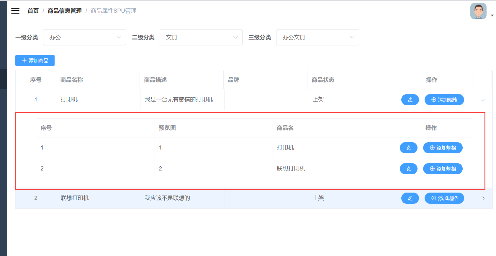

# 二级表单





点击某个按钮，然后可以通过这一列的搜索出关联列表

教程 https://www.cnblogs.com/e-cat/p/10532982.html


## 代码


```vue
<template>
  <el-table ref="table" border stripe highlight-current-row :data="tableData5" style="width: 800px;">
    <el-table-column label="商品 ID" prop="id" width="100">
    </el-table-column>
    <el-table-column label="商品名称" prop="name">
    </el-table-column>
    <el-table-column label="描述" prop="desc">
    </el-table-column>
    <el-table-column label="操作" width="100">
      <template slot-scope="scope">
        <el-button type="text" @click="toogleExpand(scope.row)">查看详情</el-button>
      </template>
    </el-table-column>
    <el-table-column type="expand" width="1">
      <template slot-scope="props">
        <el-form label-position="left" inline class="demo-table-expand">
          <el-form-item label="商品名称">
            <span>{{ props.row.name }}</span>
          </el-form-item>
        </el-form>
      </template>
    </el-table-column>
  </el-table>
</template>

<script>
export default {
  data() {
    return {
      tableData5: [{
        id: '1',
        name: '好滋好味鸡蛋仔1',
        desc: '荷兰优质淡奶，奶香浓而不腻1',
      }, {
        id: '2',
        name: '好滋好味鸡蛋仔2',
        desc: '荷兰优质淡奶，奶香浓而不腻2',
      }, {
        id: '3',
        name: '好滋好味鸡蛋仔3',
        desc: '荷兰优质淡奶，奶香浓而不腻3',
      }, {
        id: '4',
        name: '好滋好味鸡蛋仔4',
        desc: '荷兰优质淡奶，奶香浓而不腻4',
      }]
    };
  },
  methods: {
    toogleExpand(row) {
      let $table = this.$refs.table;
      $table.toggleRowExpansion(row)
    }
  }
}
</script>
```

