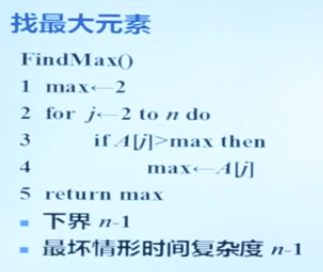

# 算法的概念

算法：

* 解决问题的一种方法 或 一个过程 ，是一个由若干运算或指令组成的有穷序列

算法---问题：

* 求解问题的算法  可以看做是 输入实例 与 输出 之间的函数

## 算法的特点

* 输入输出-Input、Output
* 确定性-Deterministic
* 可行性-Feasible
* 有穷性-Finite

## 算法的描述

* Pseudocode --》伪代码

* 流程图

---

# 算法的正确性

正确的算法

* 对任意一个输入 ，算法能得到一个正确的输出

循环不变量

* 与程序变量有关的一个语句 ，它在循环刚开始前 ，以及在循环的每个迭代执行后为真 ，特别是在循环结束之后 ，仍然为真

插入排序的循环不变量

* 在 for 循环第 j 个迭代执行前 ，子数组 A[1…j-1] 由最初 A[1…j-1] 中的元素构成 ，不过现在是有序的

---

# 算法的效率

* 算法效率（Efficiency）的分析 ，指的是算法求解一题所需要的时间和空间
* 时间资源 和 空间资源
* 计算模型
  * Turing 机、以及 RAM（随机存储器）等
* 算法时间资源的估算
  * 算法执行基本运算（或步数）的数目

## 度量方式

度量一个算法运行时间的 三种方式：

* **最好情形** 时间复杂度
* **最坏情形** 时间复杂度
* **平均情形** 时间复杂度

---

算法的时间复杂度 取决于 主要项

算法的效率 主要取决于 算法本身 ，与计算模型（例如计算机）无关 ，这样可以通过分析算法的运行时间 ，从而比较出算法之间的快慢

---

# 时间的下界

* **时间的下界** （Lower Bounds），即任何一种算法解决一个问题所必须的 **最小运行时间**
* 假定一个问题的下界为 F(n) ，而当前解决该问题的最好算法为 A ，其最坏情形时间复杂度为 W(n) ，
  如果 F(n) = W(n) ，则 A 是 **最优算法**

* 排序问题的计算时间下界为(nlogn) ，计算时间复杂性为 O(nlogn) 的排序算法是 最优算法
* 堆排序算法 是最优算法

---

# 小结

- 程序是用某种 程序设计语言 实现的算法 ，而算法是 抽象的，它不依赖于具体的程序设计语言和硬件。
- Turing奖获得者 ，**Pascal语言之父** Niklaus Wirth曾说过“**程序=数据结构+算法**”。
- Turing奖获得者 ，算法大师Donald E. Knuth说过 **计算机科学的研究** 就是 **算法的研究**。
- 52名Turing奖(类似诺贝尔奖)的获得者中 ，因为算法方面的贡献而获奖的就有30多个。
- 分析一个算法的 运行时间 应该 主要关注 与 **问题规模有关 的 主要项** ，其他低阶项 ，甚至主要项的 **常数系数都可以忽略**。

