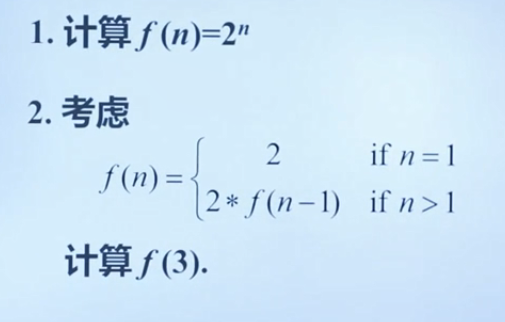

# 递归的算法思想

## 算法思想

* 递归（Recurrence）：计算机、数学、运筹等领域经常使用的最强大的解决问题的方法之一 ，它用一种简单的方式来解决那些其他方法解起来可能很复杂的问题 ，也就是说有些问题用递归算法来求解 ，则变得简单 ，而且容易理解。
* 递归的基本思想 ：把一个问题划分为一个或多个 **规模更小** 的子问题 ，然后用同样的方法解规模更小的子问题。

### 递归算法的基本设计步骤

1. 找到问题的 **初始条件**(递归出口) ，即当问题规模小到某个值时 ，该问题变得很简单。能够直接求解。
2. 设计一个策略 ，用于将一个问题划分为一个或多个一步步接近递归出口的 **相似的** 规模更小的子问题。
3. 将所解决的各个小问题的解 **组合起来** ，即可得到原问题的解。

### 需要注意的问题

1. 如何使定义的问题规模逐步缩小 ，而且始终保持 **同一问题类型** ?
2. 每个递归求解的问题其 **规模如何缩小**?
3. 多大规模的问题 **可作为** 递归出口?
4. 随着问题规模的缩小 ，能到达递归出口吗?

### 递归设计实例

