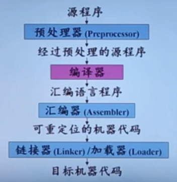
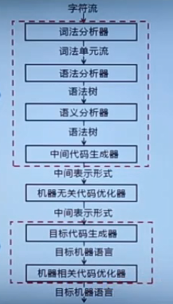
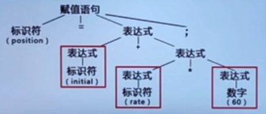
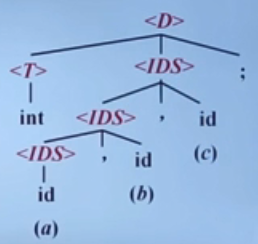
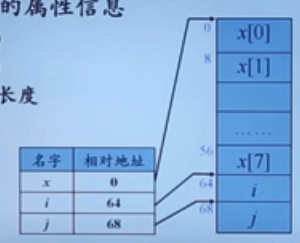

## 什么是编译

机器语言：都是0101

汇编语言：加入了助记符，可以以类似指令来操作计算机 mov x,2

高级语言：符合人类的思维，

高级语言---》汇编语言；称为编译

高级语言---》机器语言；编译

汇编语言---》机器语言；汇编

### 编译的本质

将高级语言翻译成 ==汇编语言== 或 ==机器语言== 的过程

编译是一个翻译的过程，从源语言到目标语言的翻译过程

**编译器在语言处理系统中的位置**

 


预处理器：

* 把存储在不同文件中的源程序集合在一起
* 把被称为宏的缩写语句转换为原始语句

可重定位：Relocatabic

* 在内存中存放那个的起始位置L不是固定的

加载器：

* 修改可重定位地址
* 将修改后的指令和数据放到内存中适当位置

链接器：

* 将多个可重定位的机器代码文件（包括库文件）连接到一起
* 解决外部内存地址问题
  * 指一个文件中的代码，可能会引用另一个文件中的代码的过程


---

### 编译系统的结构




第一个框：

分析部分/前端（front end）；

与源语言相关

第二个框：

综合部分/后端（back end）；

与目标语言相关


---

## 词法分析概述

词法分析/扫描（Scanning）

### 词法分析的主要任务

* 自左向右逐行扫描源程序的字符，识别出每个单词，确定 ==单词类型==
* 将识别出的单词转换成同一的机内表示---词法单元（token）形式
* `token：<种别码,属性值>`

|      | 单词类型 | 种别                                                         | 种别码                           |
| ---- | -------- | ------------------------------------------------------------ | -------------------------------- |
| 1    | 关键字   | program、if、else、then。。。                                | 一词一码                         |
| 2    | 标识符   | 变量名、数组名、记录名、过程名、                             | 多词一码                         |
| 3    | 常量     | 整型、浮点型、字符型、布尔型                                 | 一型一码                         |
| 4    | 运算符   | 算数（+-*/ ++  --）<br />关系（>< == != >= <=）<br /><br />逻辑（& \| ~） | 一词一码<br /> 或 <br />一型一码 |
| 5    | 界限符   | ; () = {} …                                                  | 一词一码                         |


## 语法分析-parsing

语法分析器 parser 从词法分析器输出的 toekn 序列中 ==识别出各类短语，并构造语法分析树== -perse tree

语法分析树描述了句子的语法结构

例子1💛💛 赋值语句的分析树


position = initial + rate \* 60 ;




例子2：💛 变量声明语句的分析树

文法：

* `<D>-><T><IDS>;`
  * D 代表 Declaration 生命变量的意思
* `<T>-> int|real|char|bool`
  * T 代表 Type 类型
* `<IDS>->id|<IDS>,id`
  * IDS--》IdentifySequence 标志符序列

输入：

* `int a,b,c;`




---


## 语义分析概述

编译的第三个阶段

### 主要任务

#### 收集标识符的属性信息

* 种属（Kind）
* 类型（Type）
* 存储位置、长度

例如：

```java
begin
    real x[8];
	integer i,j;
......
end
```

所以这个代码片段的属性信息如下




属性信息↑

* 值
* 作用域
* 参数和返回值信息
  * 参数个数、参数类型、参数传递方式、返回值类型、……

收集到的信息都会存放在一个 符号表中

#### 语义检查

* 变量或过程 **未经声明就使用**
* 变量或过程名 **重复声明**
* **运算分量** 类型不匹配
  * 比如说数组的名字和整数相加是不正确的
* 操作符 与 操作数 之间的类型不匹配
  * 例如：数组下标 不是整数
  * 例如： 对非数组变量 使用数组访问操作符
  * 对 非过程名 使用过程调用操作符
  * 过程调用的 参数类型或数目不一致
  * 函数返回类型错误

---

## 中间代码

### 常用表示形式

* 三地址码 （three-address Code)
  * 由 **类似于汇编语言** 的指令序列组成
  * 每个指令 **最多有三个操作数** （operand）
  * 
* 语法结构树/语法树（Syntax Trees)
  * 

中间代码生成例子

代码片段---》语法分析书---》中间代码


## 目标代码

生成：

* 目标代码生成以源程序的 **中间表示形式** 作为输入，并把它映射到 **目标语言**
* 目标代码生成的 **重要任务** 是为程序中使用的变量 **合理分配寄存器**


## 代码优化

* 为改进代码所进行的等价程序变换，使其 运行得更快一些、占用空间更少一些，或者二者兼顾


