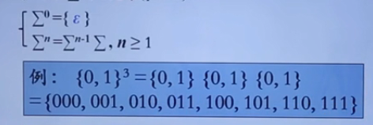
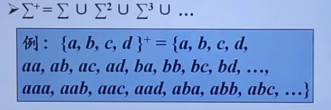
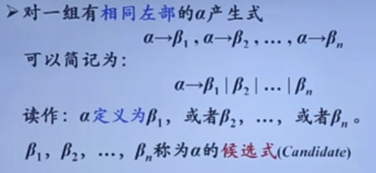
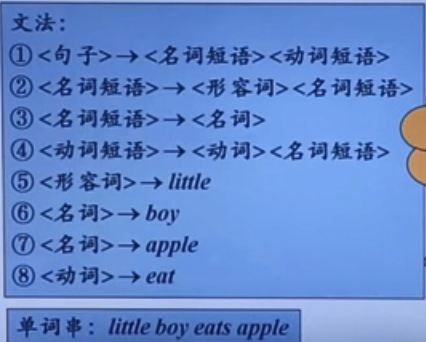
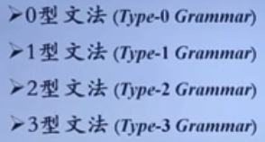
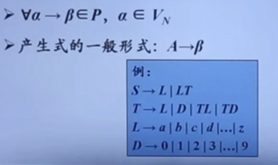
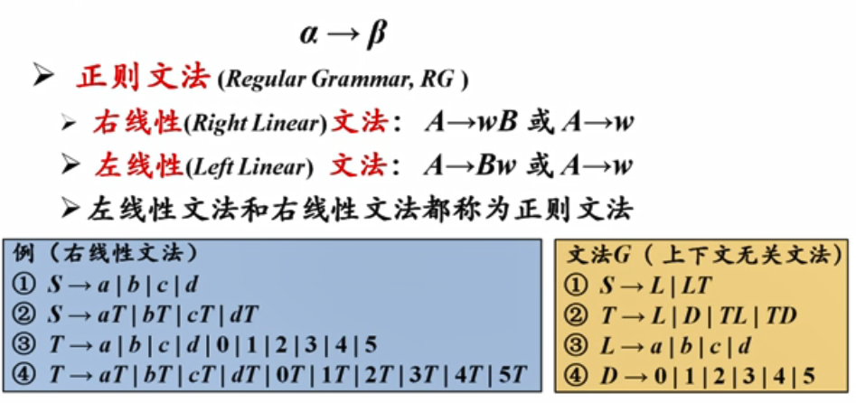
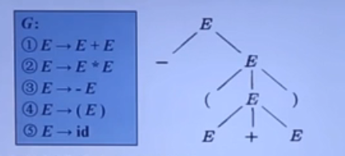
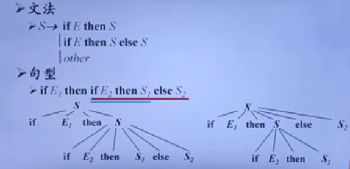

# 基本概念

## 字母表

字母表 Σ 是一个 **有穷符号集合**

符号：

* 字母、数字、标点符号。。。。。

例如：

* 二进制字母表 {0,1}
* ASCII 字符集
* Unicode 字符集

## 字母表上的运算

#### 字母表 Σ1 和 Σ2 的 乘积

（product）

* Σ1Σ2 = {ab|a ∈ Σ1，b ∈ Σ2}

$$
例: {0,1} {a, b} ={0a, 0b, 1a, 1b}
$$

#### 字母表Σ的 n次幂

字母表的 n次幂 ：长度为 n 的符号串构成的集合

#### 字母表 Σ 的 正闭包

字母表的正闭包 ：长度正数的符号串构成的集合

---

## 串

- 设 Σ 是一个字母表，V.x∈Σ*， x称为是 Σ 上的一个串
- 串是字母表中 符号的 一个 有穷序列
- 串 s 的长度，通常记作 |s| ，是指 s 中 符号的个数
  - 例如：|abc| = 3
- 空串是长度为0的串，用ε表示
  - |ε|=0

---

### 串上的运算---连接

如果x和y是串，那么x和y的连接(concatenation) 是把 y 附加到x后面而形成的串，记作xy

- 例如，如果x=dog且y=house,那么xy=doghouse

---

# 文法的定义

## 句子构成规则

自然语言的例子

* 《句子》--》《名词短语》《动词短语》
* 《名词短语》--> 《形容词》《名词短语》
* 《名词短语》 --> 《名词》
* 《动词短语》 --> 《动词》《动词短语》
* 《形容词》 --> little
* 《名词》 --> boy
* 《名词》 --> apple
* 《动词》 --> eat

* 《动词 (语法部分) 》--> eat(语言的基本符号)

## 文法的形式化定义

G=(Vt, Vn, P, S)

Vt ：终结符集合

* 终结符（terminal symbol）是文法所定义的语言的基本符号，有时也称为 token
* 例如：Vt = {apple, boy, eat, little}

Vn ：非终结符集合

* 非终结符 是用来表示语法成分的符号，有时也称为 语法变量
* 例如 ：Vn = {<句子>, <名词短语>, <动词短语>, <名词>,……}

注意

* 终结符 ∩ 非终结符 = ∅
* 终结符 ∪ 非终结符 ：文法符号集

P ：产生式集合

* 产生式 描述了将 终结符 和 非终结符 组合成串的方法
* 产生式的一般形式 ：α --> β  读作 ：α 定义为 β

S ：开始符号

* S ∈ Vn。开始符号 表示的是该文法中最大的语法成分

---

## 产生式的简写

## 符号约定

### 下述符号是 **终结符**..

➢ 字母表中排在前面的小写字母，如a、b、c

➢ 运算符，如+、*等

➢ 标点符号，如括号、逗号等

➢ 数字0、1、....9

➢ 粗体字符串，如id、if等

### 下述符号是非终结符

➢ 字母表中排在前面的大写字母，如A、B、c

➢ 字母S。通常表示开始符号

➢ 小写、斜体的名字，如expr、 stmt等

➢ 代表程序构造的大写字母。如E(表达式)、T(项) 和 F(因子)

### 文法符号

➢字母表中排在后面的大写字母(如X、Y、Z) 表示 **文法符号**(即终结符或非终结符)

### 终结符号串

➢字母表中排在后面的小写字母（主要是u、v、….、z）
表示 终结符号串 (包括 **空串**)

### 文法符号串

小写的希腊字母，如α、β、γ ，包括空串

除非特别说明，第一个产生式的左部 就是 开始符号

---

# 语言的定义

自然语言的例子

有了这个文法（语言规则），如何判定一个词串是否是满足文法的句子？

## 推导和归约

Derivations && Reductions

➢给定文法G=(Vt, Vn, P, S)， 如果α-→β∈P,那么可以将符号串γα8中的a替换为β，也就是说，
将ya8 **重写** (revrite)为γ8，记作γa8 = γp8。此时，称文法中的符号串 γa8 **直接推导**(directly derive)出 γβ8

简而言之，直接推导 就是 用产生式的右部替换产生式的左部

归约是推导的逆过程

有了这个文法（语言规则），如何判定一个词串是否是满足文法的句子？

* 句子的推导（派生） - 从 生成 语言的角度
* 句子的归约                 - 从 识别 语言的角度

---

## 句型和句子

具有具体单词，不含非终结符就是句子；

拥有非终结符就是句型

## 语言的形式化定义

➢由文法G 的 开始符号 S推导出的 所有句子 构成的集合 称为 文法G生成的语言，记为L(G )。
即
$$
L(G) = {w|S=>*w,w∈ Vt*}
$$
文法解决了无穷语言的有穷表示问题

---

# 文法的分类

## 0型文法（Type-0 Grammar）

$$
α --> β
$$

**无限制文法**（Unrestricted Grammar）/ 短语结构文法 (Phrase Structure Grammar, PSG)

对产生式几乎没有限制

### 0型语言

由0型文法 G 生成的语言 L(G)

## 1型文法 

**上下文有关文法** (Context-Sensitive Grammar , CSG)

α --> β ∈ P ， |α| <= |β|

在 0型的基础上进一步要求产生式的左部 α 中符号的个数不能大于 产生式的右部β 的个数

上下文有关语言 (1型语言)

由上下文有关文法 (1型 文法)G 生成的语言 L(G)

## 2型文法

**上下文无关文法**

Context-Free Grammar, CFG

大写A 表示非终结符

## 3型文法

正则文法 能描述程序设计语言的多数单词

## 4种文法之间的关系

逐级限制

逐级包含

0》1》2》3

---

# CFG 的分析树

## 描述

**根节点** 的标号为 **文法开始符号**

**内部节点** 表示对一个产生式 A--> β 的应用 ，该 **结点的标号** 是此产生式 **左部 A** ，该结点的 **子节点的标号** 从左到右构成了 产生式的右部β

叶结点 的标号既可以是 非终结符 ，也可以是 **终结符** 。从从左到右排列叶节点得到的符号串成为是这棵 树的产出或  边缘

### 分析树是推导的图形化表示

给定一个推导 S=>α1=>α2=>…=>αn ，对于推导过程中得到的每一个句型 αi ，都可以构造出一个边缘为 αi 的 **分析树**

### 句型的短语

给定一个句型，其分析树中的每一棵 **子树的边缘** 称为该句型的一个 **短语**(phrase)

* 如果子树只有父子两代结点，那么这棵子树的边缘称为该句型的一个直接短语immediate phrase)

### 二义性文法

如果一个文法可以为某个句子生成多棵 分析树，则称这个文法是 **二义性** 的

例如

#### 二义性文法判定

➢对于任意一个 **上下文无关文法**，**不存在** 一个算法判定它是无二义性的；但能给出一组 **充分条件**，满足这组充分条件的文法是无二义性的

➢满足，肯定无二义性

➢不满足，也未必就是有二义性的

