# 正则表达式

Regular Expression RE --》正则表达式

是一种用来描述正则语言的更紧凑的表示方法

正则表达式可以由较小的正则表达式按照特定规则递归地构建。

每个正则表达式 r 定义(表示)一个语言，记为 L(r)

这个语言也是根据r的 **子表达式所表示的语言递归定义的** 


## 正则语言

可以用 RE 定义的语言是 正则语言 或 正则集合

## 正则文法与正则表达式等价

对任何正则文法 G ，存在定义同一语言的正则表达式 r

对任何正则表达式 r ，存在生成同一语言的正则文法 G


# 有穷自动机

1. 有穷自动机( Finite Automata, F4)由两位神经物理学家 MeCuloch和Pits 于1948年首先提出 ，是对一类处理系统建立的 **数学模型**
2. 这类系统具有 一系列离散 的输入输出信息 和有穷数目的 内部状态(状态:概括了对过去输入信息处理的状况)


## FA的典型例子

电梯控制装置

1. 输入 ：顾客的 乘梯需求 （所要到达的层号）
2. 状态 ：电梯 所处的层数 + 运动方向
3. 电梯控制装置并 **不需要** 记住先前 **全部的服务要求**，只需要知道电梯 **当前** 所处的状态以及还没有满足的所有服务请求

## FA模型

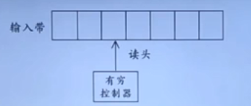

1. 输入带(input tape) ：用来存放输入符号串
2. 读头(head) ：从左向右逐个读取输入符号，不能修改(只读)不能 **往返移动**
3. 有穷控制器(finite control) ：具有 **有穷个** 状态数，根据 **当前的状态** 和当前 **输入符号** 控制转入 **下一状态**

## FA的表示

转换图

1. 节点 ：FA的状态
   1. 初始状态（开始状态）：只有一个 ，由 start箭头 指向
      1. 下面的 状态 0
   2. 终止状态（接受状态）：可以有多个 ，用 双圈 表示
      1. 下面的状态 3
2. 带标记的 有向边 ：如果对于输入 a ，存在一个从状态 p 到状态 q 的转换 ，就在p、q 之间画一条有向边 ，并标记上 a
   1. a b b都是有向边

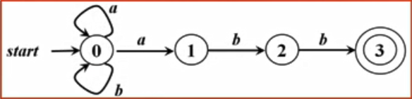


## FA定义（接受）的语言

给定输入串x ，如果存在一个对应于串x的从初始状态到某个终止状态的转换序列 ，则称串x **被该FA接收** 

由一个 有穷自动机M 接收的所有串构成的集合称为是 该FA定义(或接收)的语言 记为L(M)

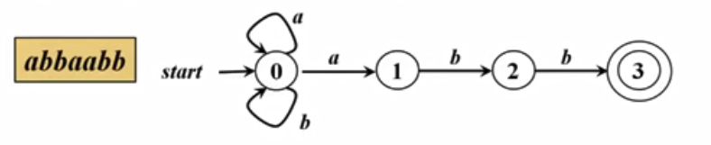


## 最长子串匹配原则

当输入串的 多个前缀 与一个或多个 模式 匹配时 ，总是选择最长的前缀进行匹配

在到达某个终态之后，只要输入带上还有符号，FA就继续前进，以便寻找 **尽可能长的匹配**


# 有穷自动机的分类

## FA的分类

### 确定的 FA ---DFA

Deterministic finite automata 

DFA 被定义为一个 五元组


S ：有穷状态集

Σ(xigema-字母表) ：表示输入字母表 ，即 **输入符号集合** 。假设 空串 不是Σ 中的元素

第三个符号 ：将 SxΣ 映射到 S的转换函数 。

* VsES,a∈E, 8(s,a) 表示从状态 s 出发 ，沿着标记为 a 的边所能到达的状态

S0 ：表示开始状态（或初始状态），S0∈S

F ：接收状态（或终止状态）集合 ，F 包含于 S

#### 例子

一个 DFA

转换图

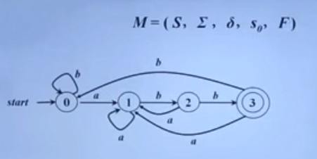

转换表

|      | a    | b    |
| ---- | ---- | ---- |
| 0    | 1    | 0    |
| 1    | 1    | 2    |
| 2    | 1    | 3    |
| 3    | 1    | 0    |

可以用转换表表示

### 非确定的 FA

Nondeterministic finite automata

也是一个五元组，跟 DFA 

S ：有穷状态集

Σ(xigema-字母表) ：表示输入字母表 ，即 **输入符号集合** 。假设 空串 不是Σ 中的元素

第三个符号 ：将 SxΣ 映射到 2^S的转换函数 。

* VsES,a∈E, 8(s,a) 表示从状态 s 出发 ，沿着标记为 a 的边所能到达的状态 **集合**
* DFA 和 NFA 唯一的区别

S0 ：表示开始状态（或初始状态），S0∈S

F ：接收状态（或终止状态）集合 ，F 包含于 S

#### 例子

状态转换图

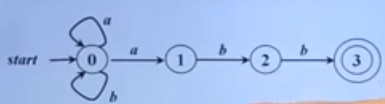

转换表

|      | a     | b    |
| ---- | ----- | ---- |
| 0    | {1,0} | {0}  |
| 1    | 空    | {2}  |
| 2    | 空    | {3}  |
| 3    | 空    | 空   |

如果转换函数没有给出对应于某个 状态-输入 对的信息 ，就把 空 放入相应的表项中


## DFA和NFA的等价性

对任何 NFA N ，存在识别同一语言的 DFA D

对任何 DFA D ，存在识别同一语言的 NFA N

### 例如

一个 NFA 可以构建对应的 DFA

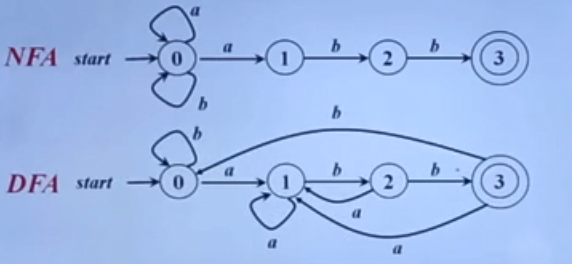


## DFA的算法实现

输入 ：以文件结束符 eof 结尾的字符串 x 。DFA的开始状态 S0 ，接收状态集 F ，转换函数 move。

输出 ：如果 D 接收 x ，则回答 "yes" ，否则回答 "no" 。

方法 ：将下述算法应用于输入串 x 。

```shell
S = S0;
c = nextChar();
while (c != eof) {
	s = move(s, c);
	c = nextChar();
}
if (s在F中) 
	return "yes";
else
	return "no";
```

函数 `nextChar()` 返回输入串 x 的下一个符号，

函数 `move(s, c)` 表示从状态 s 出发 ，沿着标记为 c 的边能到达的状态


# 正则表达式到FA

从正则表达式直接构造出 DFA 是困难的，

为什么要构造 DFA ？这个问题问得好

因为计算机实现 DFA 比较容易，而 NFA 是便于人们理解的

因为从 正则表达式 直接构造 DFA 是困难的 ，所以需要先构造出 NFA ，再从 NFA 构造 DFA


## 根据 RE 构造 NFA 

空串对应 NFA

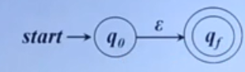


字母表 Σ 中符号 a 对应的 NFA

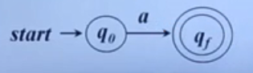


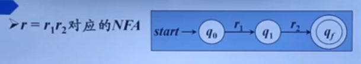

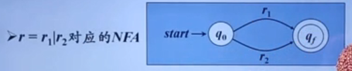


# NFA --》DFA

## 例子1

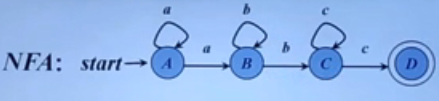


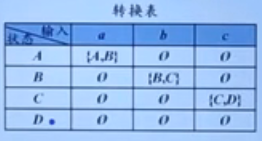

转换

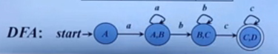

根据上述转换表转换 ，DFA 的每个状态时 NFA 的集合 

 


# 识别单词的 DFA 

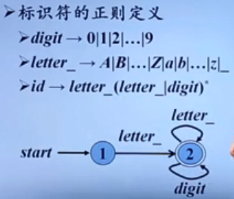


# 词法分析阶段的错误处理

1. 词法分析阶段可检测错误的类型
   1. 单词拼写错误
      1. 例如 ：`int i = 0x3G;float j = 1.05e;` 
   2. 非法字符
      1. 例如 ：`~@` 
2. 词法错误检测
   1. 如果当前状态与当前输入符号在转换表对应项中的信息为空 ，则报错 ，调用错误处理程序

##  错误处理

1. 查找已扫描字符串中最后一个对应于某状态的字符
   1. 如果找到了，将该字符与其前面的字符识别成一个单词。然后将输入指针 **退回** 到该字符，扫描器重新回到初始状态，继续识别下一个单词
   2. 如果没找到 ，则确定出错 ，采用错误恢复策略

## 错误恢复策略

1. 最简单的错误恢复策略 ：“恐慌模式（panic mode)” 恢复
   1. 从剩余的输入中 **不断删除字符**，直到词法分析器能够在剩余输入的开头发现一个正确的字符为止


