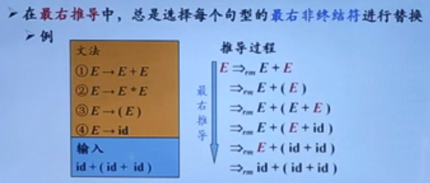
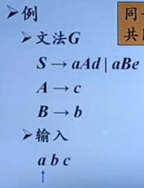
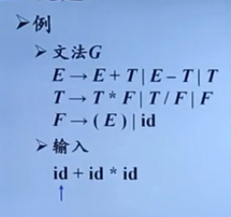
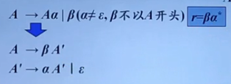
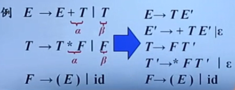
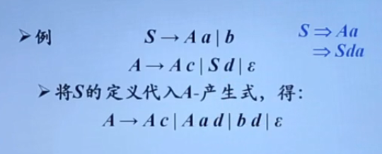
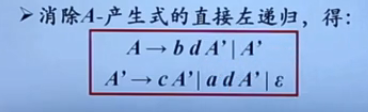
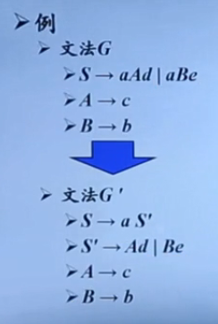
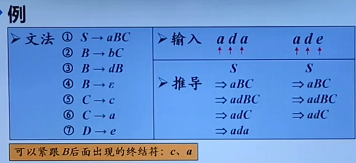
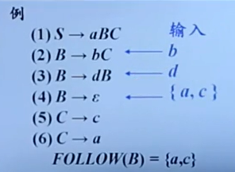

# 自顶向下的分析

Top-Down Parsing

1. 从分析树的顶部（根节点）向底部（叶节点）方向构造分析树
2. 可以看成是从文法开始符号 S **推导** 出词串 w 的过程

## 最左推导

1. 在 最左推导 中 ，总是选择每个句型的 最左非终结符 进行替换

## 最右推导




1. 在自底向上的分析中 ，总是采用最左归约的方式 ，因此把最左归约称为 **规范归约** ，而 **最右推导** 响应地称为 **规范推导** 

## 最左和最右的唯一性


## 自顶向下语法分析的通用形式

### 递归下降分析（Recursive-Descant Parsing）

* 由一组过程组成 ，每个过程对应一个 **非终结符** 
* 从文法开始符号 S 对应的过程开始 ，其中递归调用文法中其他非终结符对应的过程。
* 如果 S 对应的过程恰好扫描了整个输入串 ，这成功完成语法分析

```java
void A(){
    // 选择一个 A 产生式，A-->X1X2....Xn;
    for (i = 1 t0 k) {
        if(Xi是一个非终结符号)
            调用过程Xi();
        else if (Xi等于当前的输入符号a)
            // 当前的符号匹配
            读入下一个输入符号;
        else 
            发生了一个错误;
    }
}
```


### 预测分析

1. 预测分析是 递归下降分析 技术的一个特例 ，通过在输入中向前看 固定个数（通常为1）符号来选择正确的 A- 产生式
2. 可以对某些文法构造出向前看 k 个输入符号的预测分析器 ，该类文法有时也称为 **LL(K) 文法类** 
3. 预测分析 **不需要回溯** ，是一种确定的自顶向下的分析方法


# 文法转换

问题1



从这个文法中 ，输入的第一个终结符 a ，与文法中非终结符的两个候选式的前缀相同 ，这种情况就有点麻烦，官方的话

* 同一非终结符的多个候选式存在 **共同前缀**，将导致 **回溯现象** 

问题2 



输入的字符串跟文法中的候选式没有一个是匹配的 ，所以就需要一个个尝试

左递归文法会使递归下降分析器陷入 **无限循环** 

* 含有A→Aa形 式产生式的文法称为是 **直接左递归** 的(immediate left recursive)
* 如果一个文法中有一个 非终结符A 使得对某个串 a 存在一个推导 A=>+Aa ，那么这个文法就是 左递归 的
* 经过两步或两步以上推导产生的左递归称为是 **间接左递归的** 

## 消除直接左递归

A-->Aa|b 

这个文法可以推导成  r=ba*

草稿纸写一下就会发现 ，如果第一个候选式会导致无限循环 ，



上图就是消除过程 ，最后得到下面的文法

事实上 ，这种消除过程就是把 **左递归** 转换成了 **右递归** 



例子：

如上 ，一些过程自行脑补

 消除左递归是要付出代价的

1. 引进一些 非终结符 和 空产生式


## 消除间接左递归







## 提取左公因子



将文法中 长得不一样的提取出来编程一个新的终结符

这种方法叫做 提取左公因子方法

1. 通过改写产生式来 推迟决定 ，等读入了足够多的的输入 ，输入足够信息后再做出正确的选择


# LL(1) 文法

S_文法

1. 预测分析法的工作过程
   1. 从文法开始符号出发 ，哎每一步推导过程中根据当前句型的最左非终结符 A 和当前输入符号 a ，选择正确的 A- 产生式。为保证分析的确定性 ，选出的候选式必须是唯一的。
   2. S_文法（简单的确定性文法 ，Korenjak & Hopcroft ，1966）
      1. 每个产生式的右部都以终结符开始
      2. 同一非终结符的各个候选式的 **首终结符** 都不同 



什么时候使用 空 产生式？

1. 如果当前某 非终结符A 与 当前 输入符a 不匹配时 ，若存在A–>空 ，可以通过检查 a 是否可以出现在 A 的后面 ，来决定 是否使用产生式 A--> 空 （若文法中无A-->空 ，则应报错）

## 非终结符的后继符号集

非终结符A的后继符号集

1. 可能在某个举行中紧跟在 A 后面的终结符 a 的集合 ，记为Follow(A)
2.  




## 产生式的可选集

1. 产生式A→β 的可选集是指 可以选用该产生式进行推导 时对应的输入符号的集合，记为SELECT(A→β)
   1. SELECT(A–>αβ)={α}
   2. SELECT(A–>空)=FOLLOW(A)
2. q_文法
   1. 每个产生式的右部或为ε ，或以终结符开始
   2. 具有相同左部的产生式有 **不相交的可选集** 
   3. q_文法不含右部以 非终结符 开头的产生式

 

## 串首终结符集

串首终结符

1. 串首的第一个符号 ，并且是终结符。简称串首终结符

给定一个文法符号串a，a的串首终结符集 FIRST(a) 被定义为 可以从a推导出的所有串首终结符 构成的集合。如果a=*ε ，那么ε也在FIRST(a) 中

## LL(1)文法定义

文法G是LL(1)的，当且仅当G的任意两个具有 **相同左部的** 产生式A→a|β满足下面的条件:

* 不存在终结符a使得a和β 都能够推导出以a开头的串
* a和至多有一个能推导出ε
* 如果β→*ε，则FIRST (a)∩FOLLOW(A)=D;
* 如果a→* ε，则FIRST (β)∩FOLLOW(A) =D;
* 要保证 ：
  * 同一非终结符的各个产生式的 **可选集互不相交** 
  * 可以为 LL(1) 文法构造预测分析器

### LL(1)文法的含义

第一个 “L” 表示 从左向右扫描输入

第二个 “L” 表示产生 最左 推导

“1” 表示在每一步中只需要向前看 一个 输入符号来决定语法分析动作


# FIRST 和 FOLLOW 的计算

## 计算文法符号X的FIRST(x)

* FIRST(X) ：可以从X推导出的所有 **串首终结符** 构成的集合
* 如果X=>*ε ，那么ε∈FIRST( X )

## 算法

➢不断应用下列规则，直到没有新的终结符或8可以被加入到任何FIRST集合中为止

1. 如果X是一个终结符，那么FIRST(X)={X}、
2. 如果X是一个非终结符，且X==>Y...Yk∈P(k>=1) ，
   1. 那么如果对于某个i, a在FIRST(Y;)中且ε在所有的 
   2. FIRST(Y),... , FIRST(Yi-1) 中(即Y...Y.1>* 8),
      就把a加入到FIRST(X)中。
   3. 如果对于所有的j= 1,2,...,k, ε在FIRST(Y)中，那么将ε加入到FIRST(X )
3. 如果X-→ε∈P ，那么将ε加入到FIRST(X )中


# 递归的预测分析法

递归的预测分析法是指 ：在 递归下降分析 中 ，编写每一个非终结符对应的过程时 ，根据 预测分析表 进行产生式选择

# 非递归的预测分析法

非递归的预测分析不需要为 每个非终结符 编写递归下降过程 ，而是根据预测分析表 构造一个自动机 ，也叫表驱动的预测分析


# 预测分析法实现步骤

1. 构造文法
2. 改造文法 ：消除二义性、消除左递归、消除回溯
3. 求每个变量的FIRST集和FOLLOW集，从而求得每个候选式的SELECT集
4. 检查是不是LL(1)文法。若是，构造预测分析表
5. 对于递归的预测分析，根据预测分析表为每一个非终结符编写一个过程；对于非递归的预测分析，实现表驱动的预测分析算法


# 预测分析中的错误检测

两种情况下可以检测到错误

1. 栈顶的 终结符 和当前 输入符号 不匹配
2. 栈顶 非终结符 与当前 输入符号 在预测分析表对应项中的信息为空

## 错误恢复

恐慌模式

1. 忽略输入中的一些符号 ，直到输入中出现由设计者选定的 同步词法单元（synchronizing token）集合中的某个词法单元
2. 其效果依赖于 **同步集合的选取**。集合的选取应该使得语法分析器能从实际遇到的错误中 **快速回复**。


