# 概述

## 需求分析的目的

了解用户的真实需求

相同的需求，不同的人理解不同

### 需求分析的定义

用户解决问题或达到目标所需的条件或能力

系统或系统部件要满足合同、 标准、规范或其他正式规定文档所需具有的条件或能力

一种反应上面（1）或（2）所述条件或权能的文档说明

功能性需求

非功能性需求：对设计和实现提出了限制 ，比如性能需求、质量需求


## 需求分析的任务

准确的回答：系统必须做什么？

### 确定对系统的综合要求

功能、性能、接口、约束、出错处理、扩展等需求

### 分析系统的数据要求

通常建立数据模型 ER 图

### 导出系统的逻辑模型

通常用 **数据流图** 数据字典 构建逻辑模型

### 修正开发计划

修正以前的开发计划


## 需求分析的步骤

需求获取

* 问题识别

需求建模

* 分析建模

需求描述

* 编写需求规格说明书

需求验证

* 评估和验证需求成果


## 需求分析的获取

### 访谈用户

* 面对面的跟用户进行对话

### 开座谈会

* 通过座谈会的形式对部门业务活动调查与商讨

### 问卷调查

* 利用调查表去调查用户对软件的看法

### 跟班作业

* 软件分析人员亲自参加用户单位业务工作
* 耗费时间但是效果好

### 收集用户台账

* 台账就是显示系统的输入输出

### 通过原型完善需求

* 原型根据用户的评价不断完善修正


---

# 需求分析建模

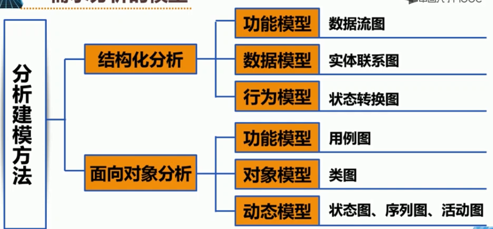


## 功能模型

什么是数据流图

数据流图 描绘系统的 逻辑模型，图中 ==无具体的== 物理元素，只是描绘 信息在系统中流动和处理 的情况。


### 例如

[学生购买教材系统] --通过对现实环境的调查,获得当前系统的物理模型

#### 物理模型


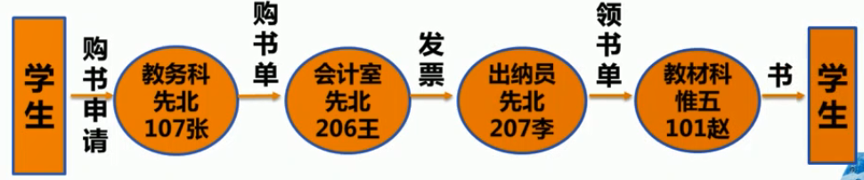


##### 分析

从物理模型中发现学生购买教材的处理流程包含了很多 **物理地点**，如教务处、教材科,会计室等。去掉具体模型中的 **非本质因素**，**抽象** 出当前系统的逻辑模型。


#### 系统的逻辑模型

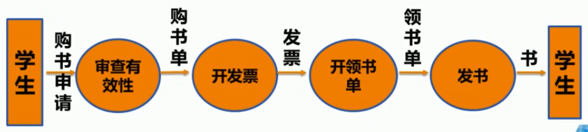


##### 分析

我们还可以进一步对系统的 **逻辑模型进行细化**，分析当前系统与目标系统的差别，建立目标系统的逻辑模型。

例如 ：发书是具体的实物操作，计算机不需要识别

#### 细化逻辑模型


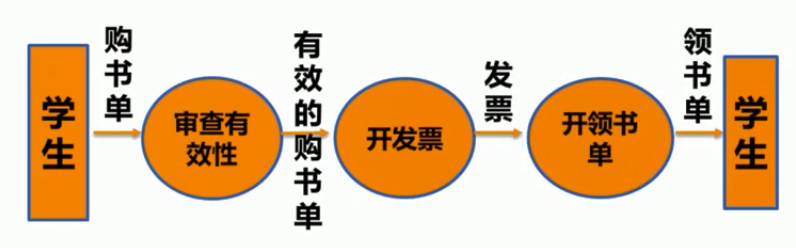


### 数据流图的基本符号

#### 外部实体

==正方形== 或 ==正方体== 位于系统之外的信息提供者或使用者

例如：


* 外部实体说明 数据输入的源点 或 数据输出的终点 可用来明确 系统和环境的边界
* 同一个外部实体可以在一张数据流程图中 出现**若干次**

#### 处理过程

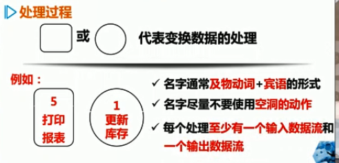


#### 数据流

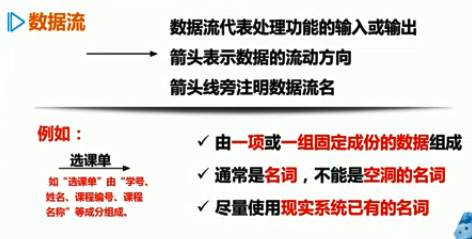


#### 数据存储

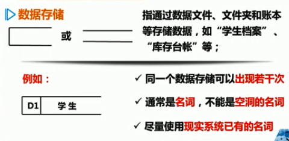


---

## 数据模型

画数据流图的步骤

1. 画系统的输入和输出（顶层图）
   1. 把整个软件系统看做一个大的加工处理，确定软件的数据源点和终点、圆点和终点与软件系统之间的    输入/输出  数据流。

2. 画系统的内部（0层图）
   1. **分解顶层图** 中的 加工处理，并用数据流将这些加工处理 **连接起来**，使得顶层图中的 输入数据流 经一连串的加工处理后 **变换成** 顶层图的输出数据流。
   2. 在数据流的组成或值发生变化的地方，应画一个加工处理，这个加工处理的功能就是实现这一变化
   3. 也可根据系统的功能确定加工处理
3. 画加工处理的内部
   1. 把每个加工处理看做一个小系统，该加工处理的输入输出数据流看成小系统的输入输出数据流
   2. 用画0层图同样的方法画出每个加工处理的 DFD（数据流程图） 子图


### 需求分析的模型

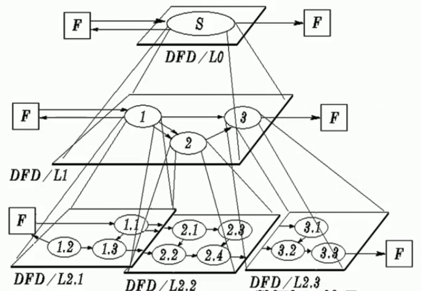


按照系统的 **层次结构** ，**逐步分解** 数据流图


### 案例

库存管理系统

一家工厂的 **采购员**，每一天需要一张 **订货报表**，报表根据 **仓库管理员** **入库出库事务** 处理的结果 来确定，当库存量低于某一临界值时，则产生 **订货信息**，每天打印报表通知 采购员。请用 **分层** 的方式画出数据流图。

#### 分析

源点/终点

* 仓库管理员、采购员

处理

* 处理事务、产生报表

数据流

* 事务、订货报表

数据存储

* 库存清单、订货信息

#### 顶层数据流图

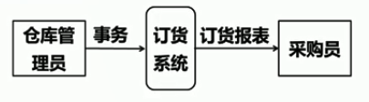

顶层图的作用在于表名被开发系统的范围以及它和周围环境的数据交换关系。对于顶层数据流图通常可以不考虑数据存储


#### 数据流图设计注意事项

在数据流图中应描绘所有可能的数据流向，而不应该描绘出现某个数据流的条件

数据流图的要点是描绘 做什么 ，而不是 怎么做

处理并不一定是一个程序，可以代表-系列程序、单个程序或者程序的一个模块，甚至人工处理过程

一个数据存储也并不一定是一个文件，它可以表示一个文件、文件的一部分、数据库的元素或记录的一部分等

采用层次结构的数据流图反映加工处理的分解，并对加工处理编号以反映这种分层结构。细化前后对应功能的
输入输出数据必须保持一致

---


### 什么是数据模型

概念性数据模型是一种 **面向问题的数据模型**，是按照用户的观点 对数据建立的模型。

它描述了从用户角度看到的数据，它反映了 **用户的现实环境**，而且与在软件系统中的 **实现方法无关**。

数据模型中包含3种相互关联的信息：**数据对象**、**数据对象的属性**、**数据对象的关系**。

#### 数据对象

数据对象是软件必须理解的复合信息的抽象

数据对象可以是 ==外部实体==

* 例如计算机

数据对象可以是 ==事务==

* 例如报表

数据对象可以是 ==行为==

* 例如打电话

数据对象可以是 ==事件==

* 例如：响警报

数据对象可以是 ==角色==

* 例如： 教师学生

数据对象可以是 ==单位==

* 例如：会计科、收发室

数据对象可以是 ==地点==

* 例如：仓库

数据对象可以是 ==结构==

* 例如：文件

总之，可以由一组属性来定义的实体都是数据对象

---

##### 属性

属性定义了数据对象的性质

* 必须把一个或多个属性定义为 “**标识符**”。应该根据对所要解决问题的理解，来确定特定数据对象的一组合适的属性。
* 例如：开发机动车管理系统，描述汽车的属性应该是 生产商、品牌、型号、车体类型、颜色、车主姓名、住址、驾驶证号码、生产日期、购买日期等等

##### 联系

数据对象彼此之间相互连接的方式成为 联系，也叫 关系

* 一对一、一对多、多对多

##### 符号

使用 实体-联系图（entity-Relationship diagram) 来建立数据模型，实体联系图简称为 **ER图**

* ER图中包含了实体（即数据对象）、关系 和 属性 等3中基本成分

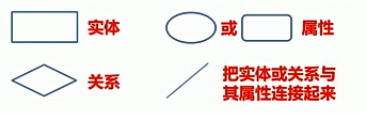

#### 如何建立 ER图

1. 列出应用软件或业务过程涉及到的所有“事物”将其演化成 **数据对象**;

2. 考虑对象和其他对象之间 **是否存在连接**;
3. 如果存在连接，应创建一个或多个关系;
4. 对每一个关系，确定其关联类型;
5. 重复步骤( 2 )到步骤( 4) ,直到定义了所有关系;
6. 定义每个实体的属性;
7. 形式化并 复审 实体关系图;
8. 重复步骤( 1 )到( 7) ,直到 数据建模 完成。


#### ER图案例


患者监护系统

某医院打算开发一个以计算机为中心的患者监护系统，业务内容描述如下：医院对 患者 监护系统的基本要求是随时接收每个 ==病人== 的 **生理信号(脉搏、体温、血压、心电图等)** ，定时记录病人情况以形成 **患者日志**，当某个病人的生理信号超出医生规定的安全范围时向 ==值班护士== 发出警告信息,此外，护士在需要时还可以要求系统打印出某个指定病人的 **病情报告**。


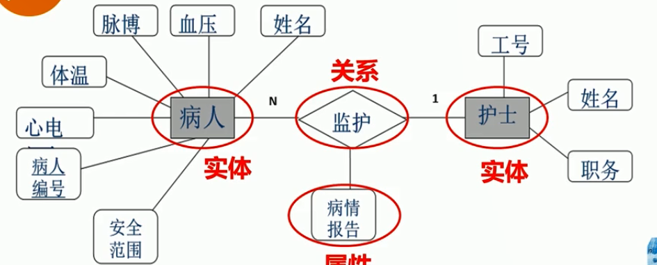


---

## 行为模型

### 状态转换图

状态转换图是一种描述系统对内部或外部事件响应的 **行为模型**。

行为模型特别适合于 **复杂状态** 的系统建模，尤其对 **控制系统 和 实时系统** 的分析特别有效。

状态转换图通过描绘系统的状态及引起系统状态转换的事件来表示系统的行为，包括 **状态、事件和行为**。


### 状态转换图的组成

#### 状态

代表系统的一种行为模式，状态规定了系统对事件的响应方式。有 初态(即初始状态)、中间状态 和 终态(即最终状态)


#### 事件

在某个特定时刻发生的事情，它是引起系统 做动作 或从一个状态 **转换到** 另一个状态的 **外界事件的抽象**，用箭头上的标记表示。


#### 行为

指对象达到某种状态时所做的一系列 **处理操作**。用箭头表示从一种状态向另一种 **状态的迁移**。

### 案例

```shell
每部电梯有m个按钮，每一个按钮代表一个楼层。当 ==按下一个按钮时==，该按钮指示灯亮，同时，电梯驶向相应的楼层，当到达 ==相应楼层== 时，指示灯熄灭。除了最低层和最高层之外，每一层都有两个按钮分别指示电梯上行和下行。按下按钮后指示灯亮,当电梯到达此楼层时指示灯熄灭，并向所需要的方向移动。当电梯无升降运动时，关门并停在当前楼层。

```

#### 分析

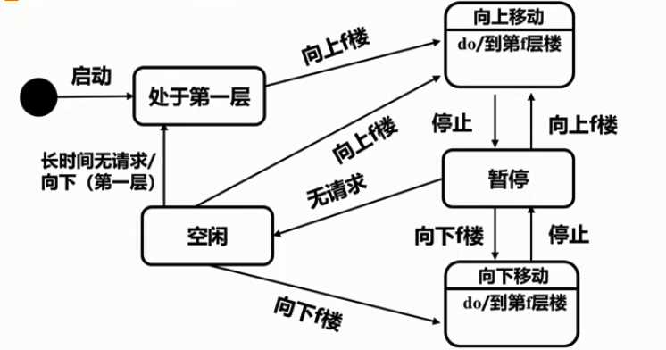


暂停细分

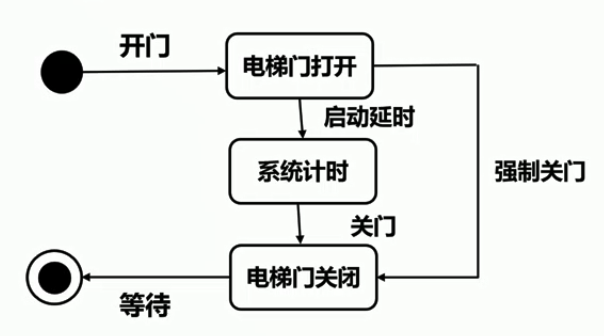


