# 结构化总体设计

## 概述

### 设计原则

模块化原则

抽象原则

逐步求精原则

* 对解决方案各个层次的细化

信息隐藏原则

一致性

## 启发式规则

模块的规模要适中

* 结构化程序设计要在模块数量与模块的大小之间取得平衡

提高模块的独立性，降低模块之间的耦合。即每个模块完善相对独立的功能 ，模块之间的关联尽可能少

* 模块之间的耦合度取决于接口的复杂度
* 耦合关系
  * 无直接耦合
  * 数据耦合
  * 标记耦合
  * 控制耦合
  * 外部耦合
  * 公共耦合
  * 内容耦合
  * 耦合级别从低到高

提高模块的内聚程度

* 偶然内聚
  * 模块内的各个组件没有任何联系
* 逻辑内聚
  * 指几个逻辑相关的功能放在同一模块中
* 时间内聚
  * 指把需要同时执行的一组动作组合起来
* 过程内聚
  * 一组会依照固定顺序执行的程序放在模块中
* 通信内聚
  * 模块内所有处理元素都在同一个数据结构上操作
* 顺序内聚
  * 一个模块中各个处理元素都密切相关于一个功能且必须顺序执行
* 功能内聚
  * 模块内所有元素共同调用一个功能
* 也是从低到高排列

加强模块的保护性

* 防止其他模块受到影响


# 面向数据流设计方法

## 设计方法

通常的结构化设计方法（简称SD方法） ，也就是 **基于数据流** 的设计方法

数据流图映射成软件结构图

根据信息流的类型可分为 ：变换流 和 事务流

### 什么是变化流

信息沿 **输入通路** 进入系统 ，同时由外部形式 **变换成** 内部形式 ，进入系统的信息通过变换中心 ，经加工处理后再沿 输出通路 变换成 外部形式离开软件系统。当数据流图具有这些特性时,这种信息流就叫做变换流。

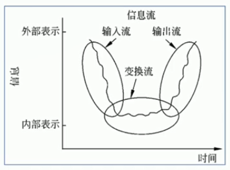


## 设计过程

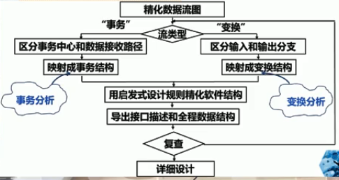


## 变换流分析

1. 首先要确定出  输入流和输出流 的边界 ，孤立出 变换中心
2. 确定边界 ，通常凭经验

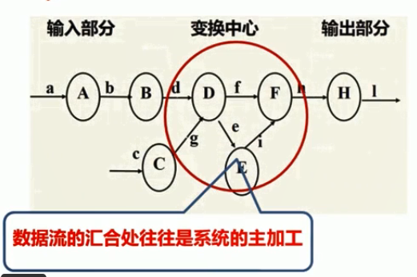

通常 数据流的汇合处往往是系统的主加工

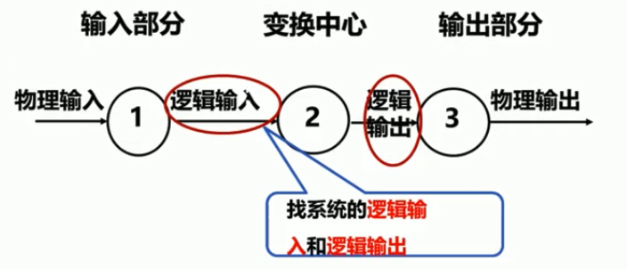


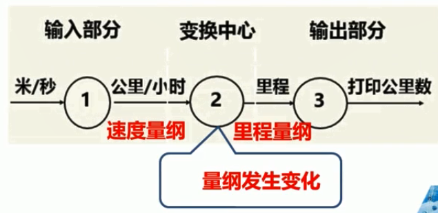

### 案例

开发一个带有微处理器的汽车数字仪表板控制系统。

完成以下功能

1. 通过 模数转换 实现传感器和微处理器接口。
2. 在发光二极管面板上显示如下数据:
   1. 显示每小时行驶的英里数 mph；
   2. 显示每加仑行驶的英里数 mpg ；
   3. 显示汽车是加速或减速行驶 ；
   4. 显示里程
3. 如果汽车的速度超过了55英里/小时 ，则发出超速警告铃声

#### 设计步骤

1. 复查基本系统模型
   1. 确保系统的 输入数据和输出数据 符合实际
2. 复查并精化数据流图
   1. 给出的数字仪表板系统的数据流图(如下图)已经足够详细 ，因此不需要精化

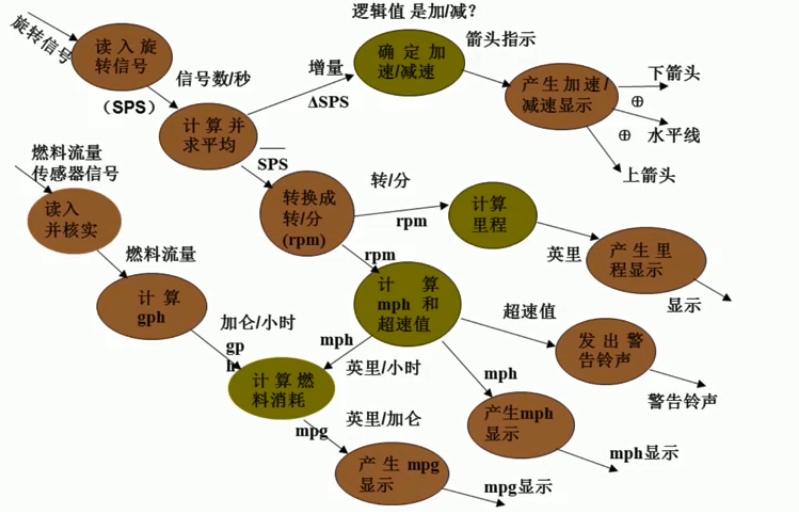


3. 确定数据流类型
   1. 从上图可以看出 ，没有明显的事务中心 ，因此认为数据流图的类型是变换性的数据流图
4. 确定 输入流河输出流 的边界 ，从而孤立出变换中心
5. 设计系统的 上层模块结构（完成第一级分解）
   1. 上层模块
      1. 顶层 ：系统模块
      2. 第一层 ：
         1. 输入模块
            1. CA
         2. 变换模块
            1. CT
         3. 输出模块
            1. CE
6. 设计 下层模块 （完成第二级分解）
   1. 下层模块
      1. 沿着 输入通路 向外移动 ，把 输入通路 中每个处理映射成软件结构中 Ca 控制下的一个底层模块
      2. 沿着 输出通路 向外移动 ，把 输出通路 中的每一个模块映射成 Ce 控制下的一个低层模块
      3. 把变换部分 中每个处理 ，映射成软件结构中 Ct 控制下的若干模块
7. 精化 模块结构
   1. 在输入结构中：
      1. 计算 rpm、计算 sps 、采集 sps 可以合并
   2. 输出结构中：
      1. 加速/减速模块可以放在显示 mph 模块下
   3. 在 变换模块中：
      1. 确定 加速/减速模块 可以放在计算 mph 模块之下 ，以减少耦合

---

# 事务流设计方法

## 什么是事务流

当数据流图的数据流是"以事务为中心的"数据沿 **输入通路** 到达一个处理T ，这个处理根据输入数据的类型在若干个动作序列中选出一个来执行。这类数据流应该划为一类特殊的数据流 ，称为事务流。

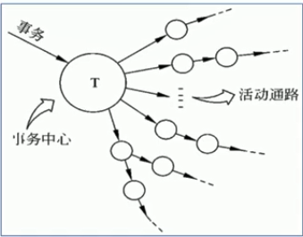


任何情况下都可使用 **变换分析方法** 设计软件结构 ，但如果 数据流 具有明显的 **事务特点** 时(有一个明显的事务中心),例如ATM机以采用事务分析方法为宜。

事务分析的设计步骤和变换分析的设计步骤 **大部分相同** 主要差别在于 数据流图到软件结构的 **映射方法不同**。


## 设计步骤

1. 在 DFD 上确定事务中心、接受部分和发送部分
2. 画出 SC（结构图）框架 ，把 DFD 上的三部分分别映射为事务控制模块、接受模块和动作发送模块
3. 分解细化 接收分支和发送分支 ，完成初始化 SC

### 事务流案例

汽车仪表板系统有一个 电子点火钥匙 和一个功能选择与显示装置 ，用来选择某些性能。通过一组按键产生一串点火启动数字 来代替普通的点火钥匙 ，这组按键的选择功能如下:

1. 点火 ，启动汽车。除了这个点火按钮之外 ，还有一排数字按钮 ，事先可以设置一个数字密码 ，只有密码对上了 ，汽车才能安全启动
2. 雷达探测。他可以给出障碍物的距离 ，如果距离太近就会发出警告 ，以防止事故的发生。
3. 显示发动机的工作状态。
4. 启动行程计算器 ，输入行程计算数据。
5. 显示行程 ，计算信息。
6. 显示清除上一键。


## 事务流分析方法

#### 

1. 复查基本系统模型
2. 复查并精化数据流图
   1. 物理输入是欲选择的某种功能键 ，按键并检查后 ，数据流沿六条路径中的一条移动 ，本题只给出详细的按键1 和 按键2 的路径 ，其他路径则简化为一个处理表示。
   2. 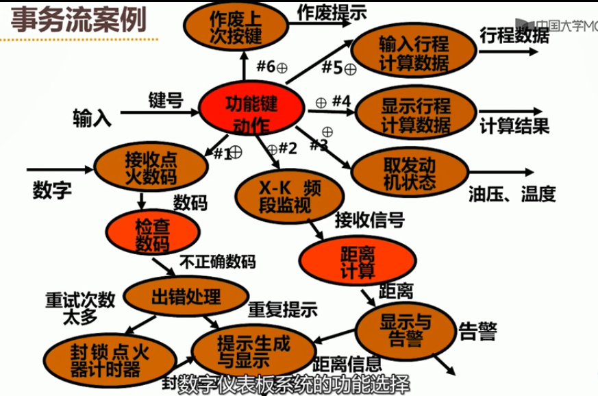
3. 确定数据流类型
   1. 由图可知 ，功能键动作是事务中心 ，因此属于事务型结构的数据流图
4. 确定 接收部分和发送 部分的边境
   1. 第一、第二条路径 ，又是两个变换流 ，可按变换流进一步划分子图边界。
5. 设计系统的上层模块结构
   1. 事务型结构的 数据流图 在映射 软件结构 时包括两个分支 ，一个为接收分支 ，一个为发送分支 ，且发送分支在 **调度模块** 的控制下。
6. 设计系统的下层模块。
   1. 接收部分的 **下层模块** 的设计从事务中心的边界开始 ，沿着接收通路向外 ，将处理映射成模块。
   2. 发送分支是在调度模块控制下的下层模块 ，从事务中心的边界开始 ，沿着 **发送通路** 向外把每个活动流通路径映射成与它的流特征相对应的结构,本题中的1.2两个分支又是变换流。( 只给出两个分支)


---


# 数据库设计

良好的数据库设计：

1. 节省存储空间
2. 保证数据完整性
3. 方便系统开发

糟糕的数据库设计：

1. 数据冗余
2. 存储空间浪费
3. 内存空间浪费
4. 数据更新和插入的异常


## 数据库设计的任务

### 数据库设计的三个阶段：

1. 概念结构设计
   1. **概念结构设计的目的** 是获取数据库的 **概念数据模型**。通常有两种方法，一是实体联系图；二是面向对象的方法，以类或对象的形式表示数据及其之间的联系。
2. 逻辑结构设计
   1. **逻辑结构设计的任务** 是将概念模型 **转换为** 传统数据模型 ，需要根据所选数据库得到具体的 **关系模式** ，即二维表结构。
3. 物理结构设计
   1. **物理结构设计** 是根据 数据模型 及处理要求 ，选择存储结构和存取方式 ，以求获得最佳的存取效率。


## 实例

教务管理系统

### 概念结构设计


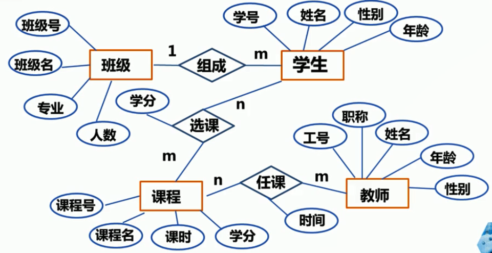


### 逻辑结构设计

1. 实体映射为表 ，实体的属性映射为表的列 ，实体的主键 就是关系的主键
2. 一对一关联 可以引申为一个独立的表 ，也可以与关联的部分或全部实体 组成表
3. 一对多关联映射为一个独立表 ，或与多端实体 组成表
4. 多对多关联可映射为一个独立表 ，该表主键是关联实体的主关键字组合。


---


# 界面设计

1. 详细设计的目的就是要 回答具体该如何设计软件
2. 详细设计不是 **具体地编写程序** ，而是设计程序的 **"蓝图"**
3. 详细设计不仅仅是 **逻辑上** 正确地实现每个模块的功能 ，更重要的是设计出的处理过程应该尽可能简明易懂。
4. 详细设计包括谋爱的 界面设计和 模块内部的结构设计

## 界面设计问题

用户界面的设计 ，必须考虑4个方面的问题

1. 系统响应时间
   1. 系统响应时间是指从用户完成某个动作(按回车键或点击鼠标)  ，到系统给出响应之间的时间间隔。
2. 用户帮助设施
   1. 它可以帮助用户更快捷、更好地学习界面的使用 ，告诉用户在遇到某些使用问题时该如何处理 ，减少用户在使用中的挫败感。
3. 出错信息处理
   1. 出错信息或警告信息 ，是用户操作系统时软件系统给出的坏消息。有效的出错信息能够提高系统的质量。
4. 命令交互
   1. 命令行是早期用户和系统软件交互的常用方式 ，现在面向窗口的、单击和拾取方式的界面已经减少了用户对命令行的依赖。但是很多软件在提供窗口界面的同时 ，依然提供了面向命令行的交互方式供 **高级用户使用**。

## 界面设计过程

界面设计是一个迭代的过程


大多数情况下 ，原型系统都是界面系统

界面往往和用户一起 ，构成用户需求

为了支持界面设计快速迭代的过程，

1. 充分利用原型开发工具

## 界面设计指南

用户界面设计更多的是依赖设计者的经验 ，有助于指导设计者设计出友好高效的人机界面。

1. 一般交互 ：涉及信息显示、数据输入和整体系统控制 ，这些指南是全局性的。严格遵循这些普遍性的设计规则 ，将避免设计界面中出现较大风险。
2. 信息显示 ：页面显示的信息必须是准确而完整的 ，可以用多种方式来显示信息 ：如文字、图片和声音 ；位置、移动和大小;颜色、分辨率和省略。
3. 数据输入 ：输入数据是用户与计算机系统交互的 **主要方式** ，目前键盘还是多数应用系统中的主要输入介质。


# 图形工具

## 程序流程图

### 常用符号

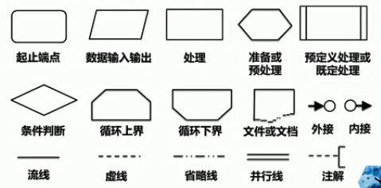

### 三种基本结构

1. 顺序结构
2. 选择结构
3. 判断结构
   1. 先判断在执行
   2. 先执行在判断
4. 多情况选择结构 --》switch

## 盒图

盒图是一种不允许违背 结构程序设计 精神的图形工具 ，又称为 **N-S图**。

### 特点

1. 没有箭头,不允许随意转移控制;
2. 每个矩形框(Case中条件取值例外)都是- -个功能域(即一个特定结构的作用域) ,结构表示明确;
3. 局部及全程数据的作用域易见;
4. 易表现嵌套关系(embed ded structure)以及模块的层次结构

### 基本符号


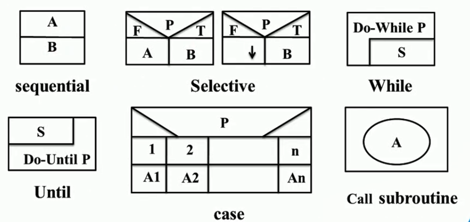


# 表格工具

详细设计阶段使用到的表格工具

## 判定表

1. 判定表能够清晰地表示 **复杂的条件组合与应做的动作之间** 的对应关系 ，而其它的工具不易表示。
2. 一张判定表由四部分组成 ，
   1. **左上部** 列出所有条件 ，
   2. 左下部 是所有可能做的动作 ，
   3. 右上部 是表示各种条件组合的一个矩阵。
   4. 右下部 是和每种条件组合相对应的动作。
3. 判定表的每一列实质上是一条规则 ，规定了与特定的条件组合相对应的动作。

### 案例

航空公司行李托运费用的计算

1. 重量不超过30公斤的行李可免费托运。
2. 对超运部分
   1. 头等舱国内乘客收4元/公斤 ；其它舱位国内乘客收6元/公斤;
   2. 外国乘客收费为国内乘客的2倍; 
   3. 残疾乘客的收费为正常乘客的1/2

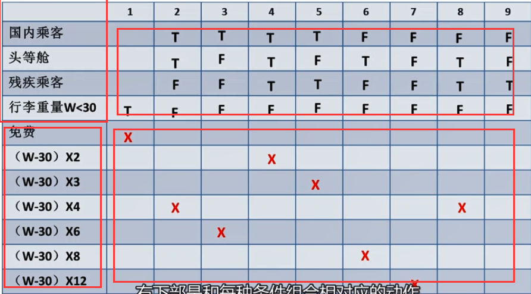


## 判定树

判定树是判定表的变种 ，也能清晰地表示复杂的条件组合与应做的动作之间的对应关系。

优点 ：

1. 形式简单 ，不需任何说明 ，易看出含义 ，易于掌握和使用。

缺点：

1. 简洁性不如判定表 ，相同的数据元素往往要重写多遍  ，而且越接近树的叶端重复次数越多。

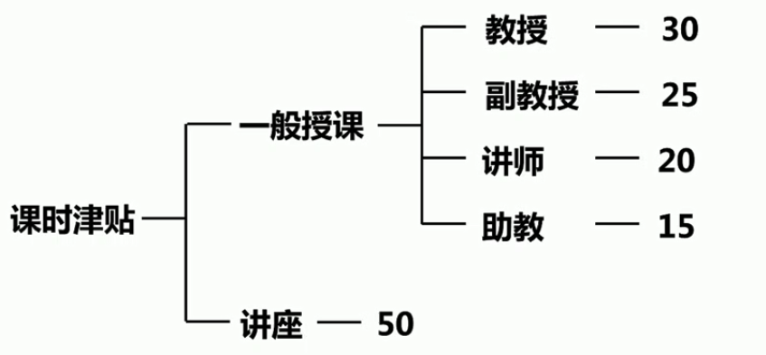


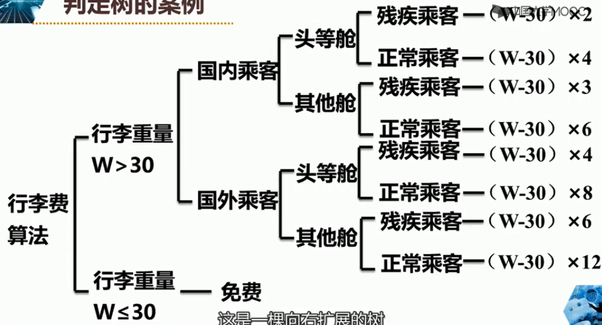


# 语言工具

## 过程设计语言

过程设计语言PDL ( Procedure DesignLanguage )也称为 **结构英语或伪码** ，是所有正文形式的过程设计工具的统称。

PDL经常表现为一种 **“混杂"** 的形式 ，允许自然语言(如英语)的词汇与某种结构化程序设计语言(如Pascal、C、Ada等)的语法结构交织在一起。

优点：

1. 提供的机制比图形全面 ，为保证详细设计与编码的质量创造了有利条件.
2. 注释嵌入在源程序中一起作为程序文档 ，有利于软件的维护。

缺点：

1. 不如图形工具形象直观
2. 描述复杂的条件组合与动作间的对应关系时 ，不如判定表清晰简单；

### PDL案例

例如 ：从一组数中找出其中最大的数 ，用 PDL 语言描述

如下：

```c
input array a;
max = a[1];
i = 2;
do for i = 2 to n
    if max < a[i]
        set max = a[i]
    endif ;
enddo
print max;
```


## 过程设计工具比较

就是找一个案例  用上面的 判定树、判定表、PDL 表示出来 然后分析一下


# 详细设计方法

## Jackson图

### 数据结构

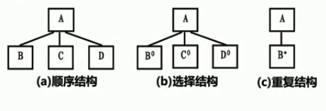

1. A由BCD顺序组成 ，每个元素只出现一次
2. 根据条件A 选择 B/C/D
3. A由n个B组成

优点

1. 便于表示层次结构 ，而且也有利于对结构自顶向下分解
2. 图形象直观 ，可读性好;
3. 不仅能表示数据结构 ，也能表示程序结构。

缺点：

1. 在选择结构和重复结构中 ，选择条件或循环结束条件不能直接在Jackson图中表示出来。影响了图形的表达能力,也不利于直接把图翻译成程序。

## Jackson程序设计方法

1. 用Jackson图描绘 **输入输出数据** 的逻辑结构。
2. 找出输入和输出数据结构中有 对应关系 的数据单元。
3. 根据规则导出程序结构的Jackson图。
4. 列出所有操作和条件并分配它们到程序结构图中的适当位置。
5. 用伪码表示程序。


