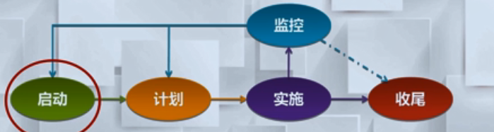

项目的启动阶段显得尤其重要，这是决定是否投资，以及投资什么项目的关键阶段，此时的决策失误可能造成巨大的损失

## 项目启动的概述

项目启动的核心目标：指定项目章程并确定初步范围

* 明确项目的需求和目标
* 定义项目干系人的期望值
* 描述基本项目范围
* 明确项目经理
* 选择基本的项目组成员
* 确认需要交付的文档

### 项目启动的三个关键点

1. 与项目干系人，特别是客户、投资人、高层等之间的沟通，明确需求及 **获得相关支持**
2. 明确项目的 **目标和定位** 
3. 召开项目启动会，同一思想、明确团队运作的制度

---

### 项目启动过程

1. 立项申请
   1. 为了识别用户的需求，进行申请书的撰写工作
   2. 必要时进行可行性调研
2. 组建项目组
   1. 挑选项目经理，形成一个跟项目本身类型相契合的组织架构
   2. 明确每个团员的职责、角色以及他们的定位
3. 制作项目章程
   1. 进一步识别干系人的基础上 ，指定项目章程
4. 项目开工会
   1. 召开项目启动会

---

## 立项申请

项目诞生的驱动因素---意向和需求的提出

* 高层的想法和意向
  * 比如：由于公司发展的需要，需要建设 ERP 系统
* 市场需求
  * 游戏公司鉴于网游市场火爆，建议开发新网游
* 企业发展战略和经营需要
  * 移动通信公司为增加增值业务收入启动新的业务
* 顾客需求
  * 银行为方便用户网上交易开发网银项目
* 技术进步
  * 应用系统由 PC 平台向移动端转移
* 法律要求
  * 确保网上交易的安全性而开展的数字证书项目

### 市场可行性分析注意事项

1、从思想上充分认识到市场可行性分析的重要性，**客观、现实** 地分析市场，而不应过于乐观或简单应付

2、立项之前 **应多方面** 收集竞争产品的各种信息，包括已有厂家情况和市场总体情况等

3、对待立项产品未来发展趋势的预测和分析

**捕捉用户的需求是一件困难的事情**

实际 ：客户并不总是知道自己想要什么

●当产品市场推介到一定程度，产品有了雏形之后，客户可能会意识到新的需求;看到原型或是样机时，客户知道他们想要什么。

●要认真地考虑客户需求，如果-一个产品包没有被目标客户所使用、使用不够或错误地使用，则该产品可被视为一一个失败的产品。

---

## 构建项目组

### 概述

一个配置合理、团队合作的项目组是项目的核心，也是项目成功的保障。

### 任务

构建项目组时应该考虑：

* 选择一个适合项目，结构合理的项目组织结构
* 寻找合适的人选，了解技术、管理方面的优劣势，争取职能部门的支持

### 项目赞助人职责

通常对项目提供资金和支持职责

* 挑选并任命项目经理，批准项目核心成员的组成
* 提供资金及审批重大财务事项

### 项目经理的职责

角色

* 

责任

职能

技能

与管理层沟通---》领导项目组---》管理项目

### 项目成员的职责

项目核心成员对项目经理负责 ，保证项目的完成

- 参与项目的计划制定
- 服从项目经理的指挥,执行计划分配的任务
- 配合其他小组成员工作
- 保持与项目经理的沟通

---

## 项目章程

### 项目干系人概述

项目干系人是指参与项目或受项目影响的个人或组织

项目管理团队需要:

* 识别各干系人，确定项目干系人需求和期望
* 管理和影响项目干系人的期望以确保项目成功

### 章程描述

* 篇为客户准备的高层文档
* 描述了项目将要交付何物，并总结了很多关键要素,如:核心利益相关者、项目角色与职责、项目目标与描等。
* 是种有效的沟通工具，项目组与客户能够对项目达成共识
* 后续工作的基础

---

## 项目开工会

### 立项启动准备

➢建立项目管理制度

- 项目考核管理制度;
- 项目费用管理制度;
- 项目例会管理制度;
- 项目通报制度;
- 项目计划管理制度;
- 项目文件管理流程;

整理启动会资料

### 启动会的任务

召开项目启动会，任务包括：

* 阐述项目背景、价值、目标
* 项目交付物介绍
* 项目组织机构及主要成员职责介绍
* 使双方人员彼此认识，清楚各个层次的接口
* 项目初步计划于风险分析
* 项目管理制度
* 项目将要使用的工作方式（全职或是兼职）

