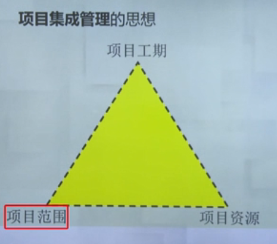
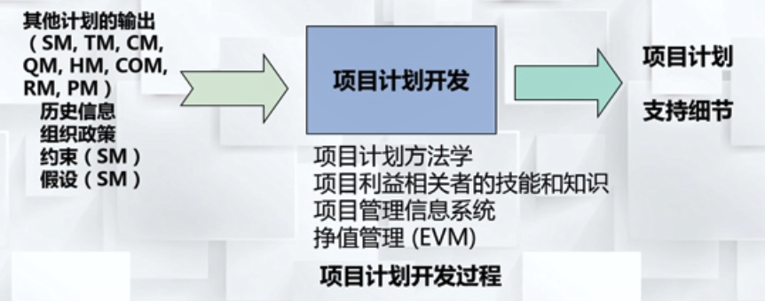

#### 项目集成管理的定义

项目集成管理 是指为确保项目各项工作能够有机地协调和配合所开展的综合性和全局性的项目管理工作和过程；

#### 集成管理的主要工作

* 集成计划的指定
* 集成计划的实施
* 项目变更的综合控制

## 集成计划制定

项目集成管理的思想

### 项目集成计划

#### 定义

项目集成计划是指，通过使用项目其他专项计划过程所生成的结果(即项目的各种专项计划)，运用集成和综合平衡的方法所制定出的，用于指导项目实施和管理的集成性、综合性、全局性、协调统- -的集成计划文件。

#### 项目计划开发过程

#### 项目计划的内容

* 整体介绍
  * 关于项目的整体介绍，描述项目是要来做什么的
* 项目组织描述
  * 进行 人力资源管理，就是要决定要什么样的人来完成项目的实施
* 管理程序和技术方法
  * 时间管理、成本管理、采购管理。。描述用什么方式来管理这些相关的类
* 需完成的工作任务

* 确定工期、成本、质量等控制基准

## 变更控制

项目执行过程中，需要通过变更来满足项目的开发

### 总体控制

在项目集成计划的实施中，必须开展对于项目变更的综合变更控制，以协调和管理好项目各要素的变更要求和各项目相关利益者提出的项目变更要求。

#### 要求

* 保持原有项目绩效度量基准的完整性
  * 工期、成本、质量等基准
* 确保项目产出物变更与项目计划更新一致性
* 协调各方面的变更要求

