# 概述

## 项目范围

范围的概念的两个方面：

* 产品范围
  * 表示产品或者服务具有的特征或者功能
* 项目的工作范围
  * 表示的是项目交付这样一个产品或服务所必需的完成的工作有哪些

# 项目的范围管理

是指对项目包括什么与不包括什么的定义与控制过程。这个过程用于确保项目组和项目干系人对作为项目结果的
项目产品以及生产这些产品所涉及到的过程有一个共同的理解。

## 主要过程

### 范围规划

产品描述

项目章程

环境因素

组织过程资产

组织过程资产：

* 不是传统的固定资产

#### 项目范围管理计划

* 是一份指南
* 从宏观上描述了我们将如何进行范围管理
* 如何进行工作分解结构
* 如何进行项目范围的变更

#### 项目范围说明书

* 创建项目范围说明书 目的是要尽可能清晰地定义和阐述项目的内容（可交付成果及其工作）和复杂性

由项目经理和客户共同完成这两份文档

### 范围定义

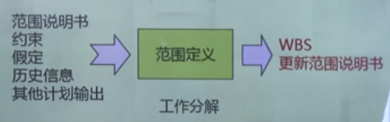

更新范围说明书

#### 工作分解

是指将项目产出物 (或项目目标) 逐层细分为更小、更易管理的子项目或项目要素,直到分解出全部生成项
目产出物的工作包为止。

### 范围核实

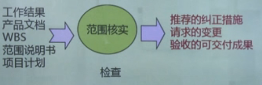

### 范围控制

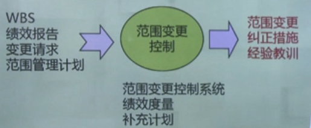

---

# 范围定义 WBS

Work Breakdown Structure

## 关键点

### 分解的策略

按产品的物理结构分解

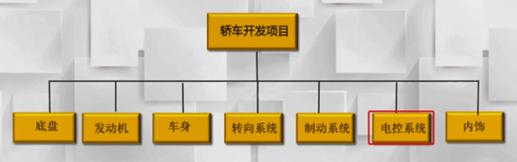

项目实施顺序

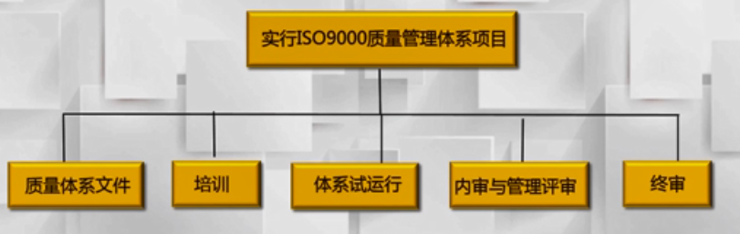

项目主要交付物

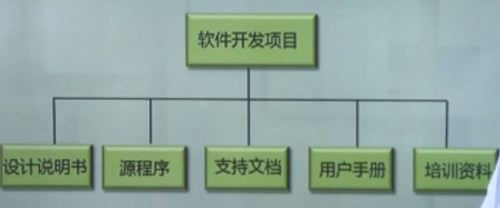

项目职能部门

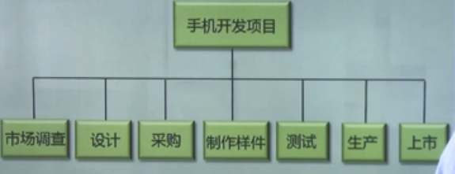

### 分解的方法

#### 类比模版法

类比法是以一个类似项目的 WBS 模版为基础，制定本项目的工作分解结构

##### 工作分解结构模版

在很多专业应用领域中，均有标准或半标准的项目工作分解结构，这些可以作为新项目范围定义的模板使用。

#### 自上而下法

自上而下法常常被视为构建WBS的常规方法，即从整个项目开始,逐步将它们分解成下一级的多个子项。这个过程就是要不断地增加级数,细化工作任务。

#### 自下而上法

自下而上法是要让项目团队成员从一开始就尽可能的确定项目有关的各项具体任务,然后将各项具体任务进行整合，并归并到一个整体活动或WBS的上一级内容当中去。这种方法般都很 **费时**，但这种方法对于WBS的创建来说**效果好**。

### 表现形式

#### 图形式

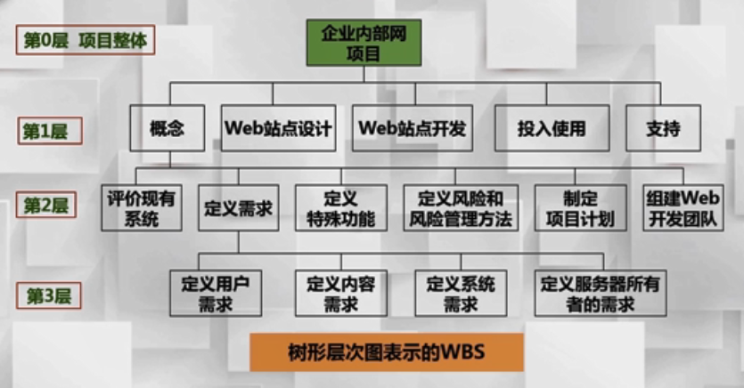

##### 工作单元编码

##### WBS 表

编制 WBS 表，说明每个单元的负责人、工作内容、经费预算等

| 编码                     | 工作单元名称 | 负责人 | 预算成本 | 相关说明 |
| ------------------------ | ------------ | ------ | -------- | -------- |
| 1000                     | xxx          | xxx    | xxx      | xxxxx    |
| 1100 1200 1300 | xxx          | xxx    | xxx      | xxxxx    |

#### 目录式

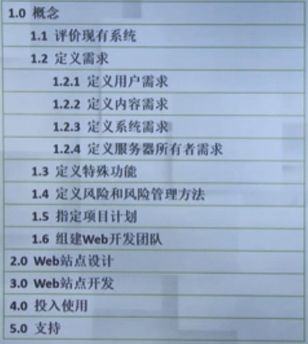

### 工作分解的重要性

WBS图是实施项目，创造最终产品或服务所必须进行的全部活动的一张清单,也是进行计划、人员分配、预算计划的 **基础**。

没有 WBS 工作，后面的一切工作都没有依据

#### 分解到什么时候为止？

工作包

* 工作包是指处于工作分解结构最低的 **可交付成果或产品**，有以下特征：
  * 一个清晰的任务完成
  * 一个清晰的负责人
  * 能够估算工作量和工期
  * 工作包的任务约80小时，原则上不超过两周

#### 项目结构分解原则

各个层次上保持项目内容的完整性，不能遗漏工作单元

一个项目单元只能从属于某一个上层单元，不能交叉。

项目单元应能区分不同的责任人和不同的工作内容

项目结构分解应能方便工期、成本、质量等的控制。

详细程度适中

### 注意事项

---

# 项目范围变更

## 概述

在项目的整个生命周期中,变更必然出现。这可能是修正设计缺陷，改进或扩展系统功能;

## 如何进行范围变更控制

如果出现范围变更需求，应以正式文档方式提出；

项目小组成员必须谨慎考虑项目范围的改变将对整个项目进程可能产生的影响,须在批准后才能进行,在实施过程中必须加以跟踪。

### 变更审批流程

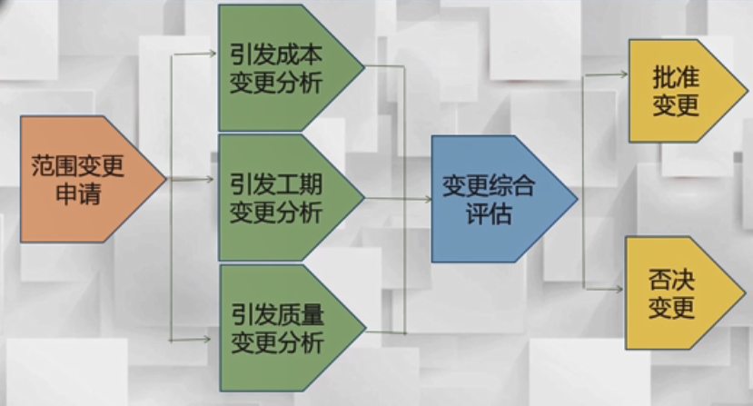

变更申请样式表举例

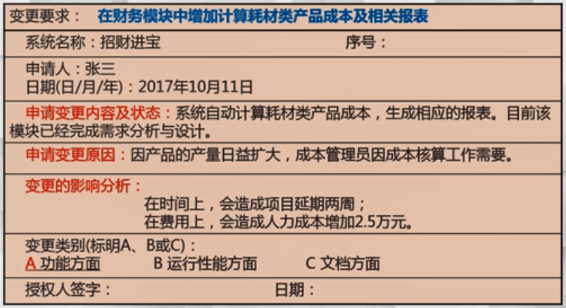

## 变更注意事项

### 做好正确的范围界定

恰当的范围定义对项目成功十分关键，当范围定义不明确时，变更就不可避免地出现，很可能造成返工、延长工期、降低团队士气等一系列不利的后果。

### 警惕范围蔓延

项目经理往往能够意识到大的范围改变，但对于 **小的改变** 却没有那么敏感。

范围蔓延 **指的是** 当项目接受了 **太多小的变化** 之后所出现的情况。当所有这些小的变化 **结合** 在一起,项目小组才意识到需要做的 **额外工作太多**，以至于出现 **超出预算**，延误工期 等不利的后果。

---

# 如何管理项目任务

软件使用

