[TOC]

# 概述

* 项目时间管理 ，是为确保项目准时完成所进行的一系列 **管理过程**
* **其主要任务就是** 项目进度计划 的制定、执行和变更控制。

时间管理与项目管理知识体系（PMBOK）

* 项目实际爱你管理 是整个 项目管理中 **最重要的** 一个注册好难过部分
* 非常重要

时间管理过程分布在不同阶段

* 活动定义
* 活动排序
* 活动资源估算
* 活动历时估算
* 指定进度计划
* 进度控制

# 时间管理与项目生命周期

 

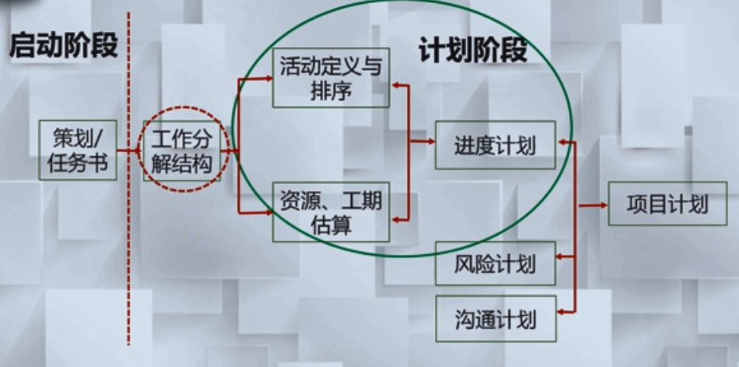

## 活动定义

* 通过对项目工作分解结构的进一步分解和细化 ，识别和定义 为实现项目目标达成所必须开张的各种具体活动

### 活动定义的过程

### 例子

* 工作包 强调结果 ，活动强调 完成结果的过程

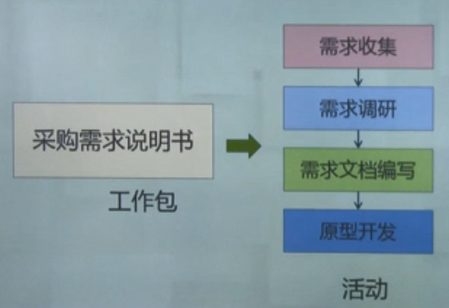

右边：这个工作包达成之后需要的具体活动

## 活动排序

* 活动排序过程主要识别、确认且编制活动间的逻辑关系

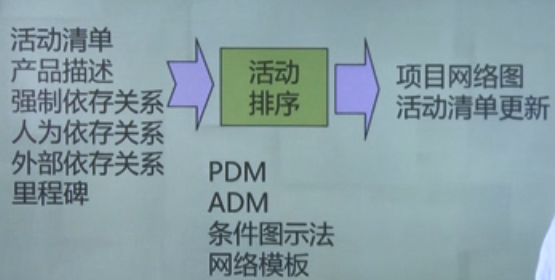

在活动清单、产品描述等要求下，使用PDM等各种工具，生成网络图、更新活动清单

### 活动排序的约束

考虑 ，存在特定的约束

1. 技术需求和规范
   1. 在软件项目开发过程中，需要收集 优先于界面的手机
2. 安全性与效率
   1. 安装新硬件/软件的时候，需要对重要数据进行备份
3. 公司政策与偏好
   1. 最终发布产品之前，有些企业可能已经开始了营销的宣传
4. 资源可用性
   1. 当某个阶段 资源紧张的时候 ，同时又是活动需要优先考虑的时候，这时 活动与活动之间的关系 他们先后的排序就出现了。
   2. 要通过资源的实际状况考虑 什么活动应该先执行 什么活动可以后执行

### 活动逻辑关系表达

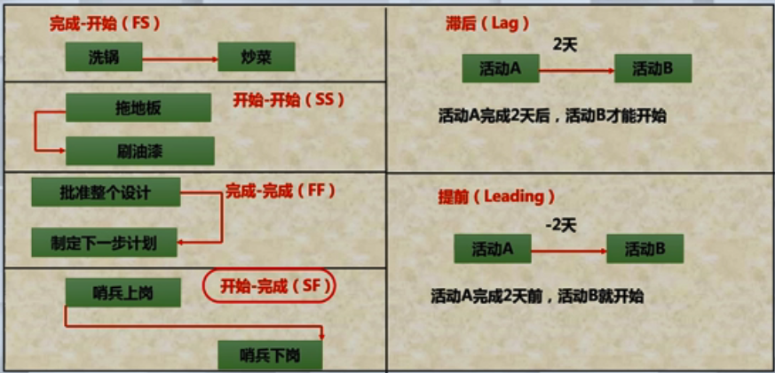

### 结果表述

项目网络图

1. 项目网络图是 项目所有活动以及他们之间逻辑关系（相关性）的一个图解表示

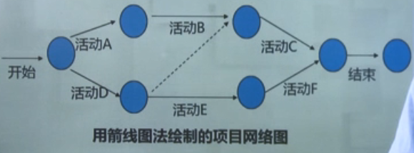

带箭头的线段：代表活动

### 例子

软件项目开发任务的网络图

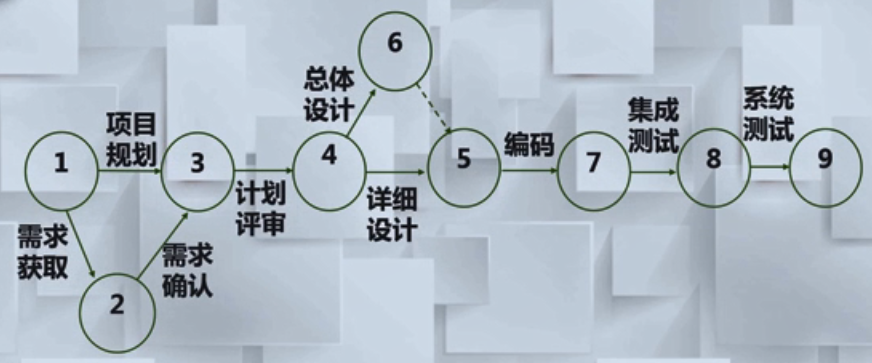

6中带虚线的箭头是虚任务 ，它仅仅表示活动间的逻辑关系，并不占用实际资源

## 活动资源估算

项目活动资源估算考量

1. 资源的种类，数量和质量
2. 资源可用性
3. 何时用，如何有效使用

活动资源估算是确定在实施项目活动时要使用何种资源、使用资源的数量以及何时用于项目计划活动

### 估算过程

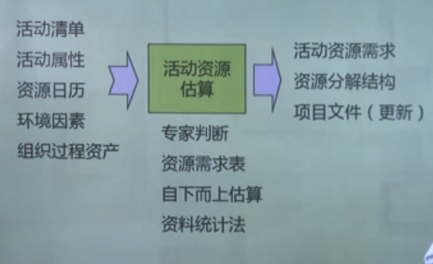

输入，采用专家判断等的方法，生成资源需求分析

### 资源分解结构

资源分解结构 是按照 资源类别和类型 而划分的 资源层级结构。**资源类别** 包括人力、材料设备和用品。
**资源类型** 包括 技能水平,等级水平或适用于项目的其他类型。

### 例子

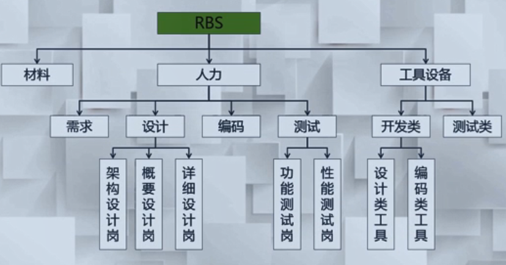

将资源分成 材料、人力、工具设备三种资源类型

采用了资源分解策略

## 活动历时估算

活动时间估计 指 预计完成各活动所需时间长短 ，在项目团队中 **熟悉** 该活动特性的 **个人和小组** 可对活动所需时间作出估计。

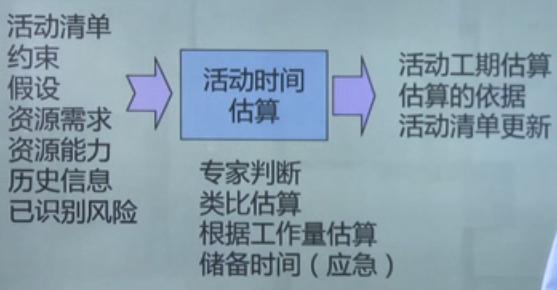

通过活动清单、约束等条件，使用类比估算等方法 ，得出活动工期估算

### 三点估算法

这是一种 **概率方法**

期望值 ：PERT=(p+4*m+o)/6

标准值 ：sigma = (p-o)/6

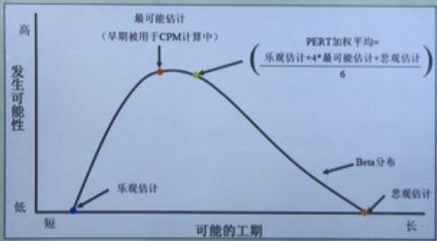

这种方法通过 求得我们项目的最乐观时间、最悲观的时间、最可能的估计时间

通过求得 PERT 的平均值 ，来估算每个活动的时间

同时，通过标准差绘制 **正态分布图** ，以求得每个时间的概率

#### 例子

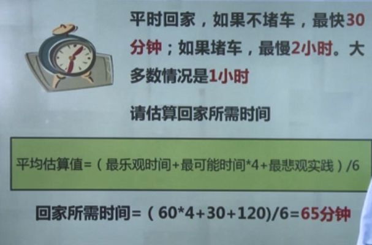

### 制定进度计划

- **工期估算** 与 **活动排序** 合并在一起，可以确定整个项目的工期，制定进度计划并可 **识别** 关键路径。

进度计划是一种迭代过程

* 进度编制、时间估计、成本估计 等过程 **交织** 在一起，并且 **反复多次**，最后才能确定项目进度。随着项目的推进，估算将越来越正确。

#### 计划编制过程

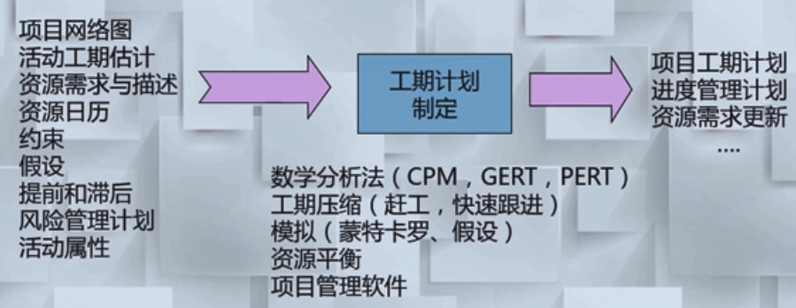

### 关键路径法

CPM-Critical Path Method

1. 沿着 项目进度网络路径 进行顺推与逆推分析 ，计算出全部活动理论上进行的 最早开始与完成时间 ，最晚开始与完成时间。
2. **工期总和最大的路径** 为 **关键路径** ，描述的是项目完成的最短时间
3. 关键路径上的活动 成为 关键活动

#### 例子

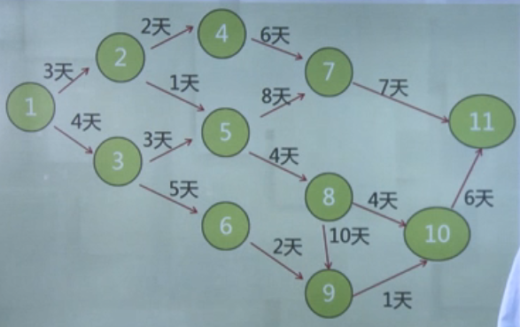

因为最长路径称为关键路径；所以

 1到11 的关键路径是 ：1--3--4--8--9--10--11

如果关键路径的进度被拖延了 ，那么整个项目就会被拖延

### 进度计划表示方法

在进度计划表示方法，通常采用两种方法，

### 里程碑计划

里程碑计划 是以项目中某些 重要事件 的 完成或开始 时间点作为 **基准** 所形成的计划。是一个 **战略计划** 或项目框架，以中间产品或 **可实现的结果** 为依据。

#### 例子

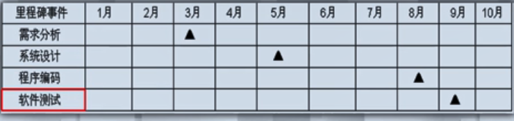

**里程碑作用** ：

化远景为近景 ，积小胜为大胜 ，变黑箱为明账 ，分大限为

### 甘特图

1. 使用条形图 来编制项目工期计划
2. 由于其简单明了、直观、易于编制 ，成为项目管理中编制项目进度计划的 主要工具；

#### 示例

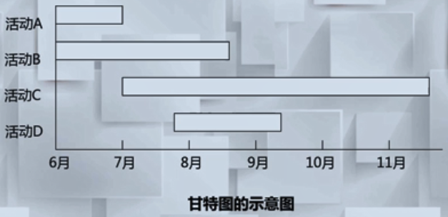

#### 例子

**局域网建设项目**

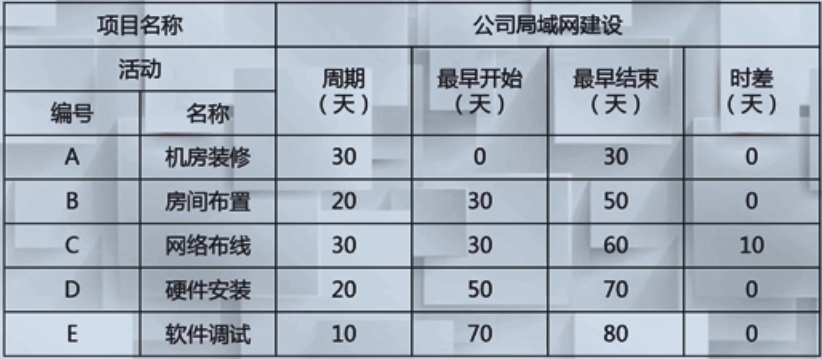

**甘特图表示**

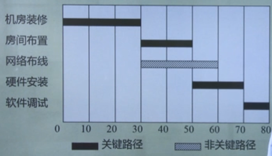

---

## 项目进度控制

* 一旦建立进度计划 ，就可以 **开始** 着手追踪和控制活动。
* 项目进度控制 是项目经理的一个重要职责
* 当实际进度发生改变时要加以控制 ，进度计划控制必须和其他控制过程结合

### 控制过程

以项目工期计划等为基础，使用进度报告等工具， 对进度进行更新、纠正错误。。。

### 心理体检

IT项目控制的心理体检

1. 异地乘车的心理体验
   1. 对目的地不断询问，怀疑自己迷路了
   2. IT项目，特别是软件项目的“不可见”特性 ，客户心理更脆弱和不稳定。
   3. 如果每次 项目经理 给出的进度都是 **无法验证的**，客户的疑问就会积累，最终到无法忍受而爆发。
2. 心理预期值
   1. 项目经理给出的进度经常会有误差，从心理角度去分析，关键是与现实的 **落差是否在可接受范围之内**。
   2. 如果客户 持续觉得 项目的进度描述是准确的 ，那么对项目也就越有信心，对项目的支持也就越好
   3. 反之，如果对项目进度 **没有信心**，那么就会对项目 **施压**，对失误的处置也会越严厉。

### 影响IT项目进度的因素

1. 低估技术难度
2. 关键人员离职
3. 进度计划错误
4. 设备未到位
5. 客户需求变更

这些因素可以用图形化的方式表达出来，

鱼骨图：

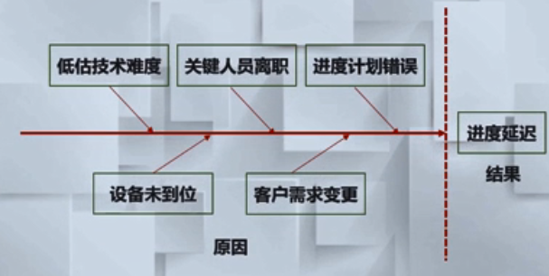

鱼头表示结果

### IT项目进度跟踪方式

可以用不同的方式进行跟踪：

1. 定期举行项目状态会议。在会上 ，每一位项目成员报告他的进展和遇到的问题
2. 评价在实施过程所产生的的 **评审结果** 
3. 确定由项目的计划进度所安排的、可能选择的正式的 里程碑
4. 比较在项目进度计划中所列出的每一个项目任务的实际开始时间和计划时间
5. 非正式的和开发人员交谈 ，以得到他们对开发进展即 刚冒头的问题 进行客观评价

### 进度控制的两个原则

作为项目经理，面对项目的拖延 ，在进行项目控制过程中把握好两个原则

#### 由近而远

1. 由近而远 ，即从 近期 的活动着手纠偏 ，以免拖到项目后期 **积重难返**。宁可在前期小步微调，也不要把问题积压到后期大动干戈。
   1. 事情尽量在前期处理好，在刚发现的时候处理好，不要拖到后期

#### 从长计议

1. 从长计议，即 **纠偏措施** 从工期较长的任务着手，工期长的大任务往往有进一步分解的回旋余地 ，可以拆分成若干小任务并联实施  ，快速跟进。

### 妥善处理好人的因素

1. 人的因素比精良的设备、先进的技术更为重要的项目成功因子
2. 许多进度计划失败并非没有好的计划 ，而是由人引起的

