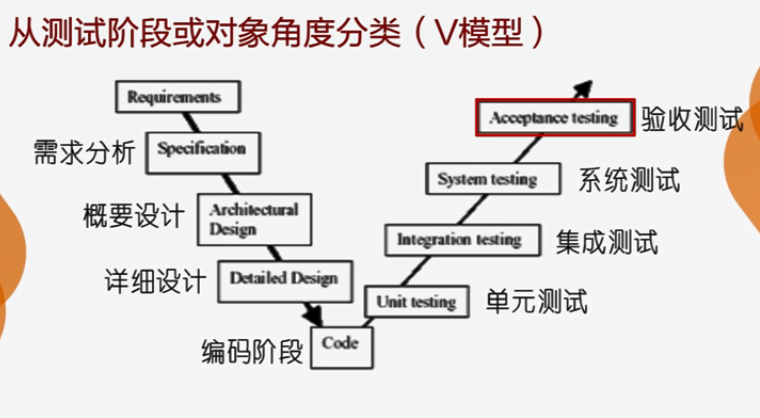

软件测试职位本身带来的价值

* 设置这一职位的目的，就是要让软件产品在交到用户手里之前得到 **很好的检验**，所以，从事软件测试工作的人员必须对被测产品的质量负责。有了岗位负责制，产品的质量就在一定程度上可以得到保障了。

# 软件测试

## 定义

以某种方式检查被测系统的过程

软件测试是为了发现缺陷而执行程序的过程

一个成功的测试使发现了至今没有发现的错误的测试

## 4个阶段

### 计划

输入

* 需求规格说明
* 项目计划

输出

* 测试计划

### 设计

输入

* 需求
* 设计文档
* 测试计划

输出

* 测试用例
* 测试过程

两个问题：

- 如何测试
- 遵循什么流程来测试

### 实施

输入

* 测试用例
* 测试过程
* 需求

输出

* 测试驱动模块
* 测试桩模块
* 测试脚本（可选）

两个问题：

- 如何让测试用例跑起来
- 被测软件中发现了什么问题

该阶段包含：实施和执行

### 评估

输入

* 测试用例
* 缺陷报告
* 测试标准

输出

* 测试评估报告

两个问题：

* 测试工作质量怎么样
* 被测试系统质量怎么样

---

## 概述

根本目的 ：确保被测系统符合用户需求

基本手段 ：设计测试用例

执行方法 ：手工/自动化

测试策略 ：动态运行/静态审阅

通用流程 ：计划、设计、实施、评估

---

# 软件缺陷

## 定义

正式定义-5种表现形式

* 软件测试员认为软件 难以理解、不易使用、运行速度缓慢，或者最终 **用户认为不好**，则是缺陷。
  * 处理方式
    * 应该是遵循软件工程的 **规范流程**，通过 **需求定义和需求分析**，将 用户需求 整理为 开发团队 认可的需求规格说明的形式，作为后续开发和测试的依据。

- 软件未达到 需求规格说明书中 指明的功能，就是缺陷
  - 二十世纪70年代初，Bill Hetzel ： 测试就是建立一种信心，认为程序能够按 预期设想 运行，简单的说，就是为了证明 **程序的正确性**。
- 软件出现了 需求规格说明书 中指明不会出现的错误，则是缺陷。这可视为对软件系统 **容错性** 的要求
  - 是否能检查异常情况
  - 检查无效用户输入的识别能力
  - 检查无效用户输入的处理能力
- 软件功能超出 需求规格说明书 中指出的范围，则是缺陷。
  - 无意加入，过错缺陷
  - 人为加入，需求缺陷
  - 人为加入，过错缺陷
  - 人为加入，病毒
- 软件未达到需求规格说明书 中虽未指出但应达到的目标，则是缺陷
  - 隐含特性，需求缺陷

## 建议

根据用户的意见和反馈执行测试

依据需求规格说明书，测试系统正常功能

依据 需求规格说明书 和 经验 ，测试系统 **容错能力**

程序员应遵循 良好的开发习惯，避免 **人为植入缺陷**

需求分析阶段强调测试专家的介入，完善需求规格说明 ，提高系统 **外部环境容错能力**

---

# 测试用例

## 测试目标

基于风险最低、效率最高、分而治之的软件设计原则

测试用例就是

* 能代表需求的小的测试单元
* 描述用户预期输出
* 反应系统实际执行结果

## 组成

输入：测试数据和操作步骤

输出：系统预期执行结果

测试环境：是系统环境设置，即进行软件测试所必需的的工作平台和前提条件

## 需要关注的问题

哪里是系统输入输出中最可能潜伏缺陷的地方？

以怎样的流程操控系统更有利于发现缺陷？

## 基本属性

典型性：能揭示最有可能存在缺陷的地方 ，能代表和覆盖合理与不合理、合法或不合法的情况

可测试性 ：一个测试用例的 预期输出 必须是可以检验的 ，可以根据相关开发文档得到明确的、可判定的结论

可重现性 ：对于相同的测试用例，系统的预期执行结果应该完全相同，否则，如果系统预期输出存在 不确定性，一旦实际运行该测试用例 ，也无法进行校验

独立性 ：测试用例 应尽量独立。

## 测试用例的设计

输入数据

* 正常数据 -》软件可以接受的数据
* 错误数据
  * 满足数据类型 ，不在有效取值范围内
  * 不完全满足数据类型
  * 输入条件确实
* 边界数据 -》 介于 正常数据 与 错误数据 之间的 临界数据
* 操作步骤
  * 

---

# 软件测试分类

## 分类角度

从 测试阶段 或 对象 的角度来分类

从 测试技术 的角度分类

从 测试目标 的角度分类

从 测试执行方式 的角度分类

## 按测试阶段 或 对象

单元测试

集成测试

系统测试

验收测试

**单元测试** 对应 **编码阶段** ，其测试对象是 单个模块或组件

**集成测试** 对应 **详细设计** ，其测试对象是 一组模块或组件

**系统测试** 和 **验收测试** 分别对应 **概要设计** 和 **需求阶段** ，测试对象是 整个软件系统

### 单元、集成测试

#### 单元测试

用于验证一个单元模块（或组件）的功能是否正常 ，一个单元模块可以包括几行或上百行代码。

单元测试 与 编码过程 是紧密联系的 ，单元测试 有时也认为是 编码阶段 的一个活动

#### 集成测试

集成测试 是将不同的单元模块组合起来 ，形成更大组件的测试过程

集成测试 用于查找不同单元或组件间的 接口错误 ，其关注重点是那些在 单元测试中 不能被发现的缺陷

### 系统、验收测试

#### 系统测试

系统测试 用于检验软件产品是否能与系统的其他部分 协调工作 ，包括 硬件、数据库 及操作人员等

系统测试 用于评估整个系统的行为并确保 系统行为 符合 用户需求 ，并且评估系统与硬件设备、运行环境和应用程序等之间的接口。

系统测试 适合于评估系统的 **非功能性需求** ，如 性能、可靠性 和 安全性等

#### 验收测试

验收测试 是软件部署之前的一个测试操作，其测试范围类似于系统测试，通常由系统提供者和客户共同完成

## 按测试技术分类

### 白盒测试

关注的是与 **代码内部结构** 相关的缺陷，因此，需要测试人员掌握一定的编程技术

### 黑盒测试

关注的是与 **产品的外部行为** 相关的缺陷，此时并不考虑 **产品的内部结构** 或 运行逻辑

### 灰盒测试

灰盒测试 是综合运用 黑盒测试 和 白盒测试技术 的一种混合测试方法

---

## 按测试目标分类

回归测试、功能测试、性能测试、Alpha测试、Beta测试

压力测试、负载测试、安全性测试

配置测试、安装测试、可用性测试、可恢复性测试等

### 典型分类定义-1

#### 功能测试

针对软件 功能需求 进行测试 ，目的是 检查应用程序的行为是否符合预期

#### 性能测试

用于验证系统是否满足 规格说明 的性能需求 ，例如：内容和响应时间等

#### Alpha测试(α测试)

在软件发布之前 ，有时会让小规模、有代表性的潜在用户 试用软件 ，如果由开发机构人员来模拟潜在用户开展测试 ，成为 **α测试**

#### Beta测试(β测试)

软件的早期版本被发布给具有 **代表性** 的用户群来测试 ，成为β测试。β测试 常被用于面向大众市场的系统、计算机游戏和类似的应用程序

#### 回归测试

在软件 **版本修改后** 的重新测试，可应用于 **所有** 测试级别，目的是 为了确保被修改组件的 **行为没有改变**，不会造成 **意外结果**。

---

### 典型分类定义-2

软件系统还需要进行 压力测试、负载测试 和 安全性测试

#### 压力测试

以设计的 **最大负载** 或者 **超过最大负载** 来运行软件 ，用于确定系统运行的 **负载界限**。

#### 负载测试

通过测试系统在 **资源超负荷** 情况下的表现，以发现 **设计上的错误** 或 验证系统的 **负载能力**。

#### 安全性测试

是对产品进行检验，以验证产品 符合 **安全需求定义** 和 **产品质量标准** 的过程。用于测试系统在遭遇 **未授权访问**、**计算机犯罪和破坏** 时是否能保护自己。

---

### 典型分类定义-3

软件系统的 配置测试、安装测试、可用性测试 和 可恢复性测试 也都是开发者和使用者非常关注的问题

#### 配置测试

当开发的系统需要应用于 **多种环境配置** 时，需要对 **每种配置** 进行测试，以检测系统行为是否符合规格要求。包含 **硬件配置** 和 **软件配置**。

#### 安装测试

在目标环境中通过 安装来验证软件及其安装过程。目的是确保该软件在 正常或异常情况 的不同条件 下都能进行安装，且安装后可立即正常运行。

#### 可用性测试

用于评估系统使用的 **简易程度**，交互是否具有 人机工程学设计 以及 **用户文档** 使用的 **有效性**。

#### 可恢复性测试

用于检验系统在 **灾难或意外宕机** 后的重启能力

---

## 按测试执行方式分类

从测试执行方式的角度来看，软件测试可分为 手动测试 或 自动测试

### 手动测试

人工执行测试。即根据 测试用例中 描述的规程，不借助 特殊的 软件工具，人工来运行被测系统，观察系统实际输出是否符合测试用例的 **预期输出**。

### 自动测试

软件测试的自动化，是一个将以 **人为驱动** 的测试行为 **转化为** 机器执行的过程。目的是 **节省人力**、时间或硬件资源，并 **提高测试效率**。

---

# 软件质量

## 质量的定义

IS08402关于质量的定义 ：反映实体满足明确或隐含需要能力的特性总和。

* 在合同环境中，需要是规定的，而在其他环境中，隐含需要应加以识别和确定。
* 在许多情况下，需要会随着时间而改变，要求定期修改规范。

### 质量的要素

#### 实体

实体是质量的主题，即测量的主体

一般指产品 ，也可以是活动、过程、组织、人 或者他们的组合

#### 特性集合

表示度量
特性必须可以测量，定性或定量方式得到指
导性结论。

#### 需求

## 软件质量定义

反映软件满足明确或隐含需要能力的 特性总和。

客观而言，软件质量是软件具有 某种能力的属性，这是前提条件。

主观而言，软件具有的能力对应不同层次的用户需求。

### 不同用户层次的用户需求

#### 显式需求

- 需求规格说明书 描述的内容
- 是软件内部质量

开发者将 用户需求具体化 ，以此开发软件，这是获得 产品质量 的基本途径。

#### 隐式需求

- 未在需求规格说明书中 明确描述
- 用户明确说明的目标
- 反应验收质量

#### 实际需求

* 软件的 使用质量
* 用户在实际使用过程中对产品的评价

狭义和广义的软件质量

- 客户并不只是购买了一件产品，他们购买的是你的保证。
- **狭义的软件质量** ：软件的内部质量，即软件无“故障”
- **广义的软件质量** ：产品质量、过程质量和客户满意度。

### GB/T 的定义

软件质量是

* 软件产品中能满足给定需要的性质和特性的总和
* 软件具有所期望的 各种属性 的组合程度
* 顾客和用户觉得软件满足其 综合期望 的程度
* 确定软件在使用中将 满足顾客预期要求的程度

## 软件测试VS软件质量

软件测试

* 目的 ：保证被测软件系统符合 用户需求
* 手段 ：通过找 bug 来判断软件与需求的 一致性

软件质量

* 定义 ：是反映 软件满足明确或隐含需要能力 的特性总和
* 狭义的质量 ：产品无缺陷

软件测试可以验证 软件质量

---

1. 广义的 软件质量 包括 ：产品质量、过程质量、客户满意度

2. 软件测试 是运行或检查被测软件的过程 ，目的是确保被测系统 符合用户需求

由此可见 ：软件测试仅针对已有软件组成部分 进行检查

测试是被动过程

**软件测试不能提高软件质量**

## 提高软件质量

提高软件质量依赖于 改进 软件开发过程 质量

- 提高软件质量必须依靠改进软件开发过程的质量
- 曲棍球式管理模式 ：定期检查，发现问题再解决问题，不能杜绝问题。
- 芭蕾舞式管理模式 ：改进开发过程，避免缺陷植入。

