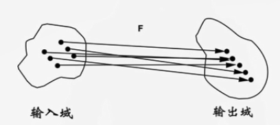
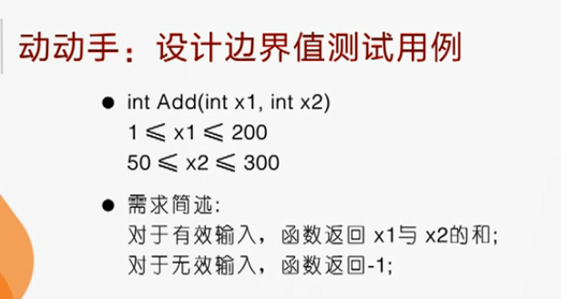
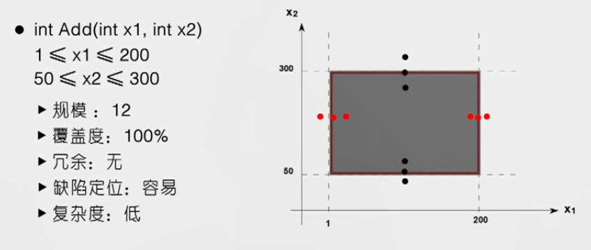
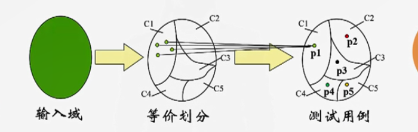
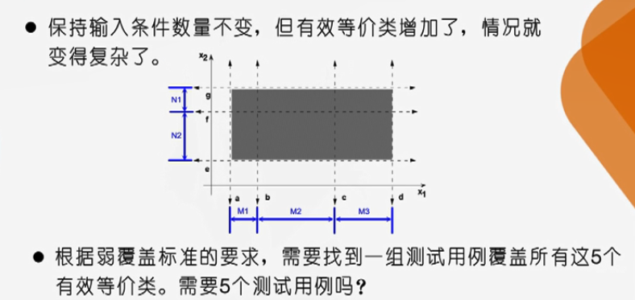
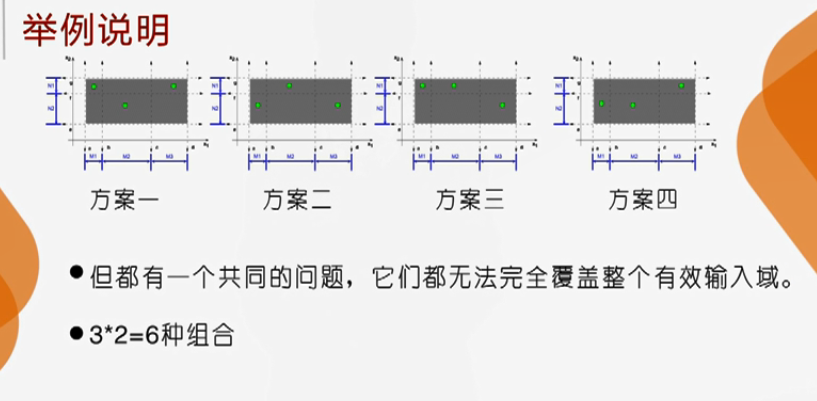
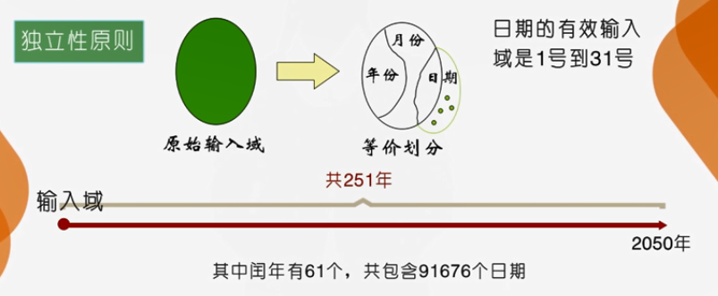
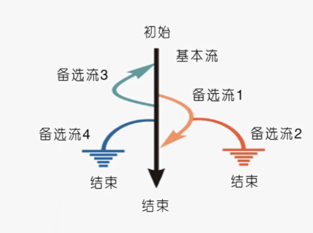

# 概述

1. 看不到他内部的实现原理，不了解内部的运行机制
2. 如果向被测系统提供 **哪些输入条件**，输入哪些数据，系统将如何响应我们的输入，系统将向我们反馈什么信息，系统的处理结果将从哪里输出，输出形式又是怎样的。

黑盒测试就是：

* 只知道系统输入和预期输出 ，不需要了解程序内部结构和内部特性的测试方法就称为黑盒测试
* 任何程序都可以被看做是从其输入域到输出域的映射

* 对程序功能的理解仅基于输入和输出 ，对其实现原理和过程一无所知

## 优势

1. 方法简单有效
2. 可以整体测试系统的行为
3. 开发与测试可以并行
4. 对测试技术人员要求较低
   1. 不一定要会编程

## 不足和弊端

1. 入门门槛低

## 黑河测试的经济学问题

1. 通过测试无法证明 ，被测软件系统是没有缺陷的
2. 软件测试的经济学问题
   1. 经济学问题 就是上面的东西 证明没有缺陷
3. 应对策略一 ：黑盒测试
4. 黑盒测试能解决经济学问题吗？

所以

1. 软件测试是不完备的
2. 软件测试是有风险的
3. 软件设计应达到的目标
   1. 提高效率
   2. 降低风险

## 测试方法的评价标准

在短时间内 ，以最少的人力 ，有利于发现最多的 ，以及最严重的缺陷

* 精确的 ：测试针对性强
* 完备的 ：测试覆盖全面 ，无漏洞
* 无冗余 ：
* 简单的 ：测试方法简单易行
* 易于调试 ：缺陷定位难度小

###  **一个中心两个坚持**

以用户需求为中心

坚持高效的测试用例设计

坚持缺陷的快速处理

### 测试方法的评价

1. 测试用例的覆盖度 ：高
   1. 覆盖什么？ 覆盖需求
   2. 测试以需求为中心
   3. 测试用例设计以需求为中心
   4. 测试用例应覆盖功能需求
   5. 测试用例应覆盖 **高风险** 数据
   6. 高风险是 ：可能漏测导致遗漏的缺陷 ，造成对软件的影响 
   7. 设计测试用例 以发现特定缺陷 ，确保风险覆盖
2. 测试用例的数量 ：少
   1. 提高效率
3. 测试用例的冗余度 ：低
4. 测试用例的缺陷定位能力 ：高
5. 测试方法的复杂程度 ：低

---

# 边界值测试

## 产生的原因

1. 经过长期的 测试工作经验 表明，在输入域的 边界或边界附近，常常会发现 **大量缺陷**。
2. 边界值测试倾向于选择系统边界或边界附近的数据来设计测试用例。

## 需要解决的问题

1. 边界在哪里？
2. 如何定义边界的邻域？
3. 如何选择测试数据？
4. 如何设计测试用例？

以下的测试用例 是 使用频率最高的

| 编号 | x1   | x2   | 预期输出 |
| ---- | ---- | ---- | -------- |
| 1    | 1    | 50   | 5        |
| 2    | 200  | 300  | 500      |
| 3    | 1    | 300  | 301      |
| 4    | 200  | 50   | 250      |
| 5    | 0    | 49   | -1       |
| 6    | 201  | 301  | -1       |
| 7    | 2    | 51   | 53       |
| 8    | 199  | 299  | 490      |

## 边界在哪里

1. 边界点就是可能导致被测系统内部处理机制发生变化的点。
2. 需求中有利于识别边界点的文字:
   1. 位置，尺寸，数量，长度，速度，高度，距离，质量，时间...
3. 可能的边界点:
   1. 第一个/最后一个，最小/最大，最少/最多，最短/最长，最快/最慢，最高/最低，最近/最远，最轻/最重，最早/最晚...

## 如何定义领域

## 如何设计测试用例

### 穷尽测试

在边界以及边界附近的邻域内选择 **所有的** 测试数据，构成测试用例。

1. 确定有几个输入条件
   1. 输入的个数由需求确定，不变的
2. 确定每个输入条件的边界点
   1. 数量由需求确定，不变的
3. 划定边界领域 δ(delta)
   1. 数据量随边界领域取指变大而变大
4. 穷尽法选择测试数据
   1. 数据量随测试数据增多而增大
5. 组合测试数据设计测试用例
   1. 测试用例随测试数据组合增大而增大
6. 3-5步需要改进

该方案可以 **满足测试覆盖度高和方法复杂度低的要求**，但它在 **冗余度、缺陷定位能力** 以及 **复杂度** 这三个方面远远 **达不到** 理想的结果。

优化 第3 点 

# 等价类测试

## 产生原因

1. 对系统进行穷尽测试是 **不可能的**。
2. 使用 **有限的数据** 对系统进行测试是可能的。
3. 我们可以选择 少量 测试用例来测试系统 ，并满足
   1. 测试是完备的
   2. 测试是没有冗余的

借鉴飞镖游戏的思想

试图将无穷多的数据缩减到 有限个等价区域 ，通过 测试等价区域 完成有穷测试

## 基本原理

3个约束

1. 分而不交

2. 合而不变

3. 类内等价

## 如何划分等价类

有效等价类

1. 有效等价类对应有 **效输入域** 的数据
2. 有效等价类 设计的测试用例用于检验被测系统是否能够 **正确完成指定功能**

无效等价类

1. 无效等价类 则对应 **无效输入域** 中的数据
2. 无效等价类设计的测试用例被用来考察被测系统的 **容错性**

### 常见方法

如果某个输入条件指定了一个连续的有效取值范围 ，则可以定义一个有效等价类和两个无效等价类

如果某个输入条件只有两种取值，是或否，也就是常见的 **布尔型** 的情况，那么，取值为真的情况对应一个有效等价类，取值为假的情况可能对应一个无效等价类，也可能对应另外一个有效等价类。

### 如何设计测试用例

一般有两种常见的覆盖要求 ：弱覆盖和强覆盖。
弱覆盖

- 测试用例应覆盖 **所有的** 有效等价类

强覆盖

- 测试用例应覆盖所有的有效等价类的 **组合**

#### 弱覆盖

就是只需要每一个 测试域 都有测试就行了，不用每一个组合都测试

#### 强覆盖

就是把上面的 6 个组合都测试

## 等价类测试的陷阱

1. 确定输入条件时，可能会改变原始输入域。
2. 对 有效域和无效域 可以用 相同方式 进行等价类测试吗?
3. 如何选择合适的覆盖指标
4. 等价类测试真的没有漏洞，没有冗余吗? 

### 陷阱一

确定输入条件时，可能会改变原始输入域。

如果在确定输入条件的时候 ，改变了原始的输入域 ，还可以进行等价类测试吗？

如果在变化的输入域上进行等价类测试 ，还能得到正确的测试用例吗？

还能达到无漏洞、无冗余的目标吗?

如何才能避免出现这种情况呢?

如果每个月都是 31 天 ，那么等价划分之后的输入域 就会大于 原始输入域

两种划分等价类的方法

1. 基于系统实现的等价划分
   1. 从程序员实现系统的角度触发
   2. 关注接口
2. 基于用户需求的等价划分
   1. 从用户的角度出发
   2. 关注隐含的系统内部处理流程

### 陷阱二

对 有效域和无效域 可以用 相同方式 进行等价类测试吗?

由于引起系统错误的原因很多 所以

对无效等价类设计测试用例时：

1. 采用单缺陷原则
   1. 即测试用例的失败应由 **单个无效等价类** 关联的缺陷所导致;
2. 有效域内设计测试用例，应确保每个测试用例覆盖的均为有效等价类，在无效域内，则应基于单缺陷原则设计测试用例，不应该出现多个无效等价类组合成测试用例的情况。

### 陷阱三

如何选择合适的覆盖指标

1. 划分出最多有效等价类的那个输入条件决定弱覆盖指标的最少测试用例数;
2. 强覆盖指标下，测试用例的数量 是每个 输入条件 所拥有的有效等价类数量的 乘积。

### 陷阱四

等价类测试真的没有漏洞，没有冗余吗? 

1. 当等价类划分不彻底时，将导致 **测试的漏洞**;
   1. 对策 ：划分等价类时务必仔 **细分析需求**，严格保证数据的等价
2. 当输入条件之间存在关联时 ，引入 **独立性原则** 将造成测试的 **冗余**。
   1. 对策 ：尽量基于关联性来划分等价类

## 输出域的等价类测试流程

1. 确定有几类输出结果
2. 对每类输出结果划分等价类
3. 选择合适的覆盖标准 ，将等价类组合起来
4. 设计测试用例

---

# 基于场景的测试

## 产生原因

1. 越来越多的软件系统采用 **事件触发** 来控制流程
2. 事件触发时的情景形成场景
3. 同一事件不同的 触发顺序 和 处理结果 形成事件流

## 基本原理

从初始到结束就构成一个用例场景

## 定义基本流和备选流

基本流

1. 高风险的事件流 确定为 基本流
2. 操作频率高
3. 涉及业务规则复杂
4. 涉及重要功能
5. 涉及用户类型广泛
6. 涉及用户数量大
7. 涉及交互复杂
8. 总之 ：应该选择容易出错的 ，或者出错后导致损失 严重的高风险事件流作为基本流

备选流

1. 备选事件流，只是业务流程片段
2. 节点形式 ：起始节点
   1. 起始节点从基本流的某个判定节点开始
   2. 起始节点从其他 备选流的某个判定节点开始
3. 终止节点 
   1. 终止节点 是基本流上的某个状态
   2. 终止节点是其他系统的中止状态
4. 备选流上的每个节点执行后可以继续往下执行 ，也可以返回基本流上的某个节点继续执行

定义基本流和备选流

对于一个从系统某个初始态到某个终止态的事件流而言，备选流可以有多个。而且，判定节点的数目越多，事务分析的颗粒度越细，特别是涉及校验性的事务越多，得到的备选流数目就越多。

## 基本流和备选流的区别

|                  | 基本流           | 备选流                      |
| ---------------- | ---------------- | --------------------------- |
| 测试重要性       | 重要             | 次要                        |
| 数目             | 1条              | 1或多条                     |
| 初始节点位置     | 系统初始状态     | 基本流或其他备选流          |
| 终止节点位置     | 系统默认中止状态 | 基本流或系统其它中止状态    |
| 是否完整业务流程 | 是               | 否 ，仅为业务流程的执行片段 |

## 定义场景

场景：

1. 可以看做是基本流与备选流的 **有序集合**。一个场景中至少应包含一条基本流。

## 从场景设计测试用例

1. 找出输入条件
2. 判断是否有效条件
3. 判断是否触发条件
4. 需要取哪些测试数据

